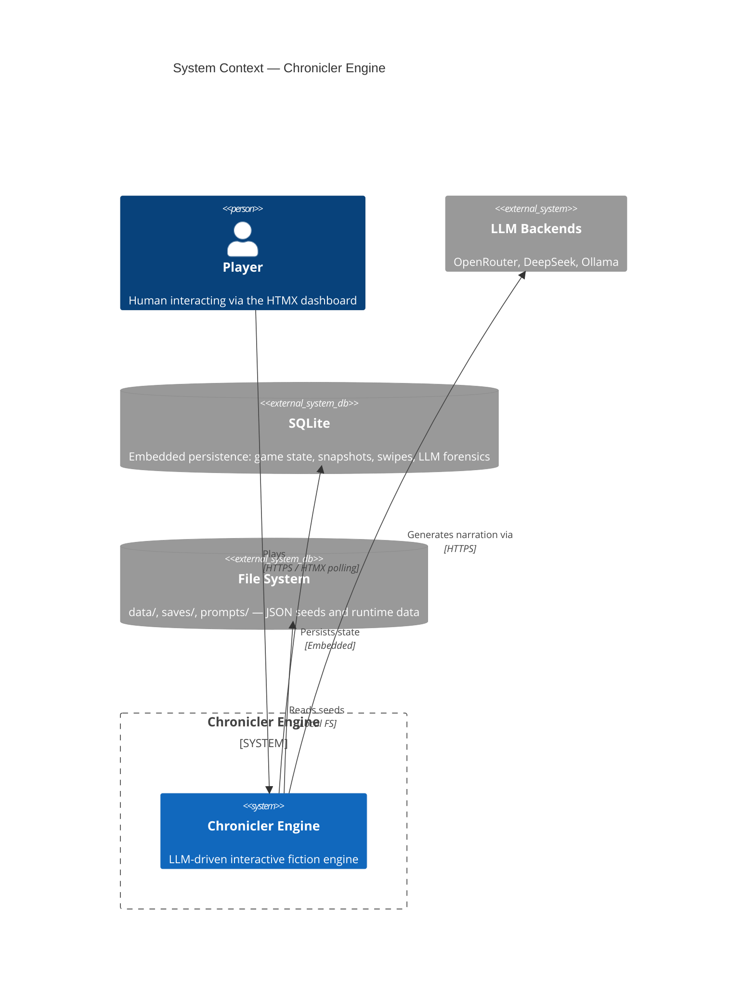
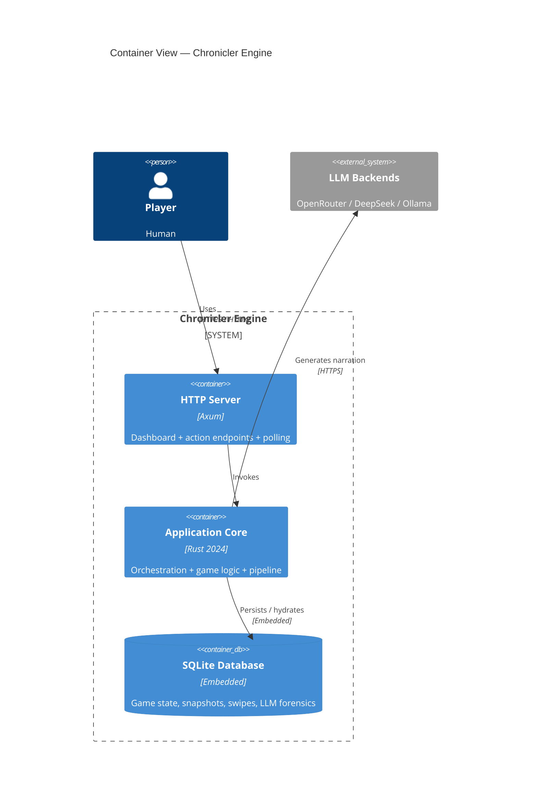
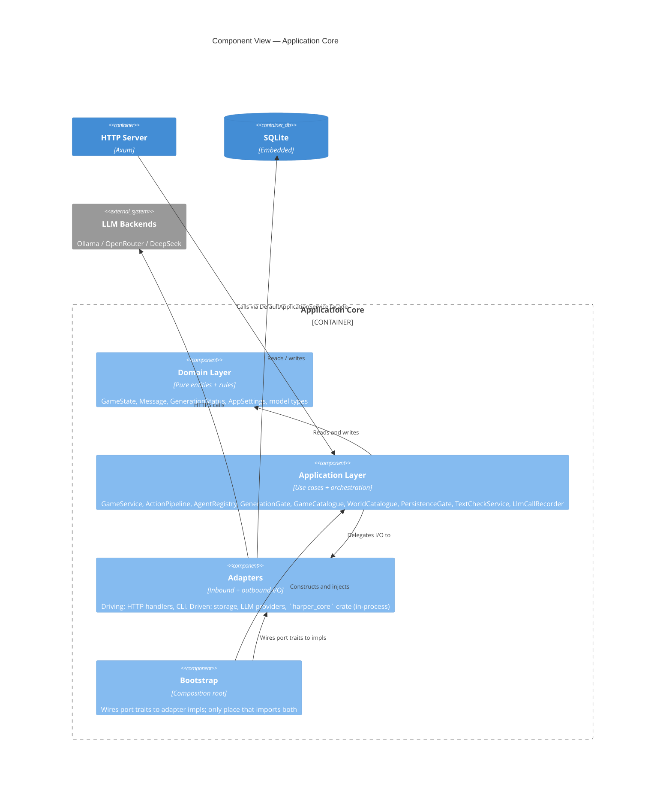
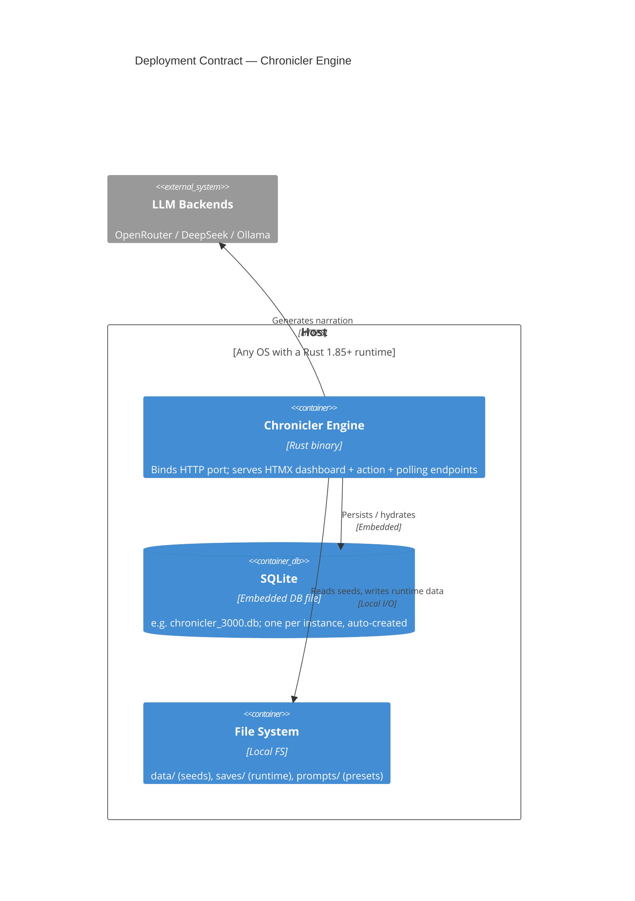

> **Diátaxis mode:** Explanation. This document is *understanding-oriented*: it shows how the Chronicler Engine is structured and why, and lays out the quality guarantees the architecture makes. It does not specify column types, phase transitions, or API contracts — those live in [`../../reference/`](../../reference/). The problem it solves for the reader is *understanding*: how the pieces fit together, what the system promises, and which tradeoffs those promises encode.

## Context

The Chronicler Engine is a single-process Rust application that turns player input into LLM-generated narrative, persists state, and renders an HTMX dashboard. It orchestrates the surrounding systems — LLM, database, grammar checker — through adapters, with the dependency direction pointing inward.

### Out of scope for this overview

The following are workspace-level systems that the engine connects to but does not contractually own:

- **Ollama runtime.** A consumed external system; the engine treats it as an HTTPS endpoint.
- **Browser rendering.** The dashboard is rendered server-side; the engine owns the templates, not the DOM.
- **Other AI-stack containers** in the workspace (Open Notebook, SurrealDB, Suwayomi, Paperless, Stable Diffusion). They share the Docker network topology but are not part of the engine's runtime contract — see the Deployment section.

## Layer Structure

The engine has four containers at the L2 level, and four cooperating layers inside the application core at L3.

### L2 — Container view

The four containers are the L2 vocabulary. The HTTP server owns the wire protocol and template rendering; the application core owns everything else.

### L3 — Component view (inside Application Core)

The engine is structured in four layers so the dependency direction is one-way: domain logic never reaches outward to HTTP or storage, application logic never reaches inward past port traits, and adapters never invent their own abstractions over the application core. Each layer has a single responsibility, and `arch-lint` enforces that no inner layer imports from an outer one. The result is that domain code can be tested without spinning up the HTTP server, and the HTTP server can be replaced without touching the orchestration layer.

See `../reference/architecture_system.md` §Layer Structure for the file-tree layout, §Dependency Invariant for the load-bearing rule, and §Port Inventory for the application-to-driven-adapter boundary.

## Deployment

The engine's deployment contract ends at its process boundary: what the process binds, reads, and calls out to. Surrounding orchestration — Caddy, Docker, the `no-internet` network, sibling AI-stack containers — is workspace-level topology, out of scope for the engine's own docs (see the Out-of-scope list above).

**Single-process deployment.** The engine runs one process against its SQLite database. The `is_generating` atomic flag is process-local; the deployment contract is one process per database. This means the database is the coordination boundary, not the engine process — restarting the engine is safe, and two engines pointing at the same database would race on `is_generating`. The single-process commitment is deliberate; horizontal scale is not in scope.

See `../reference/architecture_system.md` §Deployment Contract for the runtime elements (HTTP port, SQLite file, file system paths, outbound LLM, in-process text check) and what each binds/reads/calls.

## Quality Story

The architecture makes a set of guarantees about how it behaves under load, failure, and concurrency. Each guarantee is named, the promise is stated, and the load-bearing decision is cited. The mechanism docs (how each guarantee is delivered) live in the guardrails and rust-technical sections of the legacy `architecture/` tree and the relevant ADRs; the architectural intent is here.

### Reliability

| Attribute                          | Guarantee                                                                                                                | Source of truth                                          |
|------------------------------------|--------------------------------------------------------------------------------------------------------------------------|----------------------------------------------------------|
| Self-healing after panic           | Generation status returns to `Idle` on the next action even if the previous process exited mid-flight.                   | INV-001.                                                 |
| Stale-state recovery               | If `is_generating` is `false` but persisted status is still `Generating`, the per-game registry slot is cleared on the next action. | INV-001.                                                 |
| Lock-poison recovery               | Every `Mutex` / `RwLock` site recovers from poison via `into_inner()`.        | INV-005.                                                 |
| Dual-source consistency            | The atomic `is_generating` cache and the persisted `GenerationStatus` cannot drift: the registry claim/release path mutates both representations under the same write-lock scope. | INV-001.                                                 |
| No double-spawn race               | Only one `FreeAction` generation in flight at a time; the server rejects overlaps.                                       | INV-004b.                                                |

### Performance

| Attribute                          | Guarantee                                                                                                                | Source of truth                                          |
|------------------------------------|--------------------------------------------------------------------------------------------------------------------------|----------------------------------------------------------|
| Hot poll path                     | The HTTP poll endpoint reads the atomic `is_generating` directly; no storage round-trip per poll.                        | INV-001.                                                 |
| LLM HTTP timeout bounded           | The LLM transport enforces a 180-second HTTP timeout.                      | INV-004.                                                 |
| One FreeAction at a time           | Long-running LLM calls do not queue — overlapping actions are rejected, matching single-player semantics.                | INV-004b.                                                |
| No blocking on the Axum event loop | Synchronous services (`GameService`, `ActionPipeline`) run inside `tokio::task::spawn_blocking`; HTTP handlers return before the LLM call begins. | INV-006, INV-007.                                        |
| Settings reload is bounded         | Connection settings are immutable post-boot (see `../reference/architecture_system.md` §Settings Flow). | INV-003. |

### Concurrency

| Attribute                          | Guarantee                                                                                                                | Source of truth                                          |
|------------------------------------|--------------------------------------------------------------------------------------------------------------------------|----------------------------------------------------------|
| Tokio-only concurrency             | All concurrent work runs on the tokio runtime.        | INV-003.                                                 |
| Cancellable long-running work      | Generation is cancellable at phase boundaries (post-narration, pre-trigger, post-trigger) via the in-phase α-check on `current_game_id`. | INV-004.                                                 |
| Atomic cache single-writer rule    | Only the registry claim/release path mutates the `Arc<AtomicBool>` projection's `true` transition. `GenerationGuard::Drop` mutates the `false` transition only. All other code paths treat the atomic as read-only. | INV-001.                                                 |
| Shutdown gate at HTTP boundary     | `is_shutting_down()` is checked at the HTTP entry boundary; phase functions remain pure. | `architecture/rust_technical.md` §CancellationToken.     |
| Pipeline isolation                 | Phases operate on `GameState` and see only the in-phase α-check. | INV-002.                                                 |

---

## Document References

- [ADR-010: Concurrency and Generation Gate Model](../../../docs/adr/adr-010-concurrency-generation-gate.md) — tokio migration + `AtomicBool` generation gate + RAII guard.
- [ADR-014: Action Pipeline Architecture](../../../docs/adr/adr-014-action-pipeline.md) — phase-based pipeline; `PipelineRun` borrow structure.
- [ADR-027: Hexagonal Architecture Migration](../../../docs/adr/adr-027-hexagonal-architecture-migration.md) — dependency invariant; port ownership; storage direct-access exemption.
- [ADR-030: `is_generating` Dual-Source Invariant](../../../docs/adr/adr-030-is-generating-invariant.md) — single-writer rule; lock-order fix; property-test verification.
- [ADR-032: PhaseError](../../../docs/adr/adr-032-phaseerror.md) — errors-only enum; orchestrator seam consumption.
- [`docs/architecture/guardrails.md`](../../../docs/architecture/guardrails.md) — INV-001 through INV-007 enumerated; test references.
- [`docs/architecture/rust_technical.md`](../../../docs/architecture/rust_technical.md) — cross-cutting Rust idioms referenced by the Quality Story section.
- [`../reference/architecture_system.md`](../reference/architecture_system.md) — 8-tier tier map; dependency invariant; port inventory.
- [`../../reference/storage.md`](../../reference/storage.md) — SQLite schema; the eleven tables and their relationships.
- [`./two-state-channels.md`](./two-state-channels.md) — why the engine carries two complementary generation-state signals rather than one.
