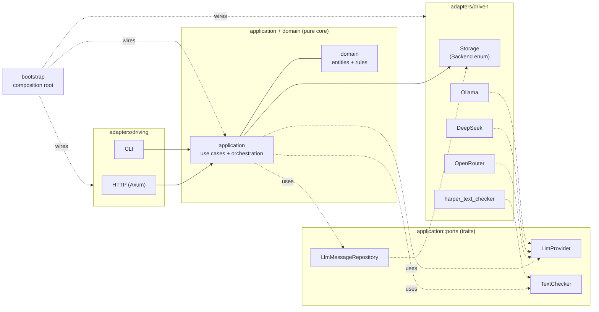

## Why hexagonal

The engine is organised around one rule: **domain and application code never import an adapter**. The rule buys two things and costs one.

It buys testability. Domain logic runs without an HTTP server, without SQLite, without an LLM endpoint. The persistence seam and the LLM seam are traits the application core owns and the adapters implement; tests substitute fakes at the trait boundary without booting infrastructure.

It buys substitutability. Swapping OpenRouter for Ollama, or SQLite for an in-memory backend, is a wiring change in `bootstrap/`. No application-layer code is edited. The four LLM impls and two storage backends exist because the seam makes them cheap; without the seam, every consumer would carry its own dispatch and the impls would fan out through the codebase.

It costs a fixed amount of indirection. The application layer reaches LLM, storage, and text-check through port traits; the cost is one trait declaration per seam and one impl per backend. Where only one impl exists and the consumer is not in core (the engine's storage seam, before hexagonal formalised it), the trait is rejected as phantom — the rule says you only pay for indirection where the substitution is the point.

## The shape

Dependency arrows point **inward**. `domain` imports nothing from `application` or `adapters`; `application` imports port traits only, never adapter code; `adapters` import `application::ports` to implement the traits; `bootstrap` imports everything and wires it. The direction is enforced by `arch-lint.toml` and visible at every import site.

Three port traits are accepted (`LlmProvider`, `LlmMessageRepository`, `TextChecker`); four others were considered and rejected as phantom. `Storage` is accessed directly by a small set of application-tier seams under a deliberate `arch-lint: storage-direct` exemption — the engine's persistence boundary is concrete-by-design, with `Backend` enum dispatch (SQLite / InMemory / Test) substituting for a port trait at lower cost.

## Why one process

The engine deploys as one process against one SQLite file. The `is_generating` atomic and the per-game generation registry are both process-local; two engines pointed at the same database would race on the gate and lose updates on the registry. The single-process commitment is the deployment contract — horizontal scaling is not on the table, and the architecture is free to use process-local concurrency primitives (RAII guards, atomic projections, lock-free hot paths) without paying for cross-process coordination. Restarting the engine is safe because the database is the coordination boundary: `is_generating`'s `false` transition is checked against the persisted `GenerationStatus` on the next action, and disagreement heals to `Idle`.

## Architectural commitments

A small set of guarantees follow from the shape above. Each is machine-checked or load-bearing in code; the formal enumeration lives in `docs/architecture/guardrails.md` §5 and the test references there. The architectural intent, in one line each:

- Domain purity — domain code has no `tokio`, no I/O, no HTTP types. Tested without a runtime.
- Single-process deployment — one engine, one database; the gate and registry are process-local.
- Tokio-only concurrency — `spawn_blocking` for synchronous services; no `std::thread::spawn` anywhere in `src/`.
- Lock-poison recovery — every `Mutex`/`RwLock` site recovers via `into_inner()`; a panic does not corrupt the lock.
- Generation self-healing — the registry claim/release path mutates both the atomic and the persisted status under one lock; a mid-flight panic leaves the next action with a recoverable `Idle`.
- One FreeAction at a time — overlapping actions are rejected at the HTTP boundary, matching single-player semantics.

## Document References

- [ADR-027: Hexagonal Architecture Migration](../../../docs/adr/adr-027-hexagonal-architecture-migration.md) — the accepted/rejected port table; the phantom-port heuristic; the storage-direct exemption.
- [`../reference/architecture_system.md`](../reference/architecture_system.md) — eight-tier map; dependency invariant; port inventory.
- [`../../reference/storage.md`](../../reference/storage.md) — SQLite schema and the eleven tables.
- [`./two-state-channels.md`](./two-state-channels.md) — why the engine carries two complementary generation-state signals.
- [`./rust_idioms.md`](./rust_idioms.md) — concrete services + `spawn_blocking` + settings-sharing shape that the hexagonal frame sits inside.
- [`docs/architecture/guardrails.md`](../../../docs/architecture/guardrails.md) §5 — formal enumeration of INV-001..007 with test references.