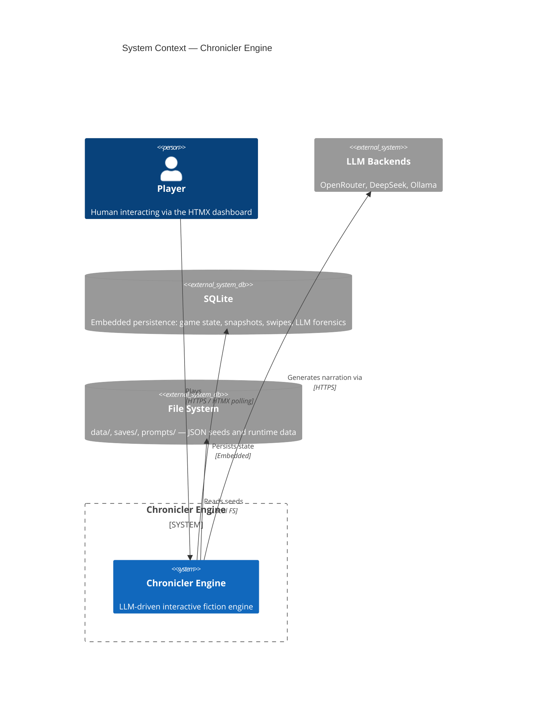
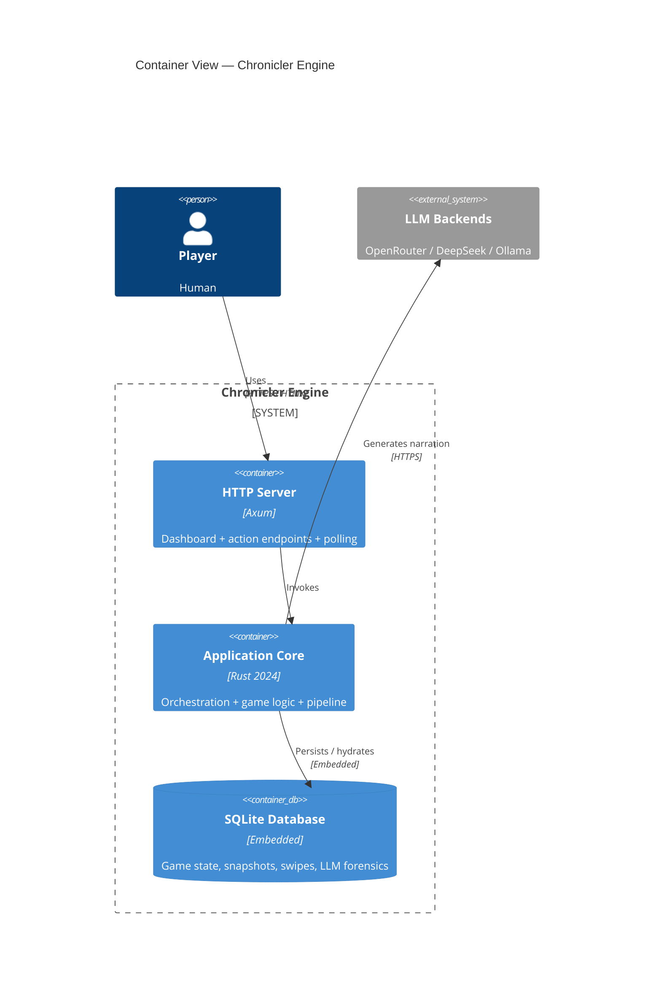
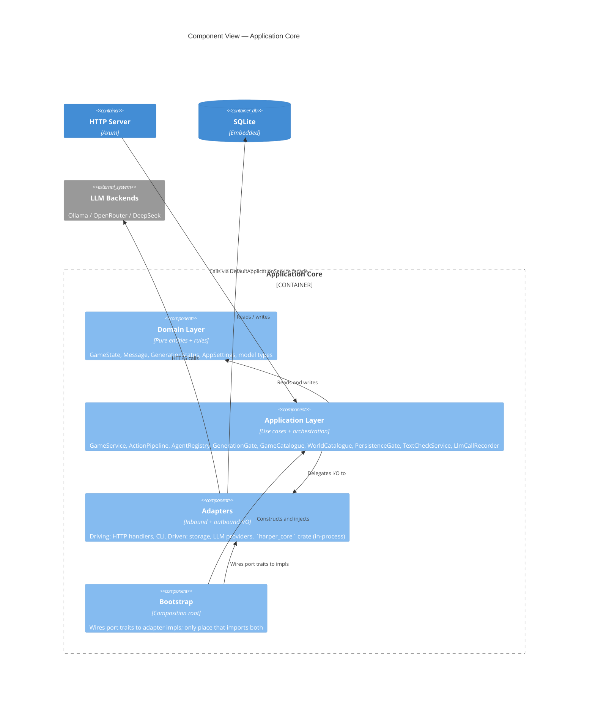
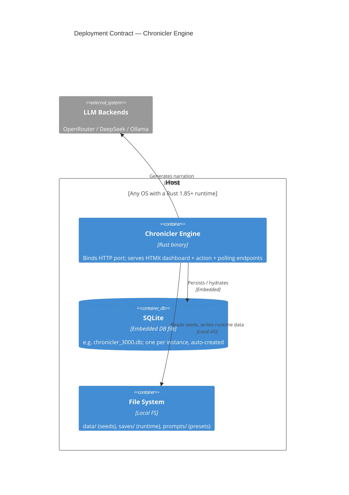

> **Diátaxis mode:** Explanation. This document is *understanding-oriented*: it shows how the Chronicler Engine is structured and why, and lays out the quality guarantees the architecture makes. It does not specify column types, phase transitions, or API contracts — those live in [`../../reference/`](../../reference/) and [`../../../docs/system/`](../../../docs/system/). The problem it solves for the reader is *understanding*: how the pieces fit together, what the system promises, and which tradeoffs those promises encode.

## Structure

This document follows the arc52 selective subset: §3 Context & Scope, §5 Building Block View, §7 Deployment View, §10 Quality Requirements.

---

## §3 Context & Scope

The Chronicler Engine is a single-process Rust application that turns player input into LLM-generated narrative, persists state, and renders an HTMX dashboard. It does not own the LLM, the database engine, or the grammar checker — it orchestrates them.

### Out of scope for this overview

The following exist in the broader workspace but are not part of the Chronicler Engine's contract:

- **Ollama runtime.** A consumed external system; the engine treats it as an HTTPS endpoint.
- **Browser rendering.** The dashboard is rendered server-side; the engine owns the templates, not the DOM.
- **Other AI-stack containers** in the workspace (Open Notebook, SurrealDB, Suwayomi, Paperless, Stable Diffusion). They share the Docker network topology but are not part of the engine's runtime contract — see §7.

---

## §5 Building Block View

The engine has four containers at the L2 level, and four cooperating layers inside the application core at L3.

### L2 — Container view

The four containers are the L2 vocabulary. The HTTP server owns the wire protocol and template rendering; the application core owns everything else.

### L3 — Component view (inside Application Core)

#### The four layers

- **Domain Layer** — `src/domain/`. Pure data and rules. No I/O, no port imports. This is the only layer the engine guarantees will not depend on anything else.
- **Application Layer** — `src/application/`. Use cases and orchestration. Owns port trait definitions under `application/ports/`. Constructs `ActionPipeline`, `GenerationGate`, `GameService`, `AgentRegistry`. Reaches `Storage` only at the explicit persistence boundary.
- **Adapters** — `src/adapters/`. Two sub-trees: `driving/` (HTTP, CLI) implements inbound port-shaped surfaces; `driven/` (storage, LLM providers, text-check via the `harper_core` crate) implements the port traits owned by application.
- **Bootstrap** — `src/bootstrap/`. Composition root. The only module allowed to import both port traits and adapter impls. Wires everything together at startup.

The dependency invariant is the load-bearing rule: `domain` + `application` depend on port traits only; adapters implement port traits; only `bootstrap` imports both. The existing 8-tier layout (`model`, `engine`, `application`, `adapters/driven`, `adapters/driving`, `bootstrap`, `settings`, `test_support`) is a file-tree expression of this rule.

---

## §7 Deployment View

The engine's deployment contract ends at its process boundary: what the process binds, reads, and calls out to. Surrounding orchestration — Caddy, Docker, the `no-internet` network, sibling AI-stack containers — is workspace-level topology, out of scope for the engine's own docs (see the map's Out-of-scope section). This section describes only what the engine process itself needs to run.

- **HTTP port.** The engine binds a single HTTP port (configurable) and serves the dashboard, action, and polling endpoints. TLS termination, reverse proxying, and port mapping are workspace-operator concerns, not the engine's.
- **SQLite database.** One file per instance (e.g. `chronicler_3000.db`), created automatically on first access.
- **File system.** Reads JSON seeds from `data/`, writes runtime data to `saves/`, reads and writes prompt presets to `prompts/`.
- **Outbound LLM calls.** HTTPS to the configured backend (OpenRouter, DeepSeek, or Ollama). The endpoint URL is configurable; the engine does not own the LLM service.
- **In-process text check.** The `harper_core` crate is linked directly into the engine binary; text checking is a function call, not a network hop. No separate service or outbound HTTPS required.

**Single-process assumption.** The engine assumes it is the only process against its SQLite database. The `is_generating` atomic flag is process-local; multi-process deployments against a shared database are not supported.

---

## §10 Quality Requirements

This section lists the cross-cutting quality attributes the architecture makes explicit. Each attribute is named, the guarantee is stated, and the load-bearing decision or invariant is cited. The mechanism docs (how each guarantee is implemented) live in [`architecture/guardrails.md`](../../../docs/architecture/guardrails.md) and the relevant ADRs.

### Reliability

| Attribute                          | Guarantee                                                                                                                | Source of truth                                          |
|------------------------------------|--------------------------------------------------------------------------------------------------------------------------|----------------------------------------------------------|
| Self-healing after panic           | Generation status returns to `Idle` on the next action even if the previous process exited mid-flight.                   | INV-001.                                                 |
| Stale-state recovery               | If `is_generating` is `false` but persisted status is still `Generating`, the per-game registry slot is cleared on the next action. | INV-001.                                                 |
| Lock-poison recovery               | Every `Mutex` / `RwLock` site recovers from poison via `into_inner()` — no panic propagation from lock poisoning.        | INV-005.                                                 |
| Dual-source consistency            | The atomic `is_generating` cache and the persisted `GenerationStatus` cannot drift: the registry claim/release path mutates both representations under the same write-lock scope. | INV-001.                                                 |
| No double-spawn race               | Only one `FreeAction` generation in flight at a time; the server rejects overlaps.                                       | INV-004b.                                                |

### Performance

| Attribute                          | Guarantee                                                                                                                | Source of truth                                          |
|------------------------------------|--------------------------------------------------------------------------------------------------------------------------|----------------------------------------------------------|
| Hot poll path                     | The HTTP poll endpoint reads the atomic `is_generating` directly; no storage round-trip per poll.                        | INV-001.                                                 |
| LLM HTTP timeout bounded           | The LLM transport enforces a 180-second HTTP timeout. There is no backend-level cancellation token.                      | INV-004.                                                 |
| One FreeAction at a time           | Long-running LLM calls do not queue — overlapping actions are rejected, matching single-player semantics.                | INV-004b.                                                |
| No blocking on the Axum event loop | Synchronous services (`GameService`, `ActionPipeline`) run inside `tokio::task::spawn_blocking`; HTTP handlers return before the LLM call begins. | INV-006, INV-007.                                        |
| Settings reload is bounded         | Connection changes require a server restart; only `max_context_tokens` is read dynamically. No business-logic layer reloads settings from disk after bootstrap. | `architecture/system.md` §Reload rules.                  |

### Concurrency

| Attribute                          | Guarantee                                                                                                                | Source of truth                                          |
|------------------------------------|--------------------------------------------------------------------------------------------------------------------------|----------------------------------------------------------|
| Tokio-only concurrency             | All concurrent work runs on the tokio runtime. No `std::thread::spawn` or `std::thread::sleep` in production code.        | INV-003.                                                 |
| Cancellable long-running work      | Generation is cancellable at phase boundaries (post-narration, pre-trigger, post-trigger) via the in-phase α-check on `current_game_id`. | INV-004.                                                 |
| Atomic cache single-writer rule    | Only the registry claim/release path mutates the `Arc<AtomicBool>` projection's `true` transition. `GenerationGuard::Drop` mutates the `false` transition only. All other code paths treat the atomic as read-only. | INV-001.                                                 |
| Shutdown gate at HTTP boundary     | `is_shutting_down()` is checked at the HTTP entry boundary only — never inside phase functions, preserving phase purity. | `architecture/rust_technical.md` §CancellationToken.     |
| Pipeline isolation                 | Phases operate on `GameState`, not on runtime signals. The pipeline does not see the shutdown gate; it sees only the in-phase α-check. | INV-002.                                                 |

---

## Document References

- [ADR-010: Concurrency and Generation Gate Model](../../../docs/adr/adr-010-concurrency-generation-gate.md) — tokio migration + `AtomicBool` generation gate + RAII guard.
- [ADR-014: Action Pipeline Architecture](../../../docs/adr/adr-014-action-pipeline.md) — phase-based pipeline; `PipelineRun` borrow structure.
- [ADR-027: Hexagonal Architecture Migration](../../../docs/adr/adr-027-hexagonal-architecture-migration.md) — dependency invariant; port ownership; storage direct-access exemption.
- [ADR-030: `is_generating` Dual-Source Invariant](../../../docs/adr/adr-030-is-generating-invariant.md) — single-writer rule; lock-order fix; property-test verification.
- [ADR-032: PhaseError](../../../docs/adr/adr-032-phaseerror.md) — errors-only enum; orchestrator seam consumption.
- [`architecture/guardrails.md`](../../../docs/architecture/guardrails.md) — INV-001 through INV-007 enumerated; test references.
- [`architecture/rust_technical.md`](../../../docs/architecture/rust_technical.md) — cross-cutting Rust idioms referenced by §10.
- [`architecture/system.md`](../../../docs/architecture/system.md) — 8-tier tier map; dependency invariant; port inventory.
- [`../../reference/data_layer.md`](../../reference/data_layer.md) — SQLite schema; the eleven tables and their relationships.
- [`../../explanation/two-state-channels.md`](../../explanation/two-state-channels.md) — why the engine carries two complementary generation-state signals rather than one.
