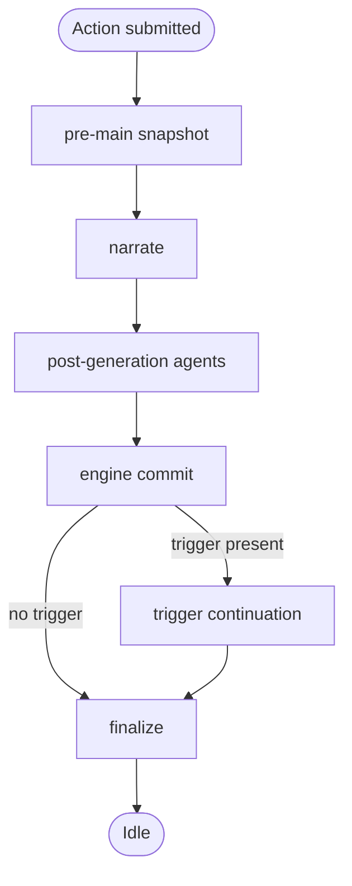

> **Diátaxis mode:** Reference. This document describes the FreeAction lifecycle as it is: the phase flow, the error contract, and the cancellation guards that bound it. The problem it solves for the reader is *look-up*: when a generation is in flight, which phase runs next, which errors surface, and which guards reject stale work. Function-level detail lives in `src/application/action_pipeline/`.

## Overview

The FreeAction lifecycle runs a fixed sequence of phases — pre-snapshot, narrate, post-generation agents, engine commit, trigger continuation, finalize — inside a `spawn_blocking` task. The sequence is shared by the normal action flow and the retry flows. All phases run synchronously inside one task.

## Phase Flow

The flow is unconditional: every action runs through the same phases. The branch at `engine commit` is the only divergence, and it depends on whether the previous phase stored a `last_trigger` reference on `NarrativeState`. Phases run synchronously and the engine commit must complete before the trigger continuation can read `state.narrative.history()`.

## Error Contract

Pipeline errors funnel through one observation channel: `state.narrative.input_buffer.status`. A phase that fails sets `GenerationStatus::Error(msg)` before returning. The UI observes the error through polling. The orchestrator consumes the phase failure and continues toward the finalize phase.

Only `PhaseError::Cancelled` propagates out of the orchestrator. Every other variant is consumed at the orchestrator seam: the orchestrator sets `GenerationStatus::Error`, persists via the finalize path, and returns `Ok(())`. `PhaseError` is errors-only — success is `Ok(())`.

| Variant | Contract | Recovery |
|---------|----------|----------|
| `Cancelled` | Mismatch between the started game and the active game at a phase boundary. | Cancellation handler resets status to `Idle`, persists, returns the variant. |
| `NarratorFailed` | The narrate call failed (missing room, empty response, LLM transport error). | Orchestrator sets `GenerationStatus::Error`, persists via the finalize path, returns `Ok(())`. |
| `PersistFailed` | A snapshot persist failed at one of four checkpoints (pre-main, pre-event, post-trigger, post-engine); the variant carries a label naming the site and the underlying source error. | Same as `NarratorFailed`. |
| `FetchFailed` | Event-retry precondition: world-bundle load (game, world, persona lookup) failed. Precedes the LLM call. | Same as `NarratorFailed`. |
| `TriggerMissing` | Event-retry precondition: `state.narrative.last_trigger` is absent. | Same as `NarratorFailed`. |
| `SnapshotMissing` | A snapshot expected at this phase was absent from storage. | Same as `NarratorFailed`. |

**Error persistence across finalize.** The finalize phase resets status to `Idle` unless the status is already `Error`. Because every recovery path sets `Error` before calling finalize, the error persists. The UI never observes a stuck `Generating` after the pipeline returns.

## Cancellation

Two independent mechanisms guard against in-flight generation drift. Both produce the `PhaseError::Cancelled` variant; the cancellation handler consumes it by resetting status to `Idle`, persisting, and returning.

**In-phase α-check.** Compares the game id captured when generation started against the current active game id. A mismatch produces `Cancelled`. Three sites:

- After the narrate call returns; before the message is added to history.
- At the start of trigger continuation; before the pre-event snapshot is persisted.
- After the trigger LLM call returns; before commit.

A reset, game switch, or game deletion running while a generation is in flight causes the stale result to be rejected at the next boundary. Snapshot persistence keys by the storage atomic's current game id, so up to one phase of stale work may persist under the new game; the next α-check sees the mismatch and aborts.

**Pre-spawn shutdown gate.** Checks whether the application is shutting down at the HTTP entry boundary only — retry handlers, retrigger handlers, and the process-action handler. When the gate is set, generation does not start; phases do not see this check.

**GenerationGuard::Drop.** Releases the registry slot if the caller still owns it (no-op if superseded by a younger generation). It carries both `game_id` and `generation_id`; on `Drop`, it verifies ownership before mutating the registry or the atomic projection. Stale cleanup from an older generation cannot clobber a newer generation's slot.

## Retry

Both retry paths re-enter the pipeline without duplicating phase logic.

- **Main retry** re-enters from action receipt. Soft-deletes messages after the anchor, preserves the old narration as a swipe, and re-runs narrate + post-generation agents + trigger evaluation + continuation.
- **Event retry** re-runs the trigger continuation against the restored snapshot, then re-runs the post-event quantifier from the new continuation text. Does not rerun main narration or the main post-generation pass.
- **Anchor** is the message whose snapshot the retry restores. The target message is temporarily removed and re-inserted after engine commit and before trigger continuation, so the cycle can iterate cleanly.

Retry errors split into two paths. Postcondition failures returned from a retry phase run through the orchestrator's finalize seam, like the standard action path. Precondition failures (missing anchor, snapshot lookup failure, load errors, no input) persist `Error` directly and rely on the next action's heal-stale-state path to reset status — they skip finalize.

## Document References

- [ADR-014: Action Pipeline Architecture](../../docs/adr/adr-014-action-pipeline.md) — original phase-based pipeline design + borrow structure.
- [ADR-027: Hexagonal Architecture Migration](../../docs/adr/adr-027-hexagonal-architecture-migration.md) — pipeline lives in `application/`; `ActionPipelineBackend` trait collapsed into direct fields.
- [ADR-032: PhaseError](../../docs/adr/adr-032-phaseerror.md) — error variant handling and the `Ok(())`-as-success contract.
- [ADR-010: Concurrency and Generation Gate Model](../../docs/adr/adr-010-concurrency-generation-gate.md) — `spawn_blocking` offload rationale and the `GenerationGuard` RAII panic-safety guarantee.
- [ADR-030: is_generating Dual-Source Invariant](../../docs/adr/adr-030-is-generating-invariant.md) — per-game registry + atomic projection contract that the cancellation guards rely on.
- [`./game_flow.md`](./game_flow.md) — phase table + status display + retry flow.
