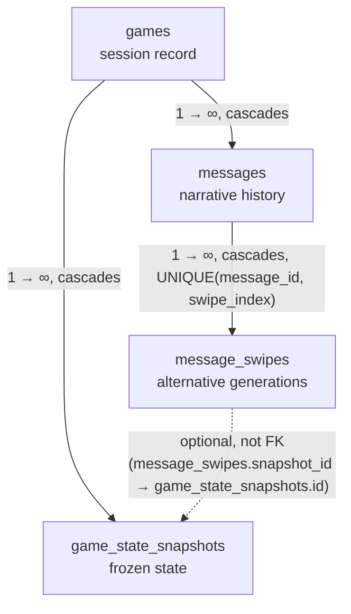
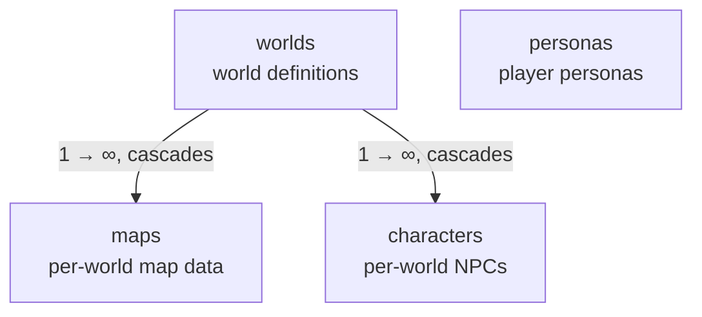
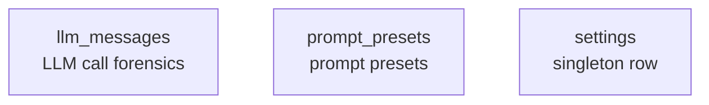

> **Diátaxis mode:** Reference. This document describes the structure of the Chronicler Engine's persistent data layer as it is: the tables that exist, the relationships between them, and the load-bearing invariants. The problem it solves for the reader is *look-up* and *orientation* — what tables exist, how they relate, where to find the schema. Column-level DDL is **not** restated here; it lives in `src/adapters/driven/storage/db.rs` and is the authoritative source. Restating it would duplicate the code and drift.

## Overview

The Chronicler Engine persists game state to SQLite. The database is created automatically on first access and is scoped to a single file per server instance (for example `chronicler_3000.db`).

The schema has 11 tables, organized into three logical clusters:

1. **Game state** — the runtime narrative and snapshot data, rooted at `games`.
2. **World catalogue** — the static world definitions and NPCs, rooted at `worlds`.
3. **Standalone** — settings, prompt presets, and LLM call forensics; independent of any game or world.

Every game and every world row can be referred to by multiple tables; the standalone tables have no FK relationships to the rest of the schema.

## Tables

### Game state cluster

- **`games`** — top-level game session record. Every snapshot and message belongs to a game. Carries `world_key` (logical reference into `worlds.key`, no SQL FK) and `persona_key` (logical reference into `personas.key`, no SQL FK) so a game pins one world and one persona at creation time. Multiple games can exist in the same database and are switched at runtime via `set_game_id`. On first startup for a world, a new `games` row is auto-created with a generated name.
- **`game_state_snapshots`** — frozen point-in-time captures of the mutable game state. Used to load the latest state on server startup and to retry a message by loading the snapshot referenced by a message's `snapshot_id`. **Snapshot invariant:** messages are **not** stored in the snapshot JSON. They live in `messages` and are hydrated after a snapshot load. Indexed by `idx_snapshots_game_latest(game_id, created_at DESC)`.
- **`messages`** — chronological narrative history. Each row is one log entry (player input, narration, system message, dialogue). Persisted incrementally (one INSERT per new entry). There is exactly one message history per game. Soft-delete flag `is_deleted`. Indexed by `idx_messages_game_id(game_id, id)`.
- **`message_swipes`** — per-message swipe versions. Each row is one alternative generation for a message. Cascades on message delete. `UNIQUE(message_id, swipe_index)`. Carries `snapshot_id`, an optional (nullable) reference to `game_state_snapshots(id)` that is **not** declared as a SQL FK — see Relationships.

### World catalogue cluster

- **`worlds`** — world definitions. `key` is `UNIQUE` (e.g. `redmist_estate`). Carries global rules, scenarios, and default scenario as JSON columns. Root of the world catalogue: `maps` and `characters` belong to a world.
- **`maps`** — map data per world. FK to `worlds(id) ON DELETE CASCADE`. `map_data` is a JSON-serialized `MapDef`. Indexed by `idx_maps_world(world_id)`.
- **`characters`** — NPC definitions per world. FK to `worlds(id) ON DELETE CASCADE`. `UNIQUE(key, world_id)`. Carries personality, triggers, relationships, inventory as JSON columns. Indexed by `idx_characters_world(world_id)`.
- **`personas`** — player personas. `key` is `UNIQUE` (e.g. `julian`). Stands alone — no SQL FK relationships — but referenced logically by `games.persona_key`. Carries personality, scenario, example dialogue, images, inventory as JSON or text columns.

### Standalone tables

- **`llm_messages`** — forensics log of LLM API calls. **Not game-scoped** and not referenced by any other table. Used for debugging and prompt engineering. Pruned automatically with a default cap of 50 rows. Indexed by `idx_llm_messages_created_at(created_at DESC)`.
- **`prompt_presets`** — prompt preset CRUD (system, quantifier, and other preset types). `id` is `TEXT PRIMARY KEY` (e.g. `system_default`). Carries role, instructions, writing style, output format columns. `is_default` flag. Indexed by `idx_prompt_presets_type(preset_type)`.
- **`settings`** — engine settings singleton. Enforced by `CHECK (id = 1)`; exactly one row. Carries connection list, default narration/quantifier connection IDs, response length, text-check config, agent configs, and active prompt preset IDs — most as JSON columns. Updated through the settings API; not related to any game or world.

## Relationships

### Game state cluster

- **`games → game_state_snapshots`** and **`games → messages`** — solid FK edges, both `ON DELETE CASCADE`. Deleting a game removes its snapshots and messages.
- **`messages → message_swipes`** — solid FK edge, `ON DELETE CASCADE`, with `UNIQUE(message_id, swipe_index)` enforcing the swipe index per message.
- **`message_swipes.snapshot_id → game_state_snapshots.id`** — **not a SQL FK**, deliberately. Each swipe carries the snapshot of the state captured *after* the swipe was created; switching swipes restores that exact state. Declaring it as a FK would cascade snapshot deletion to swipes, which the retry semantics don't want. The relationship is load-bearing but referential integrity is the application's responsibility, not SQLite's.

### World catalogue cluster

- **`worlds → maps`** and **`worlds → characters`** — solid FK edges, both `ON DELETE CASCADE`. Deleting a world removes its maps and characters.
- **`personas`** — stands alone within this cluster, with no SQL FK to `worlds` or `characters`. It's referenced logically by `games.persona_key` (see the game state cluster's cross-cluster note below).

### Standalone tables

- **`llm_messages`**, **`prompt_presets`**, **`settings`** — no FK edges to anything. Truly standalone. `settings` is a singleton row (`CHECK (id = 1)`); `llm_messages` is pruned automatically (default cap: 50 rows); `prompt_presets` uses `TEXT PRIMARY KEY` IDs.

### Cross-cluster logical references (no SQL FKs)

Several relationships between clusters are load-bearing but are **not** SQL foreign keys — either because the target table predates the column (added in a later migration) or because declaring the FK would impose a CASCADE that the application semantics don't want. Integrity for these is the application's responsibility:

- **`games.world_key → worlds.key`** (game state → world catalogue) — pins the world a game was created with. Added in migration v12.
- **`games.persona_key → personas.key`** (game state → world catalogue) — pins the persona a game was created with. Added in migration v13; see ADR-026 for why persona binding moved from world to game.
- **`message_swipes.snapshot_id → game_state_snapshots.id`** (within the game state cluster, shown above) — non-FK so snapshot deletion doesn't cascade to swipes.

## Migrations

Migrations run on first access via `run_migrations` in `src/adapters/driven/storage/db.rs`, gated by `PRAGMA user_version`. Column-level DDL — including `ALTER TABLE` adjustments in later migrations — lives in that file; this reference does not restate it. If you need the exact column list for a table, read `db.rs`.

## Document References

- [ADR-006: Quantifier-Driven Game Systems](../../docs/adr/adr-006-quantifier-systems.md) — quantifier detects NPCs + movement after narration.
- [ADR-008: SQLite Snapshot Persistence](../../docs/adr/adr-008-sqlite-snapshot-persistence.md) — `GameStateSnapshot` table + `persist_snapshot_or_err` pattern; rationale for the non-FK `snapshot_id`.
- [ADR-017: Message Swipes](../../docs/adr/adr-017-message-swipes.md) — swipe semantics for retry of the last AI message.
- [ADR-025: Multi-World Data Foundation](../../docs/adr/adr-025-multi-world-data-foundation.md) — `world_key` logical reference; worlds/maps/characters cluster.
- [ADR-026: Relocate Persona Binding from World to Game](../../docs/adr/adr-026-persona-relocation-to-game.md) — `persona_key` logical reference; why persona binding moved from world to game.
- [ADR-027: Hexagonal Architecture Migration](../../docs/adr/adr-027-hexagonal-architecture-migration.md) — storage direct-access exemption at `game_service.rs` and `agents/registry.rs`.
