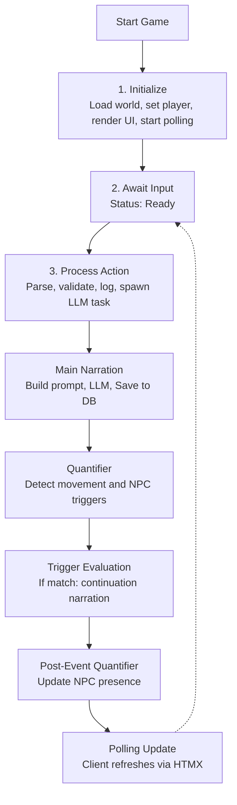
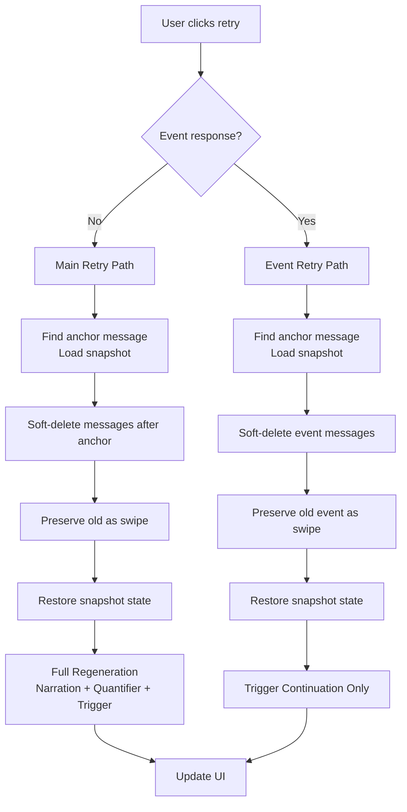

> **Diátaxis mode:** Reference. This document describes the runtime control flow of a FreeAction as it is: phase sequence, status phases, retry branching, and the unified error model. The problem it solves for the reader is *look-up*: when the engine is in state X, what happens next.

## Overview

The runtime control flow: the phase sequence from player input through LLM generation, quantification, and trigger evaluation, back to a UI update.

## The Game Flow

## Granular Status Phases

During LLM processing, the UI displays granular status phases instead of a single "Thinking..." message.

| Phase              | Display Text                  | Endpoint Value        | When Active                                                                                       |
|--------------------|-------------------------------|-----------------------|---------------------------------------------------------------------------------------------------|
| `Narrating`        | "Generating narration..."     | `narrating`           | Main LLM narration; narration is saved to DB before the quantifier runs.                          |
| `Quantifying`      | "Quantifying scene..."        | `quantifying`         | Post-narration quantifier analysis; narration is visible, metadata pending.                       |
| `GeneratingEvent`  | "Generating event..."         | `generating-event`    | Trigger continuation narration; fires after trigger evaluation.                                    |

- The persisted status field (`Idle` / `Generating` / `Error`) drives UI disable state for the polled render.
- The frontend maps endpoint values (`narrating`, `quantifying`, `generating-event`) to human-readable text.
- An optimistic "Thinking..." is shown immediately on form submit, before the first poll response.

## Retry Flow

Retrying a response (via the right-swipe arrow on the last message) branches on whether the last AI-generated content was a **main narration** or a **trigger event continuation**:

**Retry semantics:**

- **Main retry** soft-deletes messages after the anchor input and re-runs phases 4 → 4.5 → 5 → 5.5 (full regeneration). Old narration is preserved as a swipe. On success, prior swipes migrate to the new message and soft-deletes are purged; on failure, soft-deletes are restored.
- **Event retry** regenerates only the continuation text from the anchor snapshot using stored `StoredTriggerContext` prompts. Does not re-run main narration or quantification.
- **Retrigger Event** (on a narration swipe with `last_trigger` and no following event messages) runs the trigger continuation + post-trigger NPC reconciliation + finalize phases from the restored snapshot state without re-running main narration.
- Snapshots are standalone — no `base_snapshot_id` chain. Each message and each swipe carries its own `snapshot_id` of the state captured after it was created; switching swipes restores that exact state.
- If the anchor message has no `snapshot_id` or the snapshot is missing, retry fails gracefully.

## Error Model

Pipeline errors (LLM failures, empty responses, room-not-found, etc.) follow a unified contract:

- **Phase failure** is signaled via the `GenerationStatus` field on `GameState`. The caller checks `status.error_message()` to decide whether to continue to later phases or skip straight to the finalize phase. The pipeline's `Err` return is reserved for cancellation.
- **Cancellation** propagates as `Err(PhaseError::Cancelled)` to external callers (the action handler and the message-editing HTTP path). Every other `PhaseError` variant is consumed at the orchestrator seam: the orchestrator sets `GenerationStatus::Error`, persists, and returns `Ok(())`. `PhaseError` is errors-only; success is `Ok(())`.
- **Stale-Generating recovery.** If `is_generating` is `false` but persisted status is still `Generating` (e.g. after a panic), the next action resets status to `Idle` and clears the per-game registry slot. `GenerationGuard::Drop` releases the registry slot if it still owns it (no-op if superseded by a younger generation) and stores the projection atomic to `false` only when no other game's slot is generating.

## Document References

- [ADR-006: Quantifier-Driven Game Systems](../../docs/adr/adr-006-quantifier-systems.md) — quantifier detects NPCs + movement after narration.
- [ADR-008: SQLite Snapshot Persistence](../../docs/adr/adr-008-sqlite-snapshot-persistence.md) — `GameStateSnapshot` table + `persist_snapshot_or_err` pattern.
- [ADR-010: Concurrency and Generation Gate Model](../../docs/adr/adr-010-concurrency-generation-gate.md) — `is_generating` dual-source invariant + `GenerationGuard`.
- [ADR-017: Message Swipes](../../docs/adr/adr-017-message-swipes.md) — swipe semantics for retry of the last AI message.
- [`../explanation/two-state-channels.md`](../explanation/two-state-channels.md) — rationale for the dual-channel generation state.
- [`system/prompt_system.md`](../../docs/system/prompt_system.md) — layered prompt composition + per-layer token budget.
- [`system/llm_processing.md`](../../docs/system/llm_processing.md) — LLM call logging + agent registry contracts.
- [`system/triggers.md`](../../docs/system/triggers.md) — trigger evaluation rules + `NpcEncounterLog`.
- [`system/dashboard.md`](../../docs/system/dashboard.md) — polling endpoints + status display.
- [`system/narration_engine.md`](../../docs/system/narration_engine.md) — Game Master role + behavioral constraints.
