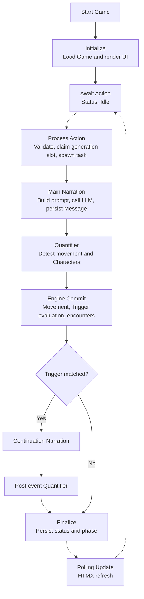
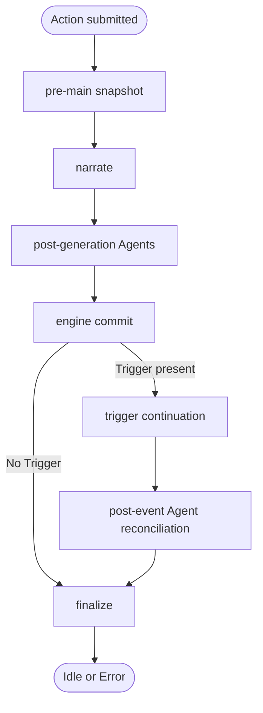

## Overview

A FreeAction moves from player input through narration, scene quantification, engine commit, optional trigger continuation, and finalization. Polling projects persisted status and phase changes to the UI.

## Granular Status Phases

`GenerationStatus` carries the coarse state (`Idle`, `Generating`, or `Error`). While it is `Generating`, `GenerationPhase` supplies the UI-facing stage.

| Phase | Display text | Endpoint value | Active work |
|---|---|---|---|
| `Narrating` | "Generating narration..." | `narrating` | Main narration; the resulting Message is persisted before quantification. |
| `Quantifying` | "Quantifying scene..." | `quantifying` | Post-narration or post-event scene analysis. |
| `GeneratingEvent` | "Generating event..." | `generating-event` | Trigger continuation narration. |

The action response immediately projects "Thinking..."; subsequent polls replace it with the persisted phase display. Finalization returns the phase to its default and changes status to `Idle` unless an error is already present.

## Phase Flow

Normal Actions and main retries run the same success-path phases. Event retry and retrigger enter at trigger continuation.

The narrate phase adds and persists the main narration before post-generation Agents run. Engine commit resolves movement, updates the current Character set, evaluates Triggers, and applies encounter transitions. A matched Trigger produces stored continuation context; continuation generation runs outside state mutation, then commits its Message before post-event reconciliation.

Phase failures route to finalization. Cancellation exits through the separate contract below.

## Cancellation

`GameService` and the Action Pipeline are synchronous. HTTP entry points offload the work with `tokio::task::spawn_blocking`, so one blocking task owns the synchronous pipeline run.

`GenerationGate` owns the per-Game slot registry and an `Arc<AtomicBool>` projection of whether any generation is active. Claiming a slot records a generation id, flips the projection, persists the initial `Generating` state, and then spawns the task. A claimed slot rejects a concurrent Action for the same Game. Shutdown checks bound task entry: retry and retrigger check before spawning, and every spawned closure checks again before running pipeline work.

The in-phase **α-check** captures the active Game id when generation starts and compares it with the current active Game id at three stage boundaries:

1. After main narration returns, before its Message enters history.
2. At trigger-continuation entry, before the pre-event snapshot.
3. After the trigger LLM call returns, before continuation commit.

A Game switch, reset, or deletion invalidates stale work at the next boundary. Mismatch returns `PhaseError::Cancelled`; its handler resets `GenerationStatus` to `Idle`, clears the phase, and persists the state.

`GenerationGuard::Drop` releases the per-Game slot on normal return or panic. Guard ownership carries both `game_id` and `generation_id`; drop mutates the registry only while both still identify the claimed slot. Cleanup from an older generation therefore leaves a newer owner's slot and atomic projection intact.

## Trigger Evaluation

Trigger evaluation runs after main narration and post-generation quantification, inside engine commit. At most the first matching Trigger produces a continuation for an Action.

1. Player Action enters the FreeAction pipeline.
2. Main narration is generated and persisted.
3. Quantifier derives current Character ids and an optional movement destination from the narrative outcome.
4. Engine iterates Character Triggers. A Trigger with a room id is eligible in that room; an omitted room id makes it globally eligible.
5. Requirement comparison reads the Character's current `times_met`. Previously fired non-repeatable Triggers are ineligible.
6. First eligible Trigger is selected. Repeatable Triggers remain eligible on later Actions; non-repeatable Triggers are marked during continuation commit.
7. Stored Trigger context supplies the continuation prompt. The continuation LLM call runs after engine commit.
8. Trigger name becomes event-header metadata on the continuation Message.
9. Post-event Quantifier reconciles Characters introduced or removed by continuation text.

### `times_met`

`times_met` counts Character encounter entries. Entering after absence increments it; remaining with the same Character leaves it unchanged. Leaving clears current-meeting state so a later re-entry increments again.

Trigger requirements observe the pre-increment value. A first-encounter equality check therefore sees `0`; after Trigger selection, encounter transitions advance the value to `1`. Less-than and greater-than-or-equal comparisons read that same pre-increment value.

### INV-002 Mutation Order

State mutation preserves this order:

1. Main narration enters history.
2. Movement resolves, then current Characters resolve against the destination.
3. Trigger requirements read the existing encounter log.
4. Character enter/leave events update `currently_meeting` and `times_met`.
5. Trigger context is stored, continuation generation runs, and successful continuation commits event metadata.
6. Post-event Character reconciliation applies after continuation commit.

INV-002 depends on Trigger evaluation preceding encounter increments. Reversing those two operations suppresses first-encounter Triggers; moving continuation commit earlier deprives it of committed narration or resolved room context.

## Retry Flow

All retry forms restore Message-aligned Snapshot state before generation.

| Branch | Entry and scope | Result |
|---|---|---|
| Main retry | Restore the last retry anchor, truncate history to it, then re-enter the full phase flow with the anchor's player Action. | New main narration becomes a Swipe on the prior Message; quantification and Trigger evaluation run again. |
| Event retry | Restore the event anchor and reuse `StoredTriggerContext`. | Only continuation generation and post-event reconciliation rerun; main narration and its first quantifier pass remain unchanged. |
| Retrigger | Start from a narration carrying stored Trigger context and no following event Message. | Continuation generation, post-event reconciliation, and finalization run from restored state. |

Each Message and Swipe points to the Snapshot representing its resulting state. Missing anchors, missing Snapshots, world-bundle fetch failures, or absent Trigger context persist `GenerationStatus::Error`. Cancellation follows the common cancellation contract.

## Movement Branch

Movement is a branch of post-generation quantification:

1. Movement occurs when the Quantifier derives a destination from the narrator's latest outcome.
2. Destination resolution first matches the static World map.
3. A static match updates `movement.current_room_id`. An unmatched destination creates a dynamic pseudo-room, stores it in `movement.dynamic_rooms`, and makes it current.
4. Engine resolves current Characters and evaluates room-scoped Triggers against the destination.
5. Movement detection runs on main narration; the post-event Quantifier reconciles Character presence.

Starting room comes from the active World's Scenario and initializes `movement.current_room_id`. Dynamic rooms travel with mutable movement state in Snapshots.

## Text-Check Branch

Text checking branches before Action dispatch and uses the `TextChecker` port with the in-process `HarperTextChecker` adapter.

- **Pre-flight entry.** Runs when text-check mode is enabled and auto-check is set. No issues dispatches the original Action. Issues render a preview where the player chooses corrected text, original text, or cancellation.
- **Manual entry.** Runs on explicit UI request whenever text-check mode is enabled and returns the same preview shape.
- **Settings lifetime.** Mode and auto-check are read per request. Ignored words are merged into Harper's local dictionary when the service is constructed.
- **Fail-open boundary.** A pre-flight checker failure is logged and dispatches the original Action. Manual checker failures surface as an error response because no Action dispatch is pending.
- **Player-consent invariant.** The submitted command remains unchanged until the player's explicit preview choice selects original or corrected text.

Only player command text enters the checker. Result DTO and issue categories are defined by the port in `src/application/ports/text_checker.rs`.

## Document References

- [ADR-006: Quantifier-Driven Game Systems](../../docs/adr/adr-006-quantifier-systems.md) — post-generation scene analysis, movement detection, and Trigger evaluation.
- [ADR-008: SQLite Snapshot Persistence](../../docs/adr/adr-008-sqlite-snapshot-persistence.md) — Message-aligned Snapshot persistence used by retry.
- [ADR-010: Concurrency and Generation Gate Model](../../docs/adr/adr-010-concurrency-generation-gate.md) — `spawn_blocking`, generation-gate, and cooperative-cancellation decision.
- [ADR-014: Action Pipeline Architecture](../../docs/adr/adr-014-action-pipeline.md) — phase-based Action Pipeline and mutation-order decision.
- [ADR-017: Message Swipes](../../docs/adr/adr-017-message-swipes.md) — alternate-generation and retry semantics.
- [ADR-027: Hexagonal Architecture Migration](../../docs/adr/adr-027-hexagonal-architecture-migration.md) — application ownership of Action Pipeline orchestration.
- [ADR-030: `is_generating` Dual-Source Invariant](../../docs/adr/adr-030-is-generating-invariant.md) — per-Game registry and atomic-projection contract.
- [ADR-032: PhaseError](../../docs/adr/adr-032-phaseerror.md) — phase error vocabulary and orchestrator disposition.
- [`../explanation/two-state-channels.md`](../explanation/two-state-channels.md) — rationale for persisted generation status and in-memory generation ownership.
- [`./narrative/narration_system.md`](./narrative/narration_system.md) — narrator configuration, backend adapters, prompt-side role, response handling, and LLM call forensics.
