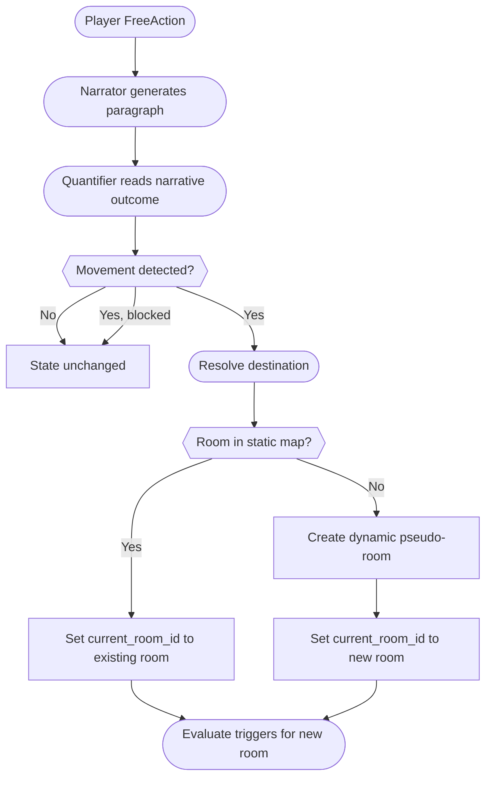

> **Diátaxis mode:** Reference. Player movement through the world as it is: quantifier-driven detection, destination resolution, the starting-room source, and the dynamic-pseudo-room fallback. Reader problem: *look-up* — when a player action results in movement, what happens between the narrator's output and the player's new room. Quantifier prompt shape: `./quantifier_prompt.md`; trigger evaluation after movement: `./triggers.md`.

## Overview

All player input is treated as a Free Action and sent to the narrator. Movement detection reads from the narrator's outcome, not from the player's typed input: when the narrator's output places the player in a different room, the engine resolves the destination and updates state; otherwise state stays put. Block-described narrations produce no movement regardless of player intent; unmatched destinations fall through to dynamic pseudo-rooms.

## Movement pipeline

## Destination resolution

In order:

1. **Extract.** Read `<LatestNarration>` and pull a destination room identifier. No destination → no movement.
2. **Block overrides intent.** If the narration describes the player as blocked, the player stays put regardless of typed input.
3. **Static lookup.** Destination matches against `MapDef` rooms; a hit updates `state.movement.current_room_id`.
4. **Dynamic fallback.** No match → engine creates a dynamic pseudo-room and points the player at it.

A second quantifier run after a successful transition scans only for NPC arrivals in trigger continuation narration; see `./triggers.md`.

## Starting room

Game start resolves the active scenario for the world and reads `starting_room_id` (default `"start"`) into `state.movement.current_room_id`. World/scenario/starting-room relationship: `./worlds.md`. JSON shapes: `./data_schemas.md`.

## After movement

A successful transition runs the auto-trigger phase in the destination room: trigger evaluation walks every NPC, fires the first matching trigger, and the trigger produces a continuation narration through a second LLM call. Trigger evaluation details (`times_met` increment order, `NpcEncounterLog` contract) live in `./triggers.md`.

Dynamic pseudo-rooms are created when no static-map match exists. They persist across save/load within a session and are dropped on new world load or DB reseed. At creation they carry only the destination name and the static placeholder description; exits and items are empty.

Trigger narrations skip the movement detector; only main narrations produce movement. This prevents the feedback loop where trigger content would generate movement and that movement would generate further triggers.

## Document References

- [ADR-006](../../docs/adr/adr-006-quantifier-systems.md) — quantifier choice and dynamic pseudo-room rationale.
- [`./quantifier_prompt.md`](./quantifier_prompt.md)
- [`./triggers.md`](./triggers.md)
- [`./data_schemas.md`](./data_schemas.md)
- [`./worlds.md`](./worlds.md)
