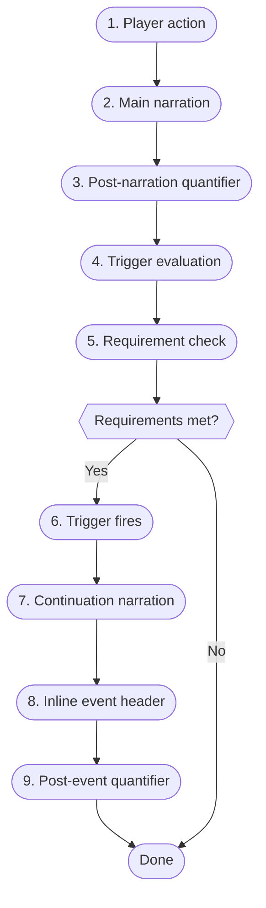

> **Diátaxis mode:** Reference. This document describes the auto-trigger and reactive encounter system as it is: the nine-step evaluation sequence, `times_met` semantics, room scoping, event headers, and the mutation order that the action pipeline must preserve. The problem it solves for the reader is *look-up*: when a trigger fires, in what order, with which counter semantics, and which state must change before the next. Trigger data shape lives in `src/domain/model/trigger.rs` and `data/worlds/*.json`.

## Overview

The auto-trigger system lets the world react to the player's presence. When a player enters a room or performs an action, the engine evaluates a set of trigger rules attached to NPCs. If requirements are met, a reactive event narration is generated. Triggers are evaluated after main narration and after the post-narration quantifier, in the engine-commit phase.

## Trigger Evaluation Sequence

These steps run after main narration and after the post-narration quantifier, in the engine-commit phase.



1. **Player action.** Player performs a FreeAction (movement, dialogue, etc.).
2. **Generate main narration.** LLM generates the main narrative response.
3. **Quantifier (post-narration).** The quantifier analyzes the generated narration to detect NPCs that appeared in it and to detect movement intent. Dynamic NPC appearances (a character emerging from shadows) are detected here.
4. **Trigger evaluation.** Every NPC in the world's NPC map is iterated, filtered by `room_id`. Triggers with `room_id: null` (or missing) are **global** — they fire anywhere. Triggers with `room_id: "some_room_id"` only fire when the player is in that room. This prevents introduction triggers from firing in the wrong location while still supporting dynamic appearances.
5. **Requirement check.** Each trigger is checked against the current `NpcEncounterLog` using `ComparisonOperator`. `TimesMet Eq 0` fires on first encounter (the counter is 0 at evaluation time). `TimesMet Lt N` fires when the counter is below `N`. `TimesMet Gte N` fires on subsequent encounters when `N ≥ 1`.
6. **Execution.** If repeatable, the trigger fires and can fire again. If non-repeatable, the trigger is marked as fired and will not re-fire.
7. **Continuation narration.** The continuation prompt is built from the trigger's `TriggerNarration` (`name` + `narration_prompt`) and the current `PromptContext`, with `narration_prompt` placed in the user message. The layered prompt pipeline is not used for continuations; the prompt is built directly from the `StoredTriggerContext` carried on `state.narrative.last_trigger`. Only the first matching trigger fires per action.
8. **Inline event header.** When a trigger fires, the engine stores the event name in `NarrativeState.pending_event`. The next `add_log` call (which adds the continuation narration) absorbs this pending metadata into `LogEntry.event_header`. The frontend renders the event header inside the same div as the continuation narration. There is no standalone event message type.
9. **Post-event quantifier (conditional).** If a trigger fired and generated continuation narration, the quantifier runs again to detect NPCs introduced by the event text and update `scene.npcs_in_area` accordingly.

## `times_met` Semantics

The `times_met` counter tracks unique encounter events with an NPC. It increments when the quantifier detects an NPC in the room/narration for the first time in that session.

| Scenario | Times Met Increments? |
|:--------|:---------------------|
| Player enters room with NPC already there | Yes — quantifier detects NPC. |
| NPC follows player to new room | Yes — quantifier detects NPC in new room. |
| NPC appears in narration while player is in room | Yes — quantifier detects NPC in narration. |
| Player stays in room with same NPC | No — already `currently_meeting`. |
| Player returns to room with same NPC | Yes — re-entry after leaving. |

The key variable is `currently_meeting`:

- Set to `true` when quantifier first detects the NPC in the current room session.
- Set to `false` when the player enters a new room (different from last room).
- `times_met` only increments when `currently_meeting` was `false`.

### Increment Order

Triggers are evaluated **before** `times_met` is incremented. The flow is:

1. Quantifier detects NPCs in narration.
2. Evaluate triggers — at this point `times_met` is still `0`, so `TimesMet Eq 0` is `true`.
3. Trigger fires.
4. Increment `times_met` (now becomes `1`).

## Trigger Requirements

| Requirement | Description |
|:-----------|:------------|
| `TimesMet` | Evaluates the `times_met` counter using `Eq`, `Lt`, or `Gte`. |
| `HasItem` | Checks player inventory for a specific item id. |

## Trigger Room Scoping

By default, triggers are global — they fire regardless of where the player is. To restrict a trigger to a specific room, the trigger carries a `room_id`. The trigger only fires when `state.movement.current_room_id == "<room_id>"`. Introduction triggers carry a `room_id`; without one they fire in the wrong location.

## Trigger Narration Fields

A `TriggerNarration` carries:

- **`name`** (required) — display name for the event. The event header uses this name before the continuation narration.
- **`narration_prompt`** (required) — the prompt sent to the LLM to generate the continuation narration.

## Event Headers

When a trigger fires and its `TriggerNarration` has a `name`, the engine inserts an event header entry into the story log before the LLM-generated narration. Event headers are visually distinct from location headers (room names) and rendered in cyan. They have no edit or retry buttons.

Example story log output:

```
─── Entrance Hall ─── 10:42
You step into the grand hall.

─── Gabriella Introduction ─── 10:43
Gabriella emerges from the shadows...
```

## Encounter State (`NpcEncounterLog`)

`NpcEncounterLog` is the per-NPC encounter record that triggers read and mutate. The log records three per-NPC fields:

- **`times_met`** — incremented on entry after leaving. Subject to the increment-order rule above.
- **`trigger_fired`** — indices of non-repeatable triggers that have already executed.
- **`currently_meeting`** — set on room entry, cleared on room exit.

The source `docs/system/character_state.md` framed this log as "the permanent records of the simulation's actors" in contrast to a "volatile `GameState`"; that permanence framing is stale and not restated here as fact. Verify the persistence contract (see Document References) before relying on it.

## Mutation Order Invariant

The action pipeline and the engine function mutate state in a strict, load-bearing order. Steps 4b and 4c happen in the application pipeline (`ActionPipeline`), not inside the engine function:

| Step | Operation | Why it must come here |
|:-----|:----------|:---------------------|
| 1 | Resolve movement (may update `movement.current_room_id`) | Room must be current before NPCs are resolved. |
| 2 | Resolve current NPCs from quantifier result | Uses updated `movement.current_room_id` from step 1. |
| 3 | Append narration to history | Narration must be in history before triggers read it. |
| 4a | Evaluate triggers + build continuation prompt | Reads history (step 3) to build the trigger continuation prompt. |
| 4b | Trigger LLM call | Runs in the action pipeline, outside the state lock. |
| 4c | Commit trigger narration | Runs in the action pipeline; re-acquires lock to add trigger logs and mark trigger fired. |
| 5 | Apply NPC encounter events (mutates `npc_encounter_log`) | `times_met` increments AFTER trigger evaluation (see Increment Order above). |

This order is load-bearing: any reordering breaks one of three contracts — first-encounter triggers fire on the right counter, trigger continuations see the prior narration, or NPC encounters reconcile after the trigger commits. If the engine function is refactored, preserve this order explicitly. Function names for each step live in `src/domain/engine/`.

## Document References

- [ADR-006: Quantifier-Driven Game Systems](../../docs/adr/adr-006-quantifier-systems.md) — quantifier detects NPCs + movement; triggers read `NpcEncounterLog`.
- [ADR-008: SQLite Snapshot Persistence](../../docs/adr/adr-008-sqlite-snapshot-persistence.md) — persistence contract for `NpcEncounterLog`; the source `character_state.md` permanence framing is stale against this ADR.
- [`./game_flow.md`](./game_flow.md) — phase pipeline where trigger evaluation sits.
- [`./agent_system.md`](./agent_system.md) — `QuantifierAgent` is the `PostGeneration` agent that drives step 3 and step 9.
- [`./action_pipeline.md`](./action_pipeline.md) — home of steps 4b and 4c in the action pipeline.
