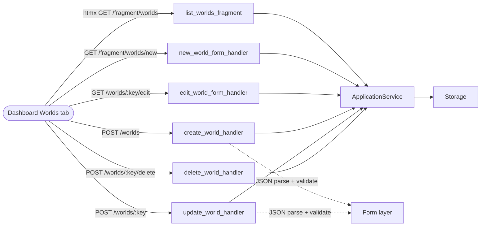

> **Diátaxis mode:** Reference. The worlds management system as it is: CRUD flow from the dashboard fragment through the application service to storage, the world-game delete dependency, the worlds tab UI, and the form validation rules. Reader problem: *look-up* — how a world is created, listed, edited, and deleted; what blocks a delete; what the form validates. JSON shapes: `./data_schemas.md`; storage internals: `./storage.md`; table structure: `./data_layer.md`.

## Overview

A world is the persistent definition of a setting plus the map structure that games run on. Multiple games can reference one world. The worlds management system is the dashboard UI plus CRUD route handlers that read/write worlds through the application service to storage.

## CRUD flow

## Routes

| Method | Path | Purpose |
|:-------|:-----|:--------|
| GET  | `/fragment/worlds`             | Render the worlds list panel |
| GET  | `/fragment/worlds/new`         | Render the new-world inline form |
| POST | `/worlds`                       | Create a new world |
| GET  | `/worlds/:key/edit`             | Render the edit-world inline form |
| POST | `/worlds/:key`                  | Update an existing world |
| POST | `/worlds/:key/delete`           | Delete a world; refused if games reference it |

## World model & relationship

A world is a runtime setting definition. JSON shapes (`WorldManifest`, `WorldCard`, `MapDef`, `Scenario`) live at `./data_schemas.md`. **Delete constraint:** a world can be deleted only when no game references it; both the handler and storage enforce this, user-displayable failures surface inline, others return HTTP status. When a world is removed, the map belonging to it is removed alongside.

## Worlds tab UI

The panel is two-state:

- **List.** "Create New World" at the top of the panel; below it, every world with name, description, game count, and edit/delete affordances. Delete asks for confirmation.
- **Form.** Inline HTMX swap replaces the list on Create/Edit. Form carries the world identity plus `map_json` and `scenarios_json` textareas. Cancel re-fetches `/fragment/worlds`.

## Validation

- **Create/Update** requires a unique key, a name, valid `map_json`, and a valid `scenarios_json`. The default scenario's `starting_room_id` must point to a room in the loaded map; bootstrap enforces this via `validate_loaded_data` (see `./startup.md`). On update, the key is read-only — the URL path is canonical.
- **Delete** requires no referencing games (see World model & relationship above).

## Document References

- [`./data_schemas.md`](./data_schemas.md) — JSON shape of `WorldManifest`, `MapDef`, `Scenario`.
- [`./data_layer.md`](./data_layer.md) — table structure for the worlds cluster.
- [`./storage.md`](./storage.md) — storage internals and the `WorldHasGames` error path.
- [`./startup.md`](./startup.md) — `validate_loaded_data`.
- [`./navigation.md`](./navigation.md) — how the active scenario and `starting_room_id` resolve the player's initial room.
- [ADR-024](../../docs/adr/adr-024-game-data-migration-to-sqlite.md), [ADR-025](../../docs/adr/adr-025-multi-world-data-foundation.md) — multi-world schema history.
