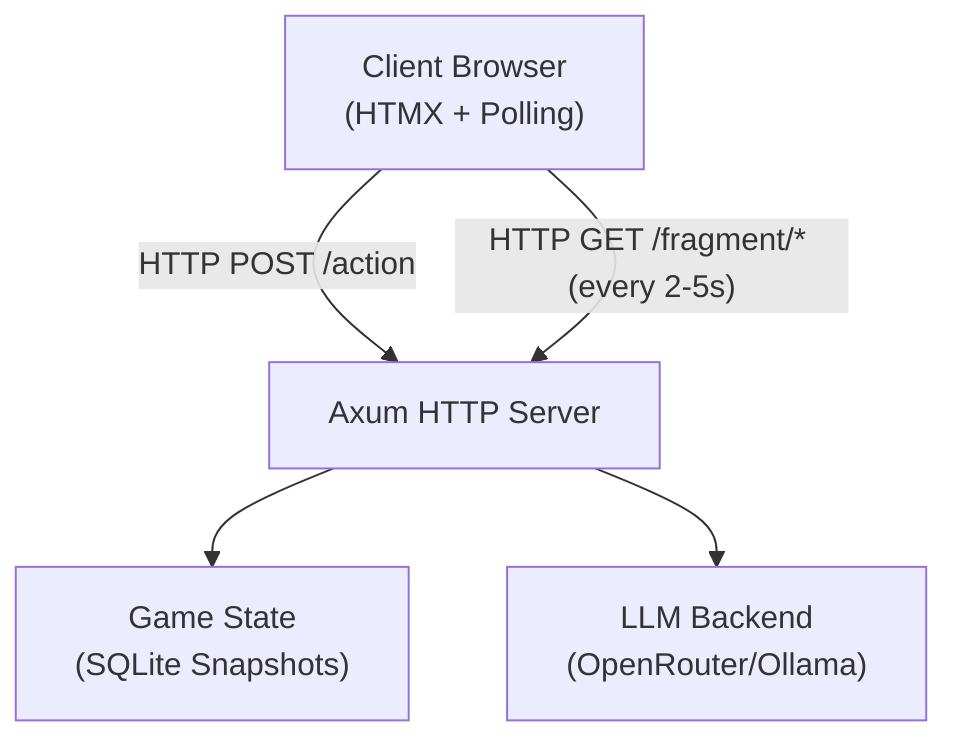

# ADR-001: HTMX Web Dashboard Architecture

**Date:** 2025-04-12
**Status:** Accepted

---

## Context

The Chronicler Engine originally used a Terminal User Interface (TUI) with Ratatui for visual display. This presented challenges:
- Terminal graphics protocols (Sixel, Kitty) had limited compatibility
- Portrait rendering was complex to implement
- Deployment required terminal emulation support
- Testing required browser automation (Playwright)

The team sought a solution that provided:
- Rich visual displays (images, portraits)
- Cross-platform compatibility
- Easier testing
- Real-time updates

---

## Decision

**Adopt HTMX web dashboard with HTTP polling for real-time updates.**

The Chronicler Engine now uses:
1. **Axum HTTP server** on port 3000
2. **HTMX** for partial page updates (fragment swapping)
3. **HTTP polling** for server→client real-time updates via `hx-trigger`
4. **WebSocket** was initially used but replaced with HTTP polling (see ADR-002)

### Architecture Components

---

## Consequences

### Positive
- Cross-platform: Works in any modern browser
- Rich visuals: CSS styling, images, portraits
- Easier testing: HTTP endpoints can be tested directly
- Real-time: HTTP polling provides updates without WebSocket/SSE complexity
- HTMX simplicity: No custom JavaScript required

### Negative
- Requires web server (more complex than CLI)
- Polling has slight latency compared to push
- Browser dependency for players

### Trade-offs
- Chose HTTP polling over SSE/WebSocket for simplicity and reliability with HTMX
- Chose HTMX over SPA (React/Vue) for simplicity and server-side rendering

---

## Related ADRs

- [ADR-002: HTTP Polling for Real-Time Updates](./adr-002-http-polling.md) - Transport layer decision
- [ADR-003: Askama Template Engine](./adr-003-askama-templates.md) - Template rendering
- [ADR-006: Quantifier-Driven Game Systems](./adr-006-quantifier-systems.md) - Quantifier-powered features

---

## History

- **2025-04-12**: Initial HTMX migration (hx_migration.md plan)
- **2026-04-19**: HTTP polling replaces WebSocket (see ADR-002)
