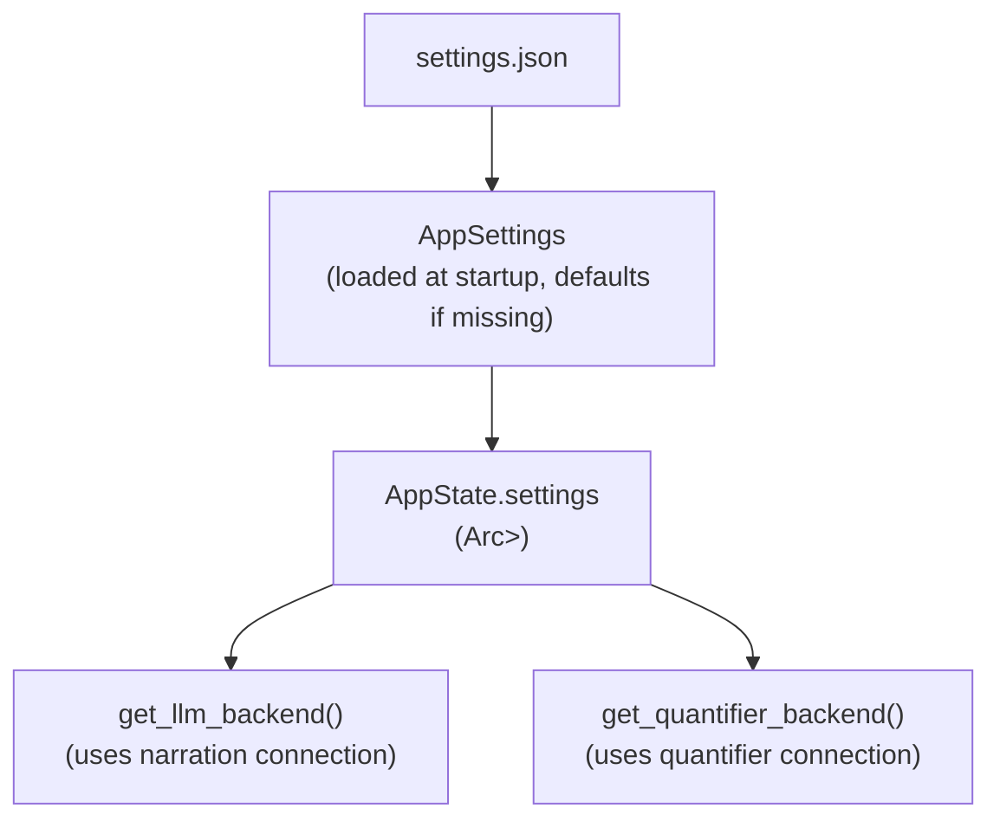

# ADR-007: Settings System Architecture

**Date:** 2026-05-01
**Updated:** 2026-05-02

> **Note:** This ADR describes the original flat settings system. It has been superseded by the **Connection Profiles** system (see implementation in `src/model/settings.rs`), which adds a `Connection` abstraction for reusable provider+model profiles. The core principles (JSON persistence, runtime mutability, HTMX UI) remain unchanged.

---

## Context

LLM backend configuration previously relied on environment variables (`LLM_BACKEND`, `LLM_MODEL`, `QUANTIFIER_MODEL`, `OPENROUTER_API_KEY`), which presented significant operational challenges:

- **Server restart required**: Any configuration change demands stopping and restarting the server, making iterative testing with different backends cumbersome
- **No UI configuration**: Non-technical users cannot modify settings without direct access to deployment environment variables
- **Poor UX**: Players or team members without CLI knowledge cannot experiment with different LLM providers or models

The team needed a solution that enabled runtime configuration without server restarts, provided a user-friendly interface for settings management, and maintained backward compatibility with existing deployments.

---

## Decision

**Adopt JSON-based settings with tabbed Settings UI.**

The Chronicler Engine now loads configuration from `data/settings.json` into an `AppSettings` struct, exposes it via `AppState` (wrapped in `Arc<RwLock<AppSettings>>`), and provides a dedicated Settings tab for runtime configuration.

### Configuration Scope (v2 — Connection-Based)

| Setting | Type | Description |
|---------|------|-------------|
| `connections` | `Vec<Connection>` | Named profiles containing provider, model, API key, and base URL |
| `narration_connection_id` | string | ID of the connection used for narrative generation |
| `quantifier_connection_id` | string | ID of the connection used for scene quantification |

Each `Connection` has:
- `id`: Unique identifier (e.g. `"conn-1"`)
- `name`: Display name (e.g. `"GPT-4o Mini"`)
- `provider`: `LlmBackendType` (`OpenRouter`, `DeepSeek`, `Ollama`, `Mock`)
- `model`: Model string (e.g. `"openai/gpt-4o-mini"`)
- `api_key`: Optional per-connection API key
- `base_url`: Optional per-connection base URL
- `single_user_message`: When `true`, merges system and user prompts into a single user message (for models that ignore the system role)

### Data Flow



The settings file serves as the single source of truth for backend selection. On first launch, the system auto-creates `settings.json` with default values if missing.

### Tabbed UI Design

Following Silly Tavern conventions, the dashboard provides a tabbed interface:

```html
<div class="dashboard">
  <div class="tab-bar">
    <button class="tab active">Game Tab</button>
    <button class="tab">Settings Tab</button>
  </div>
  <div class="tab-content">
    <!-- Tab content here -->
  </div>
</div>
```

- **Game Tab**: Current layout (story log, visual sidebar, action area)
- **Settings Tab**: Connection management (add/list connections) and active-connection selection for Narration and Quantifier

### Environment Fallback

- **API key fallback**: If a connection's `api_key` is `None`, the system falls back to the provider-specific environment variable (`OPENROUTER_API_KEY` for OpenRouter/DeepSeek)
- **Backend selection**: The `LLM_BACKEND` environment variable is **no longer consulted**; the settings file is the sole source of truth. Integration tests should write a mock settings file and set `CHRONICLER_SETTINGS_PATH`.

---

## Consequences

### Positive
- **Runtime configuration**: Settings changes take effect without server restart, enabling rapid iteration
- **User-friendly UI**: Non-technical users can modify LLM settings through the browser
- **Test simplification**: Mock backend tests use a temporary mock settings file via `CHRONICLER_SETTINGS_PATH`
- **Centralized configuration**: All LLM settings in one JSON file simplifies deployment management
- **Connection reuse**: Multiple named profiles enable switching between providers without retyping credentials

### Negative
- **Persistence complexity**: Requires file I/O for settings load/save operations, introducing potential failure modes
- **Security consideration**: API key stored in plain JSON (mitigated by masked UI display and `.gitignore` exclusion)
- **Race conditions**: Concurrent settings writes need handling (mitigated by RwLock)

### Trade-offs
- Chose JSON over YAML/TOML for native `serde` support and human readability
- Chose tabbed UI over modal/slide-out for persistent visibility
- Env var fallback preserved for API keys (deployment convenience) but removed for backend type (settings file authority)

---

## Related ADRs

- [ADR-001: HTMX Web Dashboard](./adr-001-htmx-web-dashboard.md) - UI foundation that hosts the Settings tab
- [ADR-006: Quantifier-Driven Game Systems](./adr-006-quantifier-systems.md) - Quantifier model configuration via settings

---

## History

- **2026-05-01**: Initial decision based on settings-system.md plan

---

## Historical Note

This ADR formalizes the Settings System that was designed to replace environment variable-based LLM configuration. The tabbed UI approach mirrors best practices from Silly Tavern and similar AI chat interfaces, providing a familiar experience for users accustomed to configuring AI backends through web interfaces.