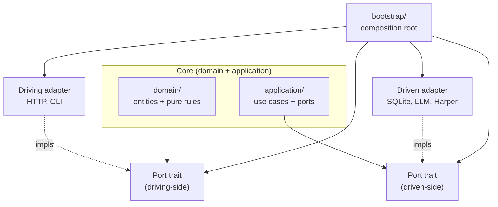
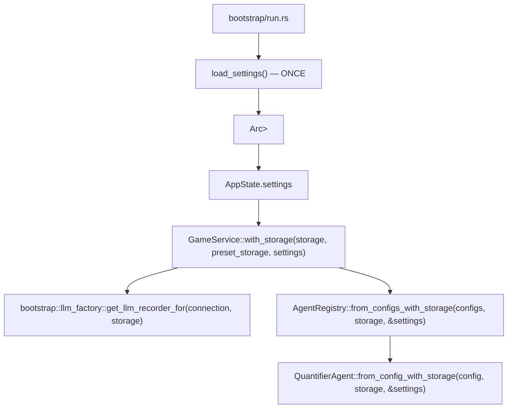

# Specification: Core Architecture (Modular)

## Tier Map

Eight tiers organize the codebase:

- `crate::domain::model` — Pure data structures; single source of truth for game state.
- `crate::domain::engine` — Pure simulation logic.
- `crate::application` — Orchestration layer; owns port traits under `application/ports/`.
- `crate::adapters::driven` — Outbound adapters (storage, LLM providers, text check).
- `crate::adapters::driving` — Inbound adapters (HTTP server, CLI).
- `crate::bootstrap` — Composition root.
- `crate::settings` — Settings data model; DB-backed, loaded once at startup.
- `crate::test_support` — Shared fixtures and the `TestAppBuilder` API.

## Hexagonal Architecture (Ports & Adapters)

See [ADR-027](../adr/adr-027-hexagonal-architecture-migration.md) for rationale (phantom port heuristic, rejected ports).

## Dependency Invariant

- `domain/` + `application/` depend on port traits only.
- Adapters implement port traits.
- Only `bootstrap/` imports both port traits and adapter impls.
- Driven-side port traits are owned by `application/ports/`.

## Port Inventory

| Port | Prod impls | Test impls |
|------|------------|------------|
| `LlmProvider` | 4 (`openrouter`, `deepseek`, `ollama`, `mock`) | 0 |
| `LlmMessageRepository` | 1 (`storage/backend/llm_messages.rs`) | 2 |
| `TextChecker` | 1 (`harper_text_checker.rs`) | 1 |

Trait paths under `application/ports/`.

## Storage Direct Access

Three `src/application/` files import `Storage` directly under `// arch-lint: storage-direct`:

- `game_service.rs` — intentional persistence boundary (ADR-027).
- `agents/registry.rs`, `agents/quantifier/agent.rs` — deferred to T2 reliability plan.

## Settings Flow

Settings are loaded **once** at startup and propagated through the construction chain:

## Default Settings

`impl Default for AppSettings` in `src/domain/model/settings.rs` is the runtime source of truth. The JSON seed `data/settings.json` is not consulted at startup.

| Provider | Default `max_context_tokens` |
|----------|------------------------------|
| `LlmBackendType::Ollama` | 8192 |
| `LlmBackendType::OpenRouter` / `DeepSeek` | 32768 |
| `LlmBackendType::Mock` | 4096 |

Default connections (3): `openrouter-gpt-4o-mini`, `openrouter-euryale`, `ollama-gemma-4-26B`. Default `narration_connection_id` and `quantifier_connection_id`: `"openrouter-gpt-4o-mini"`.

**Reload rules**: no business logic layer reloads settings from disk after bootstrap. Connection changes require a server restart to take effect.