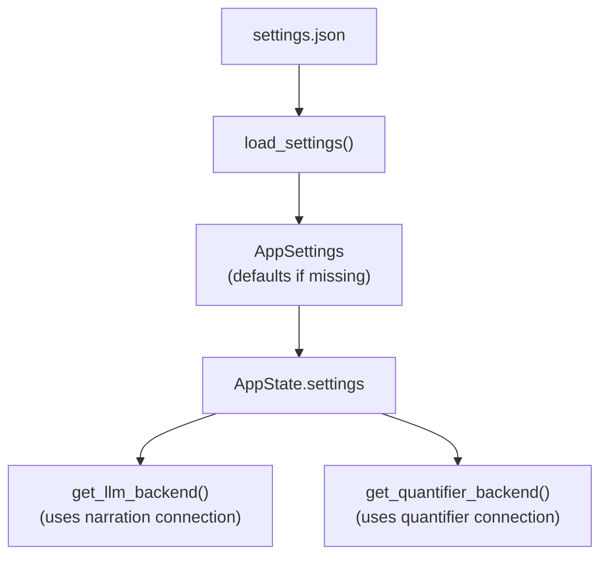

# Specification: Core Architecture (Modular)

## Objective
Establish a domain-driven modular architecture for the Chronicler Engine. This structure separates core data models from game mechanics, narrative processing, and user interface logic.

## Module Domains

### 1. The Model Tier (`crate::model::*`)
Contains pure data structures, serialization schemas, and the "Single Source of Truth" for game state. This tier has zero knowledge of the UI or LLM logic.
- **`world`**: Setting lore, global rules, and starting scenarios.
- **`map`**: Room/Region hierarchy and cardinal direction definitions.
- **`character`**: NPC attributes (name, description, personality, scenario, image_path, **profile_image**, **headshot_image**) and Player inventory.
- **`state`**: The `GameState` aggregation, narration history logs, and TUI state.
- **`scenario`**: Starting scenario definitions for narrative introductions.
- **`trigger`**: Trigger definitions, conditions, and character state tracking (`Trigger`, `TriggerCondition`, `TriggerAction`, `NpcEncounterState`, `CharacterState`).

### 2. The Engine Tier (`crate::engine::*`)
Contains the mechanics that drive the simulation. It translates user intent and state into outcomes.
- **`parser`**: Natural language command decomposition.
- **`action`**: The `Action` enum defining all supported system intents.
- **`logic`**: Rules for movement, fuzzy-matching, and room resolution.
- **`trigger_eval`**: Pure function evaluation of NPC triggers based on character state and room location (`evaluate_triggers(state, current_room_id) -> Vec<(NpcCard, Trigger)>`). Triggers with `room_id` only fire in that room.
- **`action_processing`**: Extracted pure functions for server handlers (`get_static_npcs`, `handle_movement`, `apply_npc_events`, `evaluate_and_narrate_triggers`, `commit_trigger_narration`, `execute_freeaction_impl`). Enables unit testing of server-side logic.

### 3. The Narrative Tier (`crate::narrative::*`)
The interface between the synchronous engine and stochastic LLM generation.
- **`llm`**: Directory module with traits (`LlmBackend`) and per-provider implementations (OpenRouter, DeepSeek, Ollama, Mock) for Game Master narration.
  - **`get_llm_backend()`**: Production entry point that loads the narration connection from `data/settings.json`
  - **`get_llm_backend_for(connection)`**: Create a backend for a specific `Connection` profile
  - **`DefaultGameService::with_backends(llm, quantifier)`**: Constructor for dependency-injecting mock backends in tests. No globals, no file I/O, fully isolated.
- **`prompt`**: Directory module for layered prompt construction with token budget management. Uses plain-text instructions + XML-wrapped data for reasoning-model compatibility. Includes `fit_messages_to_context()` for dynamic context-window fitting.
- **`quantifier`**: Directory module for scene quantification and dynamic room presence detection via secondary LLM. Returns NPC presence, player movement intent, and NPC enter/leave events.
  - **`QuantifierBackendTrait`**: Interface for NPC detection backends
  - **`RealQuantifierBackend`**: Production implementation using LLM
  - **`MockQuantifierBackend`**: Test implementation returning configurable NPCs with High confidence
  - **`NpcEventList`**: NPC movement events from quantification (Entered, Left)
- **`text_check`**: Directory module for spell and grammar checking of player input.
  - **`HarperBackend`**: Wraps harper-core with curated + user dictionaries
  - **`check_player_input()`**: Facade that returns `Option<CheckResult>` based on `TextCheckMode`
  - **`CheckResult`/`CheckIssue`**: Structured lint results with byte spans and suggestions

#### NPC Event Layer

Quantifier results include NPC movement events:

| Event | Trigger |
|-------|---------|
| `Entered` | NPC transitions from NOT in area → in area |
| `Left` | NPC transitions from in area → NOT in area |

When `Entered` fires: `currently_meeting = true`  
When `Left` fires: `currently_meeting = false`  

**times_met semantics**: Only increments on `Entered` (first encounter or NPC rejoins after leaving). Not on continuous presence across turns.

### 4. The Server Tier (`crate::server::*`)
The HTTP layer for the HTMX web dashboard with polling-based real-time updates.
- **`mod`**: Axum router, request handlers.
- **`fragments`**: HTML fragment generators for HTMX partial updates.
  - Uses `pulldown-cmark` for markdown→HTML conversion of LLM narrative text.
  - Uses `askama` for all 4 templates (header, story_log, visual_sidebar, action_area).
- **`templates`**: Askama template definitions with type-safe rendering.
  - Templates declare required data shapes at compile time.
  - Missing fields = compiler error (not runtime failure).

### 5. The Settings Tier (`crate::settings` + `crate::model::settings`)
Persistent JSON-based settings system for LLM configuration with reusable connection profiles.

| Component | Purpose |
|-----------|---------|
| `data/settings.json` | Persistent settings file |
| `AppSettings` struct | Configuration data model (connections + active selections) |
| `Connection` struct | Named provider+model profile |
| `AppState.settings` | Runtime access via `Arc<RwLock<AppSettings>>` |

#### Settings Flow



#### Configuration Options

| Setting | Type | Default |
|---------|------|---------|
| `connections` | `Vec<Connection>` | Three default connections (OpenRouter GPT-4o Mini, OpenRouter Euryale, Ollama Gemma) |
| `narration_connection_id` | string | `"openrouter-gpt-4o-mini"` |
| `quantifier_connection_id` | string | `"openrouter-gpt-4o-mini"` |

#### Connection Context Windows

Each connection can specify a `max_context_tokens` value. When unset, defaults are resolved by provider:

| Provider | Default `max_context_tokens` |
|----------|------------------------------|
| `ollama` | 8192 |
| `openrouter` / `deepseek` | 32768 |
| `mock` | 4096 |

Each `Connection` contains: `id`, `name`, `provider`, `model`, `api_key` (optional), `base_url` (optional), `single_user_message` (optional, default `false`), `max_tokens` (optional), `max_context_tokens` (optional).

#### Environment Fallback

- `OPENROUTER_API_KEY` env var used as fallback when connection `api_key` is None
- `LLM_BACKEND` env var is **not** consulted (settings file is sole source of truth)

### 7. The Presentation Tier (`assets/`)
Static web assets served by the server.
- **`index.html`**: HTMX frontend with tabbed interface (Game/Settings tabs)

## File Mapping

| File | Domain | Note |
| :--- | :--- | :--- |
| `src/model/world.rs` | `crate::model::world` | |
| `src/model/map.rs` | `crate::model::map` | |
| `src/model/character.rs` | `crate::model::character` | |
| `src/model/state.rs` | `crate::model::state` | |
| `src/model/scenario.rs` | `crate::model::scenario` | Starting scenarios |
| `src/model/trigger.rs` | `crate::model::trigger` | Trigger definitions, conditions, character state |
| `src/model/settings.rs` | `crate::model::settings` | AppSettings struct for persistence |
| `src/settings.rs` | `crate::settings` | Settings load/save persistence module |
| `src/engine/parser.rs` | `crate::engine::parser` | |
| `src/engine/action.rs` | `crate::engine::action` | |
| `src/engine/logic.rs` | `crate::engine::logic` | `get_current_room`, `find_room_in_map`, `find_room_in_world_map` |
| `src/engine/trigger_eval.rs` | `crate::engine::trigger_eval` | Trigger evaluation based on character state |
| `src/engine/action_processing.rs` | `crate::engine::action_processing` | Server handler pure functions (NEW) |
| `src/engine/game_service.rs` | `crate::engine::game_service` | `GameService` trait and `DefaultGameService` — game orchestration extracted from fragments.rs |
| `src/bootstrap.rs` | `crate::bootstrap` | World loading, server initialization |
| `src/cli.rs` | `crate::cli` | CLI argument parsing (clap) |
| `src/narrative/llm/mod.rs` | `crate::narrative::llm` | LLM backend module root |
| `src/narrative/llm/backend.rs` | `crate::narrative::llm` | `LlmBackend` trait |
| `src/narrative/llm/openrouter.rs` | `crate::narrative::llm` | OpenRouter backend |
| `src/narrative/llm/deepseek.rs` | `crate::narrative::llm` | DeepSeek backend |
| `src/narrative/llm/ollama.rs` | `crate::narrative::llm` | Ollama backend |
| `src/narrative/llm/mock.rs` | `crate::narrative::llm` | Mock backend for tests |
| `src/narrative/prompt/mod.rs` | `crate::narrative::prompt` | Prompt module root |
| `src/narrative/prompt/builder.rs` | `crate::narrative::prompt` | `PromptBuilder` with 8-layer construction |
| `src/narrative/prompt/budget.rs` | `crate::narrative::prompt` | Token budget and context fitting |
| `src/narrative/quantifier/mod.rs` | `crate::narrative::quantifier` | Quantifier module root |
| `src/narrative/quantifier/core.rs` | `crate::narrative::quantifier` | Core quantifier logic |
| `src/narrative/quantifier/backends.rs` | `crate::narrative::quantifier` | Quantifier backend implementations |
| `src/narrative/text_check/check.rs` | `crate::narrative::text_check` | Facade: `check_player_input()` |
| `src/narrative/text_check/harper_backend.rs` | `crate::narrative::text_check` | `HarperBackend` — harper-core wrapper |
| `src/narrative/text_check/types.rs` | `crate::narrative::text_check` | `CheckResult`, `CheckIssue`, `IssueKind` |
| `src/narrative/llm_client.rs` | `crate::narrative::llm_client` | HTTP client helpers for OpenRouter and Ollama |
| `src/model/llm_backend.rs` | `crate::model::llm_backend` | `LlmBackendType` enum for backend selection |
| `src/server/mod.rs` | `crate::server` | Axum router, `AppState`, `run_server`, `create_app_for_testing` |
| `src/server/debug.rs` | `crate::server::debug` | Dev diagnostic endpoint (`/debug/state`) |
| `src/test_support/mod.rs` | `crate::test_support` | Shared test utilities |
| `src/server/fragments.rs` | `crate::server` | HTMX endpoint handlers and HTML fragment generators |
| `src/server/settings_fragment.rs` | `crate::server` | Settings panel fragment handlers |
| `src/server/templates.rs` | `crate::server` | Askama templates |
| `assets/index.html` | Presentation | HTMX frontend |

## UI Specification

The engine presents a web-based HTMX dashboard with a tabbed interface:

### Tab Bar

Silly Tavern-style horizontal tab bar at the top:

```html
<div class="tab-bar">
  <button class="tab active">Game</button>
  <button class="tab">Settings</button>
</div>
```

- **Game Tab**: Default active tab containing the main game interface
- **Settings Tab**: Configuration panel for LLM settings and preferences

### Game Tab Content

The game tab contains the standard interface:

- **Header**: Game title only
- **Main Body**: Story log (80%) + visual sidebar (20%) (see `docs/system/dashboard.md`)
  - Story log shows location entries, narration, dialogue, system messages, and input
  - Location entries appear inline in story log with room name and timestamp
  - Visual sidebar displays:
    - Room location image (from `Room.image_path`)
    - NPC portraits in horizontal scrollable row (from `CharacterSheet.headshot_image` with fallback to `image_path`)
- **Action Area**: Command input + status indicator (Ready/Thinking)

Real-time updates via HTMX polling (2s interval for story-log, 5s for status-display and visual-sidebar).

### Scrollbar Styling

The story log and visual sidebar use custom-styled scrollbars matching the dark terminal aesthetic:

- **WebKit browsers**: Custom `::-webkit-scrollbar` with semi-transparent thumb (`rgba(255,255,255,0.2)`), 8px width, rounded corners (4px)
- **Firefox**: `scrollbar-width: thin` with `scrollbar-color` for cross-browser consistency
- **Track background**: Transparent to blend with dark backgrounds
- **Hover state**: Thumb lightens to `rgba(255,255,255,0.35)` on hover

This replaces the default browser scrollbar with a sleek, dark-themed design inspired by SillyTavern.

### NPC Display in Visual Sidebar

The visual sidebar displays NPCs present in the current room in a **horizontal scrollable row** (not a grid) to maximize space efficiency:

- **Layout**: Horizontal flex container with `flex-wrap: nowrap`, `overflow-x: auto` for horizontal scrolling
- **Portrait sizing**: Fixed 80×80px square images with `object-fit: cover`
- **Spacing**: 6px gap between portraits (tight, not huge spaces)
- **Scroll behavior**: When multiple NPCs exceed sidebar width, container scrolls horizontally
- **Dynamic NPC presence** is determined by the **Quantifier** (see `scene_quantification_v2.md` plan) rather than static room configuration:

- **Data Flow**: `quantifier result → GameState.npcs_in_area → visual sidebar`
- **Storage**: `GameState.npcs_in_area: Vec<NpcCard>` stores the current in-area NPCs
- **NPC Event Layer**: The quantifier also returns `NpcEventList` with `Entered` and `Left` events derived from comparing previous vs current NPC presence. These events drive:
  - `character_state.currently_meeting` (true on Entered, false on Left)
  - `times_met` increments only on `Entered` events (new encounters), not on simple presence
- **Update Triggers**:
  1. **Quantifier-Driven Movement**: When player enters a room via natural language, the quantifier detects movement intent and result stored in `npcs_in_area`
  2. **Re-quantification**: After LLM narration mentioning NPC movement (e.g., "follows you", "enters", "leaves"), quantifier re-runs to update `npcs_in_area` automatically
  3. **Event Detection**: NPC events (Entered/Left) are computed by comparing previous `npcs_in_area` with the new quantifier result
- **Fallback**: If quantifier is unavailable (no API key) or returns Low confidence, static `room.npcs` from `map.json` is used
- **Validation**: All NPC IDs from quantifier are validated against `GameState.npcs` - hallucinated NPCs are filtered out

### Re-quantification Triggers

NPC presence can change WITHOUT player movement. After LLM narration completes (narrate_arrival, narrate_action), the system:
1. Parses narration text for NPC movement patterns: "follows", "enters", "leaves", "comes with", "accompanies"
2. When movement is detected, calls `determine_npcs_in_room()` again to re-quantify
3. Updates `state.npcs_in_area` with the new result
4. Visual sidebar automatically displays updated NPCs on next poll

This allows NPCs like "Carla" to appear in a room because the LLM mentioned "Carla follows you from the front gate" - without the player having to physically walk there.

### Auto-Trigger System

The engine supports reactive NPC encounters based on character state. When the player moves to a new room, the system evaluates triggers before generating the final narration.

**Flow**: `first narration → quantifier & movement → trigger evaluation → (unlock) → continuation narration → (lock) → trigger commit`

1. **First Narration**: Initial LLM narration for the user's action is generated **without holding the state lock**.
2. **Movement & NPC Detection**: A single post-narration Quantifier pass detects movement intent and any NPCs mentioned in the narration.
3. **Movement Execution**: If movement is detected, the engine updates `GameState.current_room_id`.
4. **Trigger Evaluation** (`trigger_eval`): Engine evaluates all NPC triggers against `CharacterState` (e.g., `times_met == 0`). This happens inside a state lock.
5. **Trigger Prompt Building**: If triggers fire, `PromptBuilder` builds a second LLM prompt combining the first narration with trigger-specific text. The state lock is released before the LLM call.
6. **Continuation Narration** (`prompt`): The second LLM call runs **outside the state lock**, allowing the frontend to poll and display the main narration immediately.
7. **Trigger Commit**: After the LLM returns, the state lock is re-acquired and the trigger event header + continuation narration are committed to the log.

This three-phase lock/unlock pattern ensures the frontend sees the main narration as soon as it is generated, while the trigger text streams in when ready.

**`NpcEncounterState`** tracks persistent NPC encounter data:
- `times_met`: Number of times player has met the NPC
- `trigger_fired`: Indices of non-repeatable triggers that have already fired
- `currently_meeting`: Whether the player is currently in the same room/session as the NPC

**Trigger Conditions**:
- `TimesMet(ComparisonOperator, u32)`: Compare encounter count. `ComparisonOperator` is one of:
  - `Eq` — equal to
  - `Lt` — less than
  - `Gte` — greater than or equal to

**Trigger Actions**:
- `TriggerAction` contains:
  - `name`: Display name for the event (used for event headers)
  - `narration_prompt`: Prompt sent to the LLM to generate continuation narration

### Image Handling

Character images have two supported fields:
- **`image_path`**: Legacy field, full body image
- **`headshot_image`**: Preferred field for portraits (fallback to image_path)
- **`profile_image`**: For character profile display

Room images use `image_path` field in Room struct.

Click handlers on images trigger visual sidebar toggle.

## Error Strategy
A unified error type (`crate::error::EngineError`) is shared across all tiers to provide consistent error propagation from data loading through LLM failures to the final UI report.

## History Management

The engine supports editing and regenerating conversation history via the History API.

### LogEntry Structure

Each history entry has a unique auto-incrementing ID:

```rust
pub struct LogEntry {
    pub id: u64,                    // Auto-incrementing unique ID
    pub sender: Option<String>,       // Who spoke (None for narrator)
    pub text: String,               // The message content
    pub log_type: LogType,          // Category: Narration, Dialogue, System, Input, Event
    pub timestamp: DateTime<Utc>,     // When recorded
}
```

### History Editing

Entries can be edited in place via `PUT /api/history/{id}`:

- Both user inputs (`LogType::Input`) and AI responses (`LogType::Narration`, `LogType::Dialogue`) are editable
- Event headers (`LogType::Event`) and location headers are not editable
- Editing replaces `text` field; other fields unchanged
- Subsequent history entries are unaffected
- In-memory only (not persisted to disk)

### Retry Feature

The retry endpoint (`POST /api/retry`) regenerates the last AI response:

- Finds the last `LogType::Input` entry
- Regenerates its corresponding AI response via LLM
- Replaces the existing response with new narration
- Only works on the last exchange, not arbitrary history points
- **Critical**: History passed to LLM excludes the AI response being retried to prevent the LLM from repeating/paraphrasing the old response

### Server Endpoints

| Method | Path | Description |
|--------|-----|-------------|
| `GET` | `/fragment/settings` | Settings panel HTML |
| `POST` | `/settings` | Save settings from form |
| `POST` | `/history/:id` | Edit entry text |
| `POST` | `/history/:id/delete` | Delete entry |
| `POST` | `/retry` | Regenerate last AI response |
| `POST` | `/action/check` | Pre-flight spell/grammar check |
| `POST` | `/check-text` | Manual text check |

### UI Integration

The story log displays edit controls always visible:

- Action buttons always visible at top-right of every entry:
  - Edit button (✎) on all entries
  - Delete button (🗑) on all entries
  - Check button (✓) on input entries
  - Retry button (↻) on last AI message only
- Click edit → inline textarea with save/cancel, polling pauses