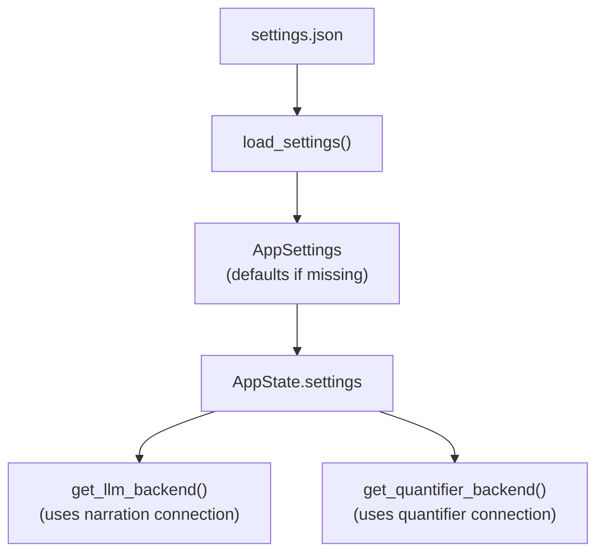

# Specification: Core Architecture (Modular)

## Objective
Establish a domain-driven modular architecture for the Chronicler Engine. This structure separates core data models from game mechanics, narrative processing, and user interface logic.

## Module Domains

### 1. The Model Tier (`crate::model::*`)
Contains pure data structures, serialization schemas, and the "Single Source of Truth" for game state. This tier has zero knowledge of the UI or LLM logic.
- **`world`**: Setting lore, global rules, and starting scenarios.
- **`map`**: Room/Region hierarchy and cardinal direction definitions.
- **`character`**: NPC attributes (name, description, personality, scenario, image_path, **profile_image**, **headshot_image**) and Player inventory.
- **`state`**: The `GameState` aggregation, narration history logs, and TUI state. Includes `StoredTriggerContext` for replaying trigger continuations on retry. `LogEntry` carries optional `location_header` and `event_header` metadata for visual rendering; `NarrativeState` tracks `pending_location` and `pending_event` for consumption by the next `add_log` call.
- **`scenario`**: Starting scenario definitions for narrative introductions.
- **`trigger`**: Trigger definitions, conditions, and character state tracking (`Trigger`, `TriggerCondition`, `TriggerAction`, `NpcEncounterState`, `CharacterState`).
- **`settings`**: `AppSettings`, `Connection`, and agent configuration data models.
- **`agent`**: `AgentConfig`, `AgentResult`, `AgentContext`, `StatePatch`, `ExecutionPhase`, `BackendSelector`, `Confidence`.
- **`llm_backend`**: `LlmBackendType` enum for backend selection.
- **`state_snapshot`**: `GameStateSnapshot` for SQLite persistence.

### 2. The Engine Tier (`crate::engine::*`)
Contains the mechanics that drive the simulation. It translates user intent and state into outcomes.
- **`parser`**: Natural language command decomposition.
- **`action`**: The `Action` enum defining all supported system intents.
- **`logic`**: Rules for movement, fuzzy-matching, and room resolution.
- **`trigger_eval`**: Pure function evaluation of NPC triggers based on character state and room location (`evaluate_triggers(state, current_room_id) -> Vec<(NpcCard, Trigger)>`). Triggers with `room_id` only fire in that room.
- **`action_processing`**: Extracted pure functions for server handlers (`get_static_npcs`, `handle_movement`, `apply_npc_events`, `evaluate_and_narrate_triggers`, `commit_trigger_narration`, `execute_freeaction_impl`). Enables unit testing of server-side logic.
- **`game_service`**: `GameService` trait and `DefaultGameService` — game orchestration extracted from fragments.rs. Includes action handling, retry logic, and context helpers.
  - `execute_freeaction_pipeline()`: Extracted full FreeAction pipeline (narrate → quantify → triggers → event continuation) usable by both normal action handling and retry logic.
  - `retry_last_response_impl()`: Granular retry that detects event continuations vs main narration and loads the appropriate pre-generation committed snapshot.
  - `save_committed_state()`: Saves snapshots with `committed = true` for pre-generation anchoring.
- **`state_diagnostics`**: Runtime invariant checks (`INV-ROOM`, `INV-NPC`, `INV-CHAR`, `INV-LOG`), feature-flagged via `diagnostics` feature.

### 3. The Narrative Tier (`crate::narrative::*`)
The interface between the synchronous engine and stochastic LLM generation.
- **`llm`**: Directory module with traits (`LlmBackend`) and per-provider implementations (OpenRouter, DeepSeek, Ollama, Mock) for Game Master narration.
  - **`get_llm_backend()`**: Production entry point that loads the narration connection from `data/settings.json`
  - **`get_llm_backend_for(connection)`**: Create a backend for a specific `Connection` profile
  - **`DefaultGameService::with_backends(llm, quantifier)`**: Constructor for dependency-injecting mock backends in tests. No globals, no file I/O, fully isolated.
- **`prompt`**: Directory module for layered prompt construction with token budget management. Uses plain-text instructions + XML-wrapped data for reasoning-model compatibility. Includes `fit_messages_to_context()` for dynamic context-window fitting.
- **`agents`**: Directory module for the agent trait, registry, and agent implementations.
  - **`Agent` trait**: Core abstraction for pre-generation and post-generation agents
  - **`AgentRegistry`**: Loads agents from config and iterates by execution phase
  - **`QuantifierAgent`**: Post-generation agent for scene quantification and dynamic room presence detection
  - **`NarratorAgent`**: Stub pre-generation agent (reserved for future use)
- **`quantifier`** (under `agents/`): Quantifier implementation module.
  - **`QuantifierBackendTrait`**: Interface for NPC detection backends
  - **`RealQuantifierBackend`**: Production implementation using LLM
  - **`MockQuantifierBackend`**: Test implementation returning configurable NPCs with High confidence
  - **`NpcEventList`**: NPC movement events from quantification (Entered, Left)
- **`text_check`**: Directory module for spell and grammar checking of player input.
  - **`HarperBackend`**: Wraps harper-core with curated + user dictionaries
  - **`check_player_input()`**: Facade that returns `Option<CheckResult>` based on `TextCheckMode`
  - **`CheckResult`/`CheckIssue`**: Structured lint results with byte spans and suggestions
- **`llm_client`**: HTTP client helpers for OpenRouter and Ollama.

#### NPC Event Layer

Quantifier results include NPC movement events:

| Event | Trigger |
|-------|---------|
| `Entered` | NPC transitions from NOT in area → in area |
| `Left` | NPC transitions from in area → NOT in area |

When `Entered` fires: `currently_meeting = true`  
When `Left` fires: `currently_meeting = false`  

**times_met semantics**: Only increments on `Entered` (first encounter or NPC rejoins after leaving). Not on continuous presence across turns.

### 4. The Server Tier (`crate::server::*`)
The HTTP layer for the HTMX web dashboard with polling-based real-time updates.
- **`mod`**: Axum router, request handlers, `AppState`, `run_server`, `create_app_for_testing`, `create_app_for_testing_with_settings`.
- **`fragments`**: HTML fragment generators for HTMX partial updates. Split into submodules:
  - **`actions`**: Action form handlers and renderers
  - **`endpoints`**: HTMX fragment endpoints (`/fragment/story-log`, `/fragment/visual-sidebar`, etc.)
  - **`history`**: History editing, deletion, and retry endpoints
  - **`misc`**: Utility endpoints (status, hints, text check)
  - **`renderers`**: HTML rendering helpers, markdown→HTML via `pulldown-cmark`
- **`settings_fragment`**: Settings panel fragment handlers and template rendering.
- **`templates`**: Askama template definitions with type-safe rendering.
  - Templates declare required data shapes at compile time.
  - Missing fields = compiler error (not runtime failure).
- **`debug`**: Dev diagnostic endpoint (`/debug/state`).

### 5. The Settings Tier (`crate::settings` + `crate::model::settings`)
Persistent JSON-based settings system for LLM configuration with reusable connection profiles.

| Component | Purpose |
|-----------|---------|
| `data/settings.json` | Persistent settings file |
| `AppSettings` struct | Configuration data model (connections + active selections) |
| `Connection` struct | Named provider+model profile |
| `AppState.settings` | Runtime access via `Arc<RwLock<AppSettings>>` |

#### Settings Flow



#### Configuration Options

| Setting | Type | Default |
|---------|------|---------|
| `connections` | `Vec<Connection>` | Three default connections (OpenRouter GPT-4o Mini, OpenRouter Euryale, Ollama Gemma) |
| `narration_connection_id` | string | `"openrouter-gpt-4o-mini"` |
| `quantifier_connection_id` | string | `"openrouter-gpt-4o-mini"` |

#### Connection Context Windows

Each connection can specify a `max_context_tokens` value. When unset, defaults are resolved by provider:

| Provider | Default `max_context_tokens` |
|----------|------------------------------|
| `ollama` | 8192 |
| `openrouter` / `deepseek` | 32768 |
| `mock` | 4096 |

Each `Connection` contains: `id`, `name`, `provider`, `model`, `api_key` (optional), `base_url` (optional), `single_user_message` (optional, default `false`), `max_tokens` (optional), `max_context_tokens` (optional).

#### Environment Fallback

- `OPENROUTER_API_KEY` env var used as fallback when connection `api_key` is None
- `LLM_BACKEND` env var is **not** consulted (settings file is sole source of truth)

### 6. The Error Tier (`crate::error`)
Unified error type shared across all tiers.
- **`EngineError`**: Top-level error enum (`Llm`, `Narrative`, `Internal`, `Io`, `Serde`, `Parse`, `Serialize`, `Navigation`, `RoomNotFound`, `NpcNotFound`, `WorldNotFound`, `Config`, `Template`, `DataLoad`, `ContextOverflow`)
- **`LlmFailure`**: LLM-specific errors (`EmptyResponse`, `Http`, `Network`, `ParseError`, `Timeout`)
- **`NarrativeFailure`**: Prompt build and generation failures
- **`InternalError`**: Invariant violations

### 7. The Storage Tier (`crate::storage`)
SQLite-based snapshot persistence for game state.
- **`db`**: Database connection and schema management
- **`snapshot_storage`**: `SnapshotStorage` trait and SQLite implementation (`SqliteSnapshotStorage`)
- **`GameStateSnapshot`**: Serializable subset of `GameState` for persistence

### 8. The Bootstrap Tier (`crate::bootstrap`)
World loading, validation, and server initialization.
- **`load`**: World data loading from `data/worlds/`
- **`validate`**: World data validation (rooms, NPCs, triggers)
- **`scenario`**: Starting scenario selection
- **`logging`**: Structured logging setup
- **`run`**: Server initialization and startup

### 9. The CLI Tier (`crate::cli`)
Command-line argument parsing via `clap`.
- **`Cli`**: CLI args struct (`--world`, `--port`, etc.)

### 10. The Test Support Tier (`crate::test_support`)
Shared test fixtures and utilities.
- **`fixtures`**: `TestGameState`, `TestNpc`, `TestMap`, etc.
- **`context`**: Test context helpers
- **`in_memory_storage`**: In-memory `SnapshotStorage` implementation for tests

> **Note:** `assets/` contains static web assets (`index.html`) served by the server. It is not a Rust module tier.

## File Mapping

> **Note:** All test files follow the sibling `*_tests.rs` pattern (e.g. `src/engine/logic_tests.rs` tests `src/engine/logic.rs`).

### Model Tier

| File | Module | Note |
| :--- | :--- | :--- |
| `src/model/mod.rs` | `crate::model` | Module root |
| `src/model/world.rs` | `crate::model::world` | `WorldCard` |
| `src/model/map.rs` | `crate::model::map` | `MapDef`, `Room`, `Region` |
| `src/model/character.rs` | `crate::model::character` | `NpcCard`, `PlayerCard`, `CharacterSheet` |
| `src/model/state.rs` | `crate::model::state` | `GameState`, `MovementState`, `NarrativeState`, `SceneState`, `LogEntry`, `GenerationState` |
| `src/model/state_snapshot.rs` | `crate::model::state_snapshot` | `GameStateSnapshot` |
| `src/model/scenario.rs` | `crate::model::scenario` | Starting scenarios |
| `src/model/trigger.rs` | `crate::model::trigger` | `Trigger`, `TriggerCondition`, `TriggerAction`, `NpcEncounterState`, `CharacterState` |
| `src/model/settings.rs` | `crate::model::settings` | `AppSettings`, `Connection`, `AgentConfig` |
| `src/model/agent.rs` | `crate::model::agent` | `AgentResult`, `AgentContext`, `StatePatch`, `ExecutionPhase`, `BackendSelector`, `Confidence` |
| `src/model/llm_backend.rs` | `crate::model::llm_backend` | `LlmBackendType` |

### Engine Tier

| File | Module | Note |
| :--- | :--- | :--- |
| `src/engine/mod.rs` | `crate::engine` | Module root |
| `src/engine/parser.rs` | `crate::engine::parser` | Natural language command decomposition |
| `src/engine/action.rs` | `crate::engine::action` | `Action` enum |
| `src/engine/logic.rs` | `crate::engine::logic` | `get_current_room`, `find_room_in_map`, `find_room_in_world_map` |
| `src/engine/trigger_eval.rs` | `crate::engine::trigger_eval` | `evaluate_triggers` |
| `src/engine/action_processing.rs` | `crate::engine::action_processing` | `execute_freeaction_impl`, `handle_movement`, `apply_npc_events` |
| `src/engine/state_diagnostics.rs` | `crate::engine::state_diagnostics` | Runtime invariant checks |
| `src/engine/game_service/mod.rs` | `crate::engine::game_service` | `GameService` trait |
| `src/engine/game_service/service.rs` | `crate::engine::game_service` | `DefaultGameService` |
| `src/engine/game_service/actions.rs` | `crate::engine::game_service` | Action handling helpers |
| `src/engine/game_service/context.rs` | `crate::engine::game_service` | `GameServiceContext` |
| `src/engine/game_service/helpers.rs` | `crate::engine::game_service` | Orchestration helpers |
| `src/engine/game_service/retry.rs` | `crate::engine::game_service` | Retry logic with granular event/main narration detection and pre-generation snapshot loading |

### Narrative Tier

| File | Module | Note |
| :--- | :--- | :--- |
| `src/narrative/mod.rs` | `crate::narrative` | Module root |
| `src/narrative/llm/mod.rs` | `crate::narrative::llm` | LLM backend module root |
| `src/narrative/llm/backend.rs` | `crate::narrative::llm` | `LlmBackend` trait |
| `src/narrative/llm/openrouter.rs` | `crate::narrative::llm` | OpenRouter backend |
| `src/narrative/llm/deepseek.rs` | `crate::narrative::llm` | DeepSeek backend |
| `src/narrative/llm/ollama.rs` | `crate::narrative::llm` | Ollama backend |
| `src/narrative/llm/mock.rs` | `crate::narrative::llm` | Mock backend |
| `src/narrative/llm_client.rs` | `crate::narrative::llm_client` | HTTP client helpers |
| `src/narrative/prompt/mod.rs` | `crate::narrative::prompt` | Prompt module root |
| `src/narrative/prompt/builder.rs` | `crate::narrative::prompt` | `PromptBuilder` with 8-layer construction |
| `src/narrative/prompt/budget.rs` | `crate::narrative::prompt` | Token budget and context fitting |
| `src/narrative/prompt/context.rs` | `crate::narrative::prompt` | Context helpers |
| `src/narrative/prompt/sanitize.rs` | `crate::narrative::prompt` | Prompt injection sanitization |
| `src/narrative/prompt/templates.rs` | `crate::narrative::prompt` | Prompt templates |
| `src/narrative/prompt/types.rs` | `crate::narrative::prompt` | Prompt types |
| `src/narrative/agents/mod.rs` | `crate::narrative::agents` | Agent module root |
| `src/narrative/agents/trait_def.rs` | `crate::narrative::agents` | `Agent` trait |
| `src/narrative/agents/registry.rs` | `crate::narrative::agents` | `AgentRegistry`, `NarratorAgent` |
| `src/narrative/agents/quantifier/mod.rs` | `crate::narrative::agents::quantifier` | Quantifier module root |
| `src/narrative/agents/quantifier/agent.rs` | `crate::narrative::agents::quantifier` | `QuantifierAgent` |
| `src/narrative/agents/quantifier/core.rs` | `crate::narrative::agents::quantifier` | Core quantifier logic |
| `src/narrative/agents/quantifier/backends.rs` | `crate::narrative::agents::quantifier` | Quantifier backends |
| `src/narrative/agents/quantifier/parser.rs` | `crate::narrative::agents::quantifier` | Quantifier response parser |
| `src/narrative/agents/quantifier/prompt.rs` | `crate::narrative::agents::quantifier` | Quantifier prompt builder |
| `src/narrative/agents/quantifier/types.rs` | `crate::narrative::agents::quantifier` | Quantifier types |
| `src/narrative/text_check/mod.rs` | `crate::narrative::text_check` | Text check module root |
| `src/narrative/text_check/check.rs` | `crate::narrative::text_check` | `check_player_input()` facade |
| `src/narrative/text_check/harper_backend.rs` | `crate::narrative::text_check` | `HarperBackend` |
| `src/narrative/text_check/types.rs` | `crate::narrative::text_check` | `CheckResult`, `CheckIssue` |

### Server Tier

| File | Module | Note |
| :--- | :--- | :--- |
| `src/server/mod.rs` | `crate::server` | Axum router, `AppState`, `run_server`, `create_app_for_testing`, `create_app_for_testing_with_settings` |
| `src/server/debug.rs` | `crate::server::debug` | Dev diagnostic endpoint (`/debug/state`) |
| `src/server/templates.rs` | `crate::server` | Askama templates |
| `src/server/fragments/mod.rs` | `crate::server::fragments` | Fragments module root |
| `src/server/fragments/actions.rs` | `crate::server::fragments` | Action form handlers |
| `src/server/fragments/endpoints.rs` | `crate::server::fragments` | HTMX fragment endpoints |
| `src/server/fragments/history.rs` | `crate::server::fragments` | History edit/delete/retry |
| `src/server/fragments/misc.rs` | `crate::server::fragments` | Status, hints, text check |
| `src/server/fragments/renderers.rs` | `crate::server::fragments` | HTML rendering helpers |
| `src/server/settings_fragment/mod.rs` | `crate::server::settings_fragment` | Settings panel module root |
| `src/server/settings_fragment/fragments.rs` | `crate::server::settings_fragment` | Settings fragments |
| `src/server/settings_fragment/handlers.rs` | `crate::server::settings_fragment` | Settings handlers |
| `src/server/settings_fragment/template.rs` | `crate::server::settings_fragment` | Settings template data |

### Settings Tier

| File | Module | Note |
| :--- | :--- | :--- |
| `src/settings.rs` | `crate::settings` | Settings load/save persistence |

### Error Tier

| File | Module | Note |
| :--- | :--- | :--- |
| `src/error.rs` | `crate::error` | `EngineError`, `LlmFailure`, `NarrativeFailure`, `InternalError` |

### Storage Tier

| File | Module | Note |
| :--- | :--- | :--- |
| `src/storage/mod.rs` | `crate::storage` | Module root |
| `src/storage/db.rs` | `crate::storage` | Database connection |
| `src/storage/snapshot_storage.rs` | `crate::storage` | `SnapshotStorage` trait, `SqliteSnapshotStorage` |

### Bootstrap Tier

| File | Module | Note |
| :--- | :--- | :--- |
| `src/bootstrap/mod.rs` | `crate::bootstrap` | Module root |
| `src/bootstrap/load.rs` | `crate::bootstrap` | World data loading |
| `src/bootstrap/validate.rs` | `crate::bootstrap` | World validation |
| `src/bootstrap/scenario.rs` | `crate::bootstrap` | Scenario selection |
| `src/bootstrap/logging.rs` | `crate::bootstrap` | Logging setup |
| `src/bootstrap/run.rs` | `crate::bootstrap` | Server startup |

### CLI Tier

| File | Module | Note |
| :--- | :--- | :--- |
| `src/cli.rs` | `crate::cli` | CLI argument parsing |

### Test Support Tier

| File | Module | Note |
| :--- | :--- | :--- |
| `src/test_support/mod.rs` | `crate::test_support` | Module root |
| `src/test_support/fixtures.rs` | `crate::test_support` | Test fixtures |
| `src/test_support/context.rs` | `crate::test_support` | Test context helpers |
| `src/test_support/in_memory_storage.rs` | `crate::test_support` | In-memory snapshot storage |

### Assets

| File | Purpose |
| :--- | :--- |
| `assets/index.html` | HTMX frontend with tabbed interface |

## UI Specification

The engine presents a web-based HTMX dashboard with a tabbed interface:

### Tab Bar

Silly Tavern-style horizontal tab bar at the top:

```html
<div class="tab-bar">
  <button class="tab active">Game</button>
  <button class="tab">Settings</button>
</div>
```

- **Game Tab**: Default active tab containing the main game interface
- **Settings Tab**: Configuration panel for LLM settings and preferences

### Game Tab Content

The game tab contains the standard interface:

- **Header**: Game title only
- **Main Body**: Story log (80%) + visual sidebar (20%) (see `docs/system/dashboard.md`)
  - Story log shows location entries, narration, dialogue, system messages, and input
  - Location entries appear inline in story log with room name and timestamp
  - Visual sidebar displays:
    - Room location image (from `Room.image_path`)
    - NPC portraits in horizontal scrollable row (from `CharacterSheet.headshot_image` with fallback to `image_path`)
- **Action Area**: Command input + status indicator (Ready/Thinking)

Real-time updates via HTMX polling (2s interval for story-log, 5s for status-display and visual-sidebar).

### Scrollbar Styling

The story log and visual sidebar use custom-styled scrollbars matching the dark terminal aesthetic:

- **WebKit browsers**: Custom `::-webkit-scrollbar` with semi-transparent thumb (`rgba(255,255,255,0.2)`), 8px width, rounded corners (4px)
- **Firefox**: `scrollbar-width: thin` with `scrollbar-color` for cross-browser consistency
- **Track background**: Transparent to blend with dark backgrounds
- **Hover state**: Thumb lightens to `rgba(255,255,255,0.35)` on hover

This replaces the default browser scrollbar with a sleek, dark-themed design inspired by SillyTavern.

### NPC Display in Visual Sidebar

The visual sidebar displays NPCs present in the current room in a **horizontal scrollable row** (not a grid) to maximize space efficiency:

- **Layout**: Horizontal flex container with `flex-wrap: nowrap`, `overflow-x: auto` for horizontal scrolling
- **Portrait sizing**: Fixed 80×80px square images with `object-fit: cover`
- **Spacing**: 6px gap between portraits (tight, not huge spaces)
- **Scroll behavior**: When multiple NPCs exceed sidebar width, container scrolls horizontally
- **Dynamic NPC presence** is determined by the **Quantifier** (see `scene_quantification_v2.md` plan) rather than static room configuration:

- **Data Flow**: `quantifier result → GameState.npcs_in_area → visual sidebar`
- **Storage**: `GameState.npcs_in_area: Vec<NpcCard>` stores the current in-area NPCs
- **NPC Event Layer**: The quantifier also returns `NpcEventList` with `Entered` and `Left` events derived from comparing previous vs current NPC presence. These events drive:
  - `character_state.currently_meeting` (true on Entered, false on Left)
  - `times_met` increments only on `Entered` events (new encounters), not on simple presence
- **Update Triggers**:
  1. **Quantifier-Driven Movement**: When player enters a room via natural language, the quantifier detects movement intent and result stored in `npcs_in_area`
  2. **Re-quantification**: After LLM narration mentioning NPC movement (e.g., "follows you", "enters", "leaves"), quantifier re-runs to update `npcs_in_area` automatically
  3. **Event Detection**: NPC events (Entered/Left) are computed by comparing previous `npcs_in_area` with the new quantifier result
- **Fallback**: If quantifier is unavailable (no API key) or returns Low confidence, static `room.npcs` from `map.json` is used
- **Validation**: All NPC IDs from quantifier are validated against `GameState.npcs` - hallucinated NPCs are filtered out

### Re-quantification Triggers

NPC presence can change WITHOUT player movement. After LLM narration completes (narrate_arrival, narrate_action), the system:
1. Parses narration text for NPC movement patterns: "follows", "enters", "leaves", "comes with", "accompanies"
2. When movement is detected, calls `determine_npcs_in_room()` again to re-quantify
3. Updates `state.npcs_in_area` with the new result
4. Visual sidebar automatically displays updated NPCs on next poll

This allows NPCs like "Carla" to appear in a room because the LLM mentioned "Carla follows you from the front gate" - without the player having to physically walk there.

### Auto-Trigger System

The engine supports reactive NPC encounters based on character state. When the player moves to a new room, the system evaluates triggers before generating the final narration.

**Flow**: `first narration → quantifier & movement → trigger evaluation → (unlock) → continuation narration → (lock) → trigger commit`

1. **First Narration**: Initial LLM narration for the user's action is generated **without holding the state lock**.
2. **Movement & NPC Detection**: A single post-narration Quantifier pass detects movement intent and any NPCs mentioned in the narration.
3. **Movement Execution**: If movement is detected, the engine updates `GameState.current_room_id`.
4. **Trigger Evaluation** (`trigger_eval`): Engine evaluates all NPC triggers against `CharacterState` (e.g., `times_met == 0`). This happens inside a state lock.
5. **Trigger Prompt Building**: If triggers fire, `PromptBuilder` builds a second LLM prompt combining the first narration with trigger-specific text. The state lock is released before the LLM call.
6. **Continuation Narration** (`prompt`): The second LLM call runs **outside the state lock**, allowing the frontend to poll and display the main narration immediately.
7. **Trigger Commit**: After the LLM returns, the state lock is re-acquired and the trigger event header + continuation narration are committed to the log.

This three-phase lock/unlock pattern ensures the frontend sees the main narration as soon as it is generated, while the trigger text streams in when ready.

**`NpcEncounterState`** tracks persistent NPC encounter data:
- `times_met`: Number of times player has met the NPC
- `trigger_fired`: Indices of non-repeatable triggers that have already fired
- `currently_meeting`: Whether the player is currently in the same room/session as the NPC

**Trigger Conditions**:
- `TimesMet(ComparisonOperator, u32)`: Compare encounter count. `ComparisonOperator` is one of:
  - `Eq` — equal to
  - `Lt` — less than
  - `Gte` — greater than or equal to

**Trigger Actions**:
- `TriggerAction` contains:
  - `name`: Display name for the event (used for event headers)
  - `narration_prompt`: Prompt sent to the LLM to generate continuation narration

### Image Handling

Character images have two supported fields:
- **`image_path`**: Legacy field, full body image
- **`headshot_image`**: Preferred field for portraits (fallback to image_path)
- **`profile_image`**: For character profile display

Room images use `image_path` field in Room struct.

Click handlers on images trigger visual sidebar toggle.

## Error Strategy
A unified error type (`crate::error::EngineError`) is shared across all tiers to provide consistent error propagation from data loading through LLM failures to the final UI report.

## History Management

The engine supports editing and regenerating conversation history via the History API.

### LogEntry Structure

Each history entry has a unique auto-incrementing ID:

```rust
pub struct LogEntry {
    pub id: u64,                    // Auto-incrementing unique ID
    pub sender: Option<String>,       // Who spoke (None for narrator)
    pub text: String,               // The message content
    pub log_type: LogType,          // Category: Narration, Dialogue, System, Input, Event
    pub timestamp: DateTime<Utc>,     // When recorded
}
```

### History Editing

Entries can be edited in place via `POST /history/:id`:

- Both user inputs (`LogType::Input`) and AI responses (`LogType::Narration`, `LogType::Dialogue`) are editable
- Location and event headers are not editable
- Editing replaces `text` field; other fields unchanged
- Subsequent history entries are unaffected
- In-memory only (not persisted to disk)

### Retry Feature

The retry endpoint (`POST /retry`) regenerates the last AI response with granular scoping:

- **Pre-generation committed snapshots**: Before every LLM call, a committed snapshot is saved with a prefixed `message_id`:
  - `pre-main:{uuid}` — saved before the main narration LLM call
  - `pre-event:{uuid}` — saved before the trigger continuation LLM call
- **Event continuation detection**: Retry checks for an `Event` log entry between the last `Input` and the last AI response
- **Event retry path**: Loads `pre-event:{uuid}` snapshot, regenerates only the continuation text using stored trigger prompts (`StoredTriggerContext`), preserves the main narration unchanged
- **Main retry path**: Loads `pre-main:{uuid}` snapshot, re-runs the full pipeline (narrate → quantify → triggers → event continuation)
- **Swipe index increment**: Each retry saves with `swipe_index + 1`, preserving the original snapshot
- Only works on the last exchange, not arbitrary history points
- **Critical**: History passed to LLM excludes the AI response being retried to prevent the LLM from repeating/paraphrasing the old response

### Server Endpoints

| Method | Path | Description |
|--------|-----|-------------|
| `GET` | `/` | Main page (serves `assets/index.html`) |
| `GET` | `/fragment/header` | Header fragment |
| `GET` | `/fragment/story-log` | Story log fragment |
| `GET` | `/fragment/visual-sidebar` | Visual sidebar fragment |
| `GET` | `/fragment/action-area` | Action area fragment |
| `GET` | `/fragment/character-headshots` | Character headshots fragment |
| `POST` | `/action` | Main action handler |
| `POST` | `/action/check` | Pre-flight spell/grammar check |
| `POST` | `/action/confirm` | Confirm corrected text submission |
| `POST` | `/check-text` | Manual text check |
| `GET` | `/hints` | Action hints |
| `GET` | `/status/ready` | Ready status |
| `GET` | `/status/generating` | Generating status with phase |
| `POST` | `/status/reset-generating` | Reset generating state |
| `POST` | `/history/:id` | Edit entry text |
| `POST` | `/history/delete` | Delete last entry |
| `POST` | `/retry` | Regenerate last AI response |
| `POST` | `/reset` | Reset game state — returns `HX-Refresh: true` for clean page reload |
| `GET` | `/fragment/settings` | Settings panel HTML |
| `POST` | `/settings` | Save settings from form |
| `POST` | `/connections/add` | Add new connection |
| `GET` | `/fragment/connections/:id` | Connection card fragment |
| `GET` | `/fragment/connections/:id/edit` | Edit connection form |
| `POST` | `/connections/:id/edit` | Save edited connection |
| `POST` | `/connections/:id/delete` | Delete connection |
| `POST` | `/connections/:id/set-narrator` | Set as narrator connection |
| `POST` | `/connections/:id/set-quantifier` | Set as quantifier connection |
| `POST` | `/settings/text-check` | Save text check settings |
| `GET` | `/debug/state` | Dev diagnostic endpoint (dev only) |

### UI Integration

The story log displays edit controls always visible:

- Action buttons always visible at top-right of every entry:
  - Edit button (✎) on all entries
  - Delete button (🗑) on all entries
  - Check button (✓) on input entries
  - Retry button (↻) on last AI message only
- Click edit → inline textarea with save/cancel, polling pauses