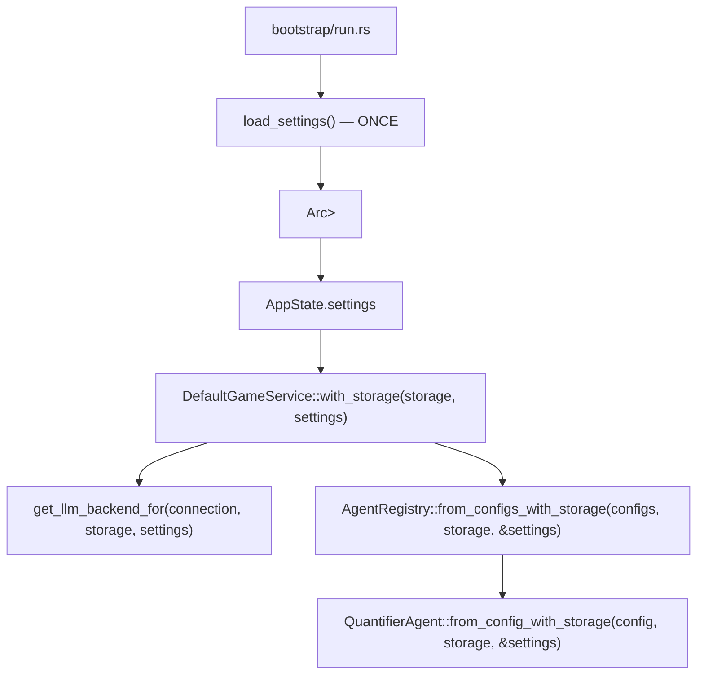

# Specification: Core Architecture (Modular)

## Objective
Establish a domain-driven modular architecture for the Chronicler Engine. This structure separates core data models, game mechanics, application orchestration, narrative processing, and user interface logic.

## Module Domains

### 1. The Model Tier (`crate::model::*`)
Contains pure data structures, serialization schemas, and the "Single Source of Truth" for game state. This tier has zero knowledge of the UI or LLM logic.
- **`world`**: Setting lore, global rules, and starting scenarios.
- **`map`**: Room/Region hierarchy and cardinal direction definitions.
- **`character`**: NPC attributes (name, description, personality, scenario, image_path, **profile_image**, **headshot_image**) and Player inventory.
- **`state`**: The `GameState` aggregation, narration history logs, and TUI state. `NarrativeState` uses a `Vec<Message>` where each `Message` is an independent narrative unit (input, narration, dialogue, or system). `LogEntry` remains the atomic rendering unit for templates and prompts. `StoredTriggerContext` enables replaying trigger continuations on retry. `LogEntry` carries optional `location_header` and `event_header` metadata for visual rendering; `NarrativeState` tracks `pending_location` and `pending_event` for consumption by the next `add_log` call.
- **`scenario`**: Starting scenario definitions for narrative introductions.
- **`trigger`**: Trigger definitions, conditions, and character state tracking (`Trigger`, `TriggerCondition`, `TriggerAction`, `NpcEncounterState`, `CharacterState`).
- **`settings`**: `AppSettings`, `Connection`, and agent configuration data models.
- **`agent`**: `AgentConfig`, `AgentResult`, `AgentContext`, `StatePatch`, `ExecutionPhase`, `BackendSelector`, `Confidence`.
- **`llm_backend`**: `LlmBackendType` enum for backend selection.
- **`llm_message`**: `LlmMessage` struct for LLM call forensics — agent name, backend, model, prompts, raw request/response JSON, parsed response, error, timestamp.
- **`state_snapshot`**: `GameStateSnapshot` for SQLite persistence. Snapshots are standalone state blobs with an auto-increment `id`. Each message stores `snapshot_id` referencing the snapshot saved after it was created.

### 2. The Engine Tier (`crate::engine::*`)
Contains the mechanics that drive the simulation. It translates user intent and state into outcomes.
- **`parser`**: Natural language command decomposition.
- **`action`**: The `Action` enum defining all supported system intents.
- **`logic`**: Rules for movement, fuzzy-matching, and room resolution.
- **`trigger_eval`**: Pure function evaluation of NPC triggers based on character state and room location (`evaluate_triggers(state) -> Vec<(NpcCard, Trigger, usize)>`). Triggers with `room_id` only fire in that room.
- **`action_processing`**: Extracted pure functions for server handlers (`handle_movement`, `apply_npc_events`, `evaluate_and_narrate_triggers`, `commit_trigger_narration`, `execute_freeaction_impl`). Enables unit testing of server-side logic.
- **`state_diagnostics`**: Runtime invariant checks (`INV-ROOM`, `INV-NPC`, `INV-CHAR`, `INV-LOG`), feature-flagged via `diagnostics` feature.

### 2.5. The Application Tier (`crate::application::*`)
Orchestration layer that coordinates game flow, persistence, and LLM generation. Sits between the HTTP server and the pure simulation engine.
- **`game_service`**: `GameService` trait and `DefaultGameService` — game orchestration extracted from fragments.rs. Includes action handling, retry logic, and context helpers.
  - `execute_freeaction_pipeline()`: Extracted full FreeAction pipeline (narrate → quantify → triggers → event continuation) usable by both normal action handling and retry logic.
  - `retry_last_response_impl()`: Message-aligned retry that detects event continuations vs main narration, finds the anchor message, loads its `snapshot_id` snapshot, and regenerates.
  - `save_committed_state()`: Saves snapshots with `committed = true` for pre-generation anchoring.

### 3. The Narrative Tier (`crate::narrative::*`)
The interface between the synchronous engine and stochastic LLM generation.
- **`llm`**: Directory module with traits (`LlmBackend`) and per-provider implementations (OpenRouter, DeepSeek, Ollama, Mock) for Game Master narration.
  - **`get_llm_backend_for(connection, storage, settings)`**: Create a backend for a specific `Connection` profile. Settings are passed in — no file I/O inside the backend.
  - **`DefaultGameService::with_storage(storage, settings)`**: Production constructor that receives pre-loaded settings.
  - **`DefaultGameService::with_backends(llm, registry)`**: Constructor for dependency-injecting mock backends and agent registry in tests. No globals, no file I/O, fully isolated.
- **`prompt`**: Directory module for layered prompt construction with token budget management. Uses plain-text instructions + XML-wrapped data for reasoning-model compatibility. Includes `fit_messages_to_context()` for dynamic context-window fitting.
- **`agents`**: Directory module for the agent trait, registry, and agent implementations.
  - **`Agent` trait**: Core abstraction for pre-generation and post-generation agents
  - **`AgentRegistry`**: Loads agents from config and iterates by execution phase
  - **`QuantifierAgent`**: Post-generation agent for scene quantification and dynamic room presence detection
  - **`NarratorAgent`**: Stub pre-generation agent (reserved for future use)
- **`quantifier`** (under `agents/`): Quantifier implementation module.
  - **`QuantifierAgent`**: Post-generation agent that uses `LlmBackend::complete()` for scene quantification
  - **`NpcEventList`**: NPC movement events from quantification (Entered, Left)
- **`text_check`**: Directory module for spell and grammar checking of player input.
  - **`HarperBackend`**: Wraps harper-core with curated + user dictionaries
  - **`check_player_input()`**: Facade that returns `Option<CheckResult>` based on `TextCheckMode`
  - **`CheckResult`/`CheckIssue`**: Structured lint results with byte spans and suggestions
- **`llm_client`**: HTTP client helpers for OpenRouter and Ollama.

#### NPC Event Layer

Quantifier results include NPC movement events:

| Event | Trigger |
|-------|---------|
| `Entered` | NPC transitions from NOT in area → in area |
| `Left` | NPC transitions from in area → NOT in area |

When `Entered` fires: `currently_meeting = true`  
When `Left` fires: `currently_meeting = false`  

**times_met semantics**: Only increments on `Entered` (first encounter or NPC rejoins after leaving). Not on continuous presence across turns.

### 4. The Server Tier (`crate::server::*`)
The HTTP layer for the HTMX web dashboard with polling-based real-time updates.
- **`mod`**: Axum router, request handlers, `AppState`, `run_server`, `create_app_for_testing`, `create_app_for_testing_with_settings`.
- **`fragments`**: HTML fragment generators for HTMX partial updates. Split into submodules:
  - **`actions`**: Action form handlers and renderers
  - **`endpoints`**: HTMX fragment endpoints (`/fragment/story-log`, `/fragment/visual-sidebar`, etc.)
  - **`history`**: History editing, deletion, and retry endpoints
  - **`misc`**: Utility endpoints (status, hints, text check)
  - **`renderers`**: HTML rendering helpers, markdown→HTML via `pulldown-cmark`
- **`settings_fragment`**: Settings panel fragment handlers and template rendering.
- **`templates`**: Askama template definitions with type-safe rendering.
  - Templates declare required data shapes at compile time.
  - Missing fields = compiler error (not runtime failure).
- **`debug`**: Dev diagnostic endpoint (`/debug/state`).

### 5. The Settings Tier (`crate::settings` + `crate::model::settings`)
Persistent JSON-based settings system for LLM configuration with reusable connection profiles.

| Component | Purpose |
|-----------|---------|
| `data/settings.json` | Persistent settings file |
| `AppSettings` struct | Configuration data model (connections + active selections) |
| `Connection` struct | Named provider+model profile |
| `AppState.settings` | Runtime access via `Arc<RwLock<AppSettings>>` |

#### Settings Flow

Settings are loaded **once** at startup and passed down through the construction chain:

- Backends store `Option<Arc<RwLock<AppSettings>>>` and read `response_length` dynamically per-call.
- Connection changes still require a server restart (Approach A).
- Only `response_length` and `max_context_tokens` are read dynamically at runtime.

#### Configuration Options

| Setting | Type | Default |
|---------|------|---------|
| `connections` | `Vec<Connection>` | Three default connections (OpenRouter GPT-4o Mini, OpenRouter Euryale, Ollama Gemma) |
| `narration_connection_id` | string | `"openrouter-gpt-4o-mini"` |
| `quantifier_connection_id` | string | `"openrouter-gpt-4o-mini"` |

#### Connection Context Windows

Each connection can specify a `max_context_tokens` value. When unset, defaults are resolved by provider:

| Provider | Default `max_context_tokens` |
|----------|------------------------------|
| `ollama` | 8192 |
| `openrouter` / `deepseek` | 32768 |
| `mock` | 4096 |

Each `Connection` contains: `id`, `name`, `provider`, `model`, `api_key` (optional), `base_url` (optional), `single_user_message` (optional, default `false`), `max_tokens` (optional), `max_context_tokens` (optional).

#### Environment Fallback

- `OPENROUTER_API_KEY` env var used as fallback when connection `api_key` is None
- `LLM_BACKEND` env var is **not** consulted (settings file is sole source of truth)

### 6. The Error Tier (`crate::error`)
Unified error type shared across all tiers.
- **`EngineError`**: Top-level error enum (`Llm`, `Narrative`, `Internal`, `Io`, `Serde`, `Parse`, `Serialize`, `Navigation`, `RoomNotFound`, `NpcNotFound`, `WorldNotFound`, `Config`, `Template`, `DataLoad`, `ContextOverflow`)
- **`LlmFailure`**: LLM-specific errors (`EmptyResponse`, `Http`, `Network`, `ParseError`, `Timeout`)
- **`NarrativeFailure`**: Prompt build and generation failures
- **`InternalError`**: Invariant violations

### 7. The Storage Tier (`crate::storage`)
SQLite-based persistence for game state and LLM call forensics.
- **`db`**: Database connection and schema management. Schema includes:
  - `games` — top-level game session record (`id`, `world_name`, `created_at`, `updated_at`)
  - `game_state_snapshots` — serialized game state metadata, scoped to `game_id`
  - `messages` — narrative history, scoped to `game_id`
  - `checkpoints` — named save points referencing snapshots
  - `llm_messages` — LLM API call logging (not game-scoped)
- **`snapshot_storage`**: `SnapshotStorage` trait and SQLite implementation (`SqliteGameStorage`). All operations filter by `game_id`.
- **`llm_message_storage`**: `LlmMessageStorage` trait + `SqliteLlmMessageStorage` (auto-pruning to 50 rows) + `InMemoryLlmMessageStorage` (tests)
- **`GameStateSnapshot`**: Serializable subset of `GameState` for persistence (messages excluded; hydrated separately)

### 8. The Bootstrap Tier (`crate::bootstrap`)
World loading, validation, and server initialization.
- **`load`**: World data loading from `data/worlds/`
- **`validate`**: World data validation (rooms, NPCs, triggers)
- **`scenario`**: Starting scenario selection
- **`logging`**: Structured logging setup
- **`run`**: Server initialization and startup

### 9. The CLI Tier (`crate::cli`)
Command-line argument parsing via `clap`.
- **`Cli`**: CLI args struct (`--world`, `--port`, etc.)

### 10. The Test Support Tier (`crate::test_support`)
Shared test fixtures and utilities.
- **`fixtures`**: `TestGameState`, `TestNpc`, `TestMap`, etc.
- **`context`**: Test context helpers
- **`in_memory_storage`**: In-memory `SnapshotStorage` and `LlmMessageStorage` implementations for tests

> **Note:** `assets/` contains static web assets (`index.html`) served by the server. It is not a Rust module tier.

## File Navigation

For file-to-module mapping, use `cargo doc` or navigate `src/` directly. Files follow the pattern `src/<tier>/<module>.rs` with sibling `*_tests.rs` test files.

## Sub-system References

The following concerns are documented in dedicated `docs/system/` files. Those are the authoritative source — this file covers module structure only.

| Topic | Document |
|-------|----------|
| Dashboard layout, tabs, polling, edit/retry UI | [`system/dashboard.md`](../system/dashboard.md) |
| UI design tokens, CSS components, animations | [`system/ui_design.md`](../system/ui_design.md) |
| Full game loop phases, retry flow, status phases | [`system/game_flow.md`](../system/game_flow.md) |
| History management, Message model | [`system/game_flow.md`](../system/game_flow.md) |
| Server endpoint reference | [`system/game_flow.md`](../system/game_flow.md) |
| Auto-trigger system and mutation order invariant | [`system/triggers.md`](../system/triggers.md) |
| Navigation and movement resolution | [`system/navigation.md`](../system/navigation.md) |
| Narration engine and Game Master logic | [`system/narration_engine.md`](../system/narration_engine.md) |
| LLM call logging and forensics | [`system/llm_processing.md`](../system/llm_processing.md) |

## Error Strategy

A unified error type (`crate::error::EngineError`) is shared across all tiers for consistent error propagation — from data loading through LLM failures to HTTP responses. See `src/error.rs` for the full variant list.
