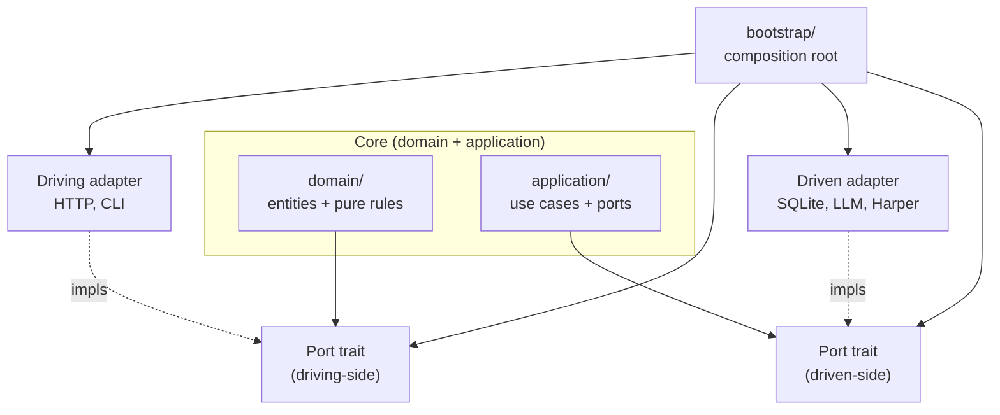
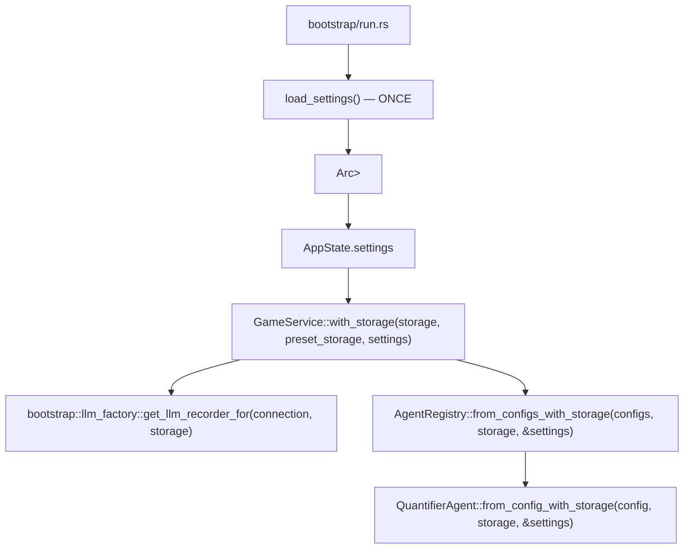

# Specification: Core Architecture (Modular)

## Objective

Establish a domain-driven modular architecture for the Chronicler Engine. This structure separates core data models, game mechanics, application orchestration, narrative processing, and user interface logic.

## Hexagonal Architecture (Ports & Adapters)

Chronicler Engine adopts **Ports & Adapters (Hexagonal) Architecture**. Authoritative decisions, rationale, accepted/rejected port traits, the "phantom port" heuristic, and the Storage direct-access exemption live in [ADR-027](../adr/adr-027-hexagonal-architecture-migration.md).

Dependency invariant:

- Core (`domain/`, `application/`) depends on port traits only.
- Adapters implement port traits.
- Only `bootstrap/` imports both port traits and adapter impls (composition root).
- Driven-side port traits owned by `application/ports/`: `LlmProvider` (4 impls), `LlmMessageRepository` (1 impl), `TextChecker` (1 impl).
- Storage is accessed directly by 5 application files (3 intentional persistence boundary + 2 deferred to T2), each marked with `// arch-lint: storage-direct` — see ADR-027.

### Adapters

| Type | Path | Examples |
|------|------|----------|
| Driving (inbound) | `adapters/driving/` | HTTP server (`http/`), CLI (`cli.rs`) |
| Driven (outbound) | `adapters/driven/` | Storage (SQLite/InMemory/Test), LLM providers, HarperTextChecker |

## Module Domains

### 1. The Model Tier (`crate::domain::model::*`)

Contains pure data structures, serialization schemas, and the "Single Source of Truth" for game state. This tier has zero knowledge of the UI or LLM logic.

- **`world`**: Setting lore, global rules, and starting scenarios.
- **`map`**: Room/Region hierarchy and cardinal direction definitions.
- **`character`**: NPC attributes (name, description, personality, scenario, **profile_image**, **headshot_image**) and Player inventory. `inventory` lives on `PlayerCard`/`NpcCard`, not on the shared `CharacterSheet`.
- **`state`**: The `GameState` aggregation, narration history logs, and TUI state. `NarrativeState` holds a `MessageHistory` (independent narrative units with swipe metadata). `LogEntry` is the atomic rendering unit for templates and prompts, carrying `swipe_count` and `active_swipe_index`. `StoredTriggerContext` enables replaying trigger continuations on retry or retrigger. `LogEntry` carries optional `location_header` and `event_header` metadata for visual rendering; `NarrativeState` tracks `last_trigger_id` for retrigger capability.
- **`scenario`**: Starting scenario definitions for narrative introductions. `StartingScenario` carries `starting_room_id` (default `"start"`) so each scenario declares its own entry room.
- **`trigger`**: Trigger definitions, conditions, and NPC encounter tracking (`Trigger`, `TriggerCondition`, `TriggerEffect`, `NpcEncounterState`, `NpcEncounterLog`).
- **`settings`**: `AppSettings`, `LlmProviderConfig`, and agent configuration data models.
- **`agent`**: `AgentConfig`, `AgentResult`, `AgentContext`, `StatePatch`, `ExecutionPhase`, `BackendSelector`, `Confidence`. `AgentContext` carries the current room for agents that need spatial awareness.
- **`quantifier`**: `QuantifierResult`, `QuantifierParseResult`, `MovementParseResult`, `QuantifierConfidence`, `NpcEvent`, `NpcEventType`, `NpcEventList`. Mechanical result types produced by the narrative quantifier but consumed by the engine tier. Living in `model` prevents engine→narrative coupling.
- **`llm_backend`**: `LlmBackendType` enum for backend selection.
- **`llm_message`**: `LlmMessage` struct for LLM call forensics — agent name, backend, model, prompts, raw request/response JSON, parsed response, error, timestamp.
- **`state_snapshot`**: `GameStateSnapshot` for SQLite persistence. Snapshots are standalone state blobs with an auto-increment `id`. Each message stores `snapshot_id` referencing the snapshot saved after it was created. Type lives in `domain::model::state::game_state_snapshot` (domain-owned DTO).

### 2. The Engine Tier (`crate::domain::engine::*`)

Contains the mechanics that drive the simulation. It translates user intent and state into outcomes.

- **`parser`**: Command wrapping — all input becomes `Action::FreeAction(String)`.
- **`action`**: The `Action` enum defining all supported system intents.
- **`logic`**: Rules for movement, fuzzy-matching, and room resolution.
- **`trigger_eval`**: Pure function evaluation of NPC triggers based on character state and room location. Triggers with `room_id` only fire in that room.
- **`action_processing`**: Pure functions for movement and narrative state updates. `handle_movement` composes `attempt_movement` (with dynamic room creation on failure), `update_npc_encounters_on_room_change`, and `log_movement_completion`. `execute_freeaction_impl` evaluates triggers before applying NPC events and returns `TriggerMatch` data for the application tier to build continuation prompts. Enables unit testing of server-side logic.
- **`state_diagnostics`**: Runtime invariant checks (`INV-ROOM`, `INV-NPC`, `INV-CHAR`, `INV-LOG`), feature-flagged via `diagnostics` feature.

### 2.5. The Application Tier (`crate::application::*`)

Orchestration layer that coordinates game flow, persistence, and LLM generation. Sits between the HTTP server and the pure simulation engine.

- **`context`**: Shared infrastructure for game service operations.
  - `OpContext`: Process refs (storage, preset_storage, settings, cancel_token, is_generating) + per-op domain data (world_snapshot). Per-op view, not long-lived.
  - `context.rs`: Shared persistence helpers (`load_or_fresh`, `load_expecting_valid_state`, `save_state`, `save_message_and_snapshot`, `map_llm_error`). Cross-storage coordination helpers (`load_messages`, `update_message_text`, `migrate_swipes`). Test-only `load_state_for_test` lives at module scope (not on `OpContext`).
  - `save_message_and_snapshot()`: Saves a snapshot and immediately persists the newest unpersisted message with the snapshot ID. Messages are persisted as they are created; there is no batching or `committed` flag.

**Arrival narration use case** (`application::arrival_service::ArrivalTaskContext::run`) routes through `save_message_and_snapshot`. Snapshot blob carries history for audit only; `messages` table is source of truth on reload.

- **`message_editing.rs`**: Free fns for message editing operations - `switch_swipe`, `edit_history`, `delete_last`, `retry`, `retrigger`. `retry` and `retrigger` take `&Arc<GameService>` and spawn their pipeline task via the shared `application::spawn_pipeline_task` helper. `switch_swipe`/`edit_history`/`delete_last` take only `OpContext` (no `game_service` dependency).
- **`query_handlers.rs`**: Free fns for read-only query operations - `get_generating_status`, `reset_generating_status`, `get_current_game_name`, `list_latest_llm_messages`, `get_story_log_entries`, `get_input_status`, `get_current_room_view`, `get_npc_headshots`, `get_debug_state`.
- **`spawn.rs`**: `pub(crate) fn spawn_pipeline_task(game_service, ctx, f: F)` — dedupes `Arc::clone` + `tokio::task::spawn_blocking`. Cancel-check + `GenerationGuard` lifetime stay inside each caller's closure (zero behavior change).
- **`arrival_service.rs`**: Arrival narration use case. `ArrivalTaskContext` struct (12 fields — owns `OpContext`, prompt preset, NPC lists, `LlmCallRecorder`) + `run()` method (loads snapshot → builds prompt → calls LLM narrator → persists via `save_message_and_snapshot`). Spawned via `spawn_blocking` from `bootstrap::init_game::spawn_arrival_task_if_needed`. Test-only constructor `new_for_test` + `run_sync` entrypoint.
- **`scenario.rs`**: `inject_scenario_logs(state, world, player)` — pure application logic (renders scenario text template + adds as `MessageType::Narration`).
- **`action_pipeline`**: Action-processing workflows and the `ActionPipeline` orchestration struct. See [`system/action_pipeline.md`](../system/action_pipeline.md) for full mechanics (`PipelineInputs` ownership, `PipelineRun<'a>` borrow, error model, cancellation sites).
  - `pipeline.rs`: `ActionPipeline` struct holds direct fields (`prompt_assembler: Arc<PromptAssembler>`, `llm_recorder: Arc<LlmCallRecorder>`, `agent_registry: Arc<AgentRegistry>`); `run_post_generation_agents` is now an inline phase method. Orchestrates the full FreeAction pipeline via `run_from_input`. Checks `CancellationToken::is_cancelled()` at stage boundaries and aborts gracefully via `handle_cancellation()`. **Error model**: pipeline errors set `GenerationStatus::Error` on state and return `Ok(())`; only `Err(ActionOutcome::Cancelled)` uses the `Err` path.
  - `phases.rs`: `PipelineRun<'a>` struct borrows `(pipeline, ctx)` for the duration of `run_from_input`. Phase methods (`phase_narrate`, `phase_post_generation`, `phase_engine_commit`, `phase_trigger_continuation_llm_call`, `reconcile_post_trigger_npcs`, `build_trigger_request`) are methods on `PipelineRun`, dropping the `ctx: &OpContext` parameter from each signature. Includes `persist()`, `persist_snapshot_failed()`, and `error_return()` helpers. `pipeline.rs` constructs `PipelineRun` once in `run_from_input` + routes calls through it. External callers (retry.rs) use `ActionPipeline::phase_trigger_continuation()` pub(crate) wrapper.
  - `PipelineInputs`: Owned struct bundling pipeline input parameters (owned `Vec<NpcCard>` + `String`) passed to `run_from_input` / `build_trigger_request` / `phase_trigger_continuation_llm_call`. Avoids borrow-checker fights by owning data outright instead of borrowing from `GameState`.
  - `actions.rs`: Thin dispatch layer — `execute_action_impl` calls `service.pipeline()` and delegates to `run_from_input`.
  - `retry.rs`: Retry-specific setup (anchor finding, message deletion, snapshot loading) delegates continuation regeneration to `pipeline.phase_trigger_continuation()` + `PipelineRun::reconcile_post_trigger_npcs()` and main narration retry to `pipeline.run_from_input()`.
- **`game_service`**: `GameService` struct (renamed from `DefaultGameService`) exposes `execute_action(ctx, input)` and `retry_last_response(ctx)`. No trait impl — `ActionPipelineBackend` deleted. Also exposes `pipeline()` accessor returning a fresh `ActionPipeline` (callers no longer reach into `prompt_assembler` / `llm_recorder` / `agent_registry` fields to build one). External callers use the `GameService` methods; only the `ActionPipeline` internals call the impl functions directly.
- **`application_service`**: Thin orchestrator struct (`DefaultApplicationService`) with game lifecycle operations inlined (`create_game`, `switch_game`, `delete_game`, `list_games`, `current_game_id`, `reset`, worlds CRUD). Contains `process_action` entry point with self-healing stale-`Generating` detection and `GenerationGuard` RAII helper for `is_generating` flag cleanup. `process_action` spawns its blocking task via the shared `application::spawn_pipeline_task` helper. Read-only query and message-editing operations are NOT delegated through this struct anymore — server callers route to `application::query_handlers` and `application::message_editing` module free fns directly (T3 service-layer cleanup). `ApplicationError::is_user_displayable()` enables type-driven error branching — validation errors and `WorldHasGames` domain constraints are inline-displayable; engine errors use `app_err_to_response()`.

### 3. The Server Tier (`crate::adapters::driving::http::*`)

The HTTP layer for the HTMX web dashboard with polling-based real-time updates.

**Layer Boundary:** The server tier must never access `GameState` directly. All reads go through the `ApplicationService` trait (`get_story_log_entries`, `get_input_status`, `get_current_room_view`, `get_npc_headshots`, `get_debug_state_view`, etc.). All writes go through `ApplicationService` command methods (`process_action`, `retry`, `reset`, etc.). This keeps the HTTP layer decoupled from domain state structure.

**Context Loading Pattern (ADR-025):** `load_op_context_for_active_game()` free fn (in `op_context_loader.rs`) loads world context on-demand from DB based on active game's `world_key`. All handlers MUST propagate errors — never silently swallow with defaults. Use `ctx_or_error()` helper in `renderers.rs` to avoid repeating error handling boilerplate.

**`mod`**: Axum router, request handlers, `AppState`, `run_server_with_config`. Test constructors (`create_app_for_testing`, `create_app_for_testing_with_settings`) live in `test_support/test_app_builder.rs`.

- **`fragments`**: HTML fragment generators for HTMX partial updates. Split into submodules:
  - **`actions`**: Action form handlers and renderers
  - **`endpoints`**: HTMX fragment endpoints (`/fragment/story-log`, `/fragment/visual-sidebar`, etc.)
  - **`generation_guard`**: Generation lock/status fragment endpoints
  - **`history`**: History editing, deletion, and retry endpoints
  - **`misc`**: Utility endpoints (status, text check)
  - **`renderers`**: HTML rendering helpers, markdown→HTML via `pulldown-cmark`. Exports `ctx_or_error()` helper for consistent context loading.
- **`games_fragment`**: Game management sub-module (moved from `fragments/games`). Handles the Games panel (formerly "Save / Load") with three vertical sections: Active Game (with inline reset button), New Game (always-visible form with world dropdown **and persona dropdown per ADR-026**), and Saved Games. Game switching, deletion, and reset. Endpoints: `/fragment/games` (list), `/games` (create with `world_key` + `persona_key` form params), `/games/:id/switch`, `/games/:id/delete`. Reset is the top-level `POST /reset` (renames/recreates the active game).
- **`settings_fragment`**: Settings panel fragment handlers and template rendering.
- **`prompt_presets_fragment`**: Prompt Presets panel with two independent collections (System, Quantifier). Supports CRUD operations, active selection, and protected default presets.
- **`worlds_fragment`**: Worlds management panel for multi-world orchestration. Supports CRUD operations on worlds including map/scenario definitions and game count validation. Persona selection moved to `games_fragment` per ADR-026. Handlers: `list_worlds_fragment`, `new_world_form_handler`, `edit_world_form_handler`, `create_world_handler`, `update_world_handler`, `delete_world_handler`. Uses HTMX inline swaps (no modal) — Create/Edit buttons replace the `.worlds-panel` content; Cancel button returns to list.
- **`view_models`**: View model structs that decouple templates from domain types.
  - `view_models.rs`: `MessageEntryView`, `LlmMessageView`, `PreviewIssueView`, `ActionAreaViewModel`, `VisualSidebarViewModel`, `NpcPortraitView`, and `SafeHtml` / `markdown_to_html`.
  - Domain-to-view mapping lives here; `templates.rs` focuses purely on HTML.
- **`templates`**: Askama template definitions with type-safe rendering.
  - Templates declare required data shapes at compile time.
  - Missing fields = compiler error (not runtime failure).
- **`debug`**: Dev diagnostic endpoint (`/debug/state`).

### 5. The Settings Tier (`crate::settings` + `crate::domain::model::settings`)

DB-backed settings system for LLM configuration with reusable connection profiles (seeded from JSON at startup).

| Component | Purpose |
|-----------|---------|
| `data/settings.json` | Seed template for default settings (DB is runtime source of truth) |
| `AppSettings` struct | Configuration data model (connections, agents, prompt presets, text check settings) |
| `LlmProviderConfig` struct | Named provider+model profile |
| `AppState.settings` | Runtime access via `Arc<RwLock<AppSettings>>` |

#### Settings Flow

Settings are loaded **once** at startup and passed down through the construction chain:

- Backends store `Option<Arc<RwLock<AppSettings>>>` for settings access.
- Connection changes still require a server restart (Approach A).
- Only `max_context_tokens` is read dynamically at runtime.

#### Configuration Options

| Setting | Type | Default |
|---------|------|---------|
| `connections` | `Vec<LlmProviderConfig>` | Three default connections (OpenRouter GPT-4o Mini, OpenRouter Euryale, Ollama Gemma) |
| `narration_connection_id` | string | `"openrouter-gpt-4o-mini"` |
| `quantifier_connection_id` | string | `"openrouter-gpt-4o-mini"` |
| `text_check` | `TextCheckSettings` | Spell/grammar check config |
| `agents` | `Vec<AgentConfig>` | Agent registry config |
| `active_system_prompt_preset_id` | string | Active system prompt preset |
| `active_quantifier_prompt_preset_id` | string | Active quantifier preset |
| `active_system_prompt` | `Option<String>` | Runtime override (serde-skipped) |
| `active_quantifier_prompt` | `Option<String>` | Runtime override (serde-skipped) |

#### Provider Context Windows

Each connection can specify a `max_context_tokens` value. When unset, defaults are resolved by provider:

| Provider | Default `max_context_tokens` |
|----------|------------------------------|
| `ollama` | 8192 |
| `openrouter` / `deepseek` | 32768 |
| `mock` | 4096 |

Each `LlmProviderConfig` contains: `id`, `name`, `provider` (`LlmBackendType`), `model`, `api_key` (optional), `base_url` (optional), `single_user_message` (default `false`), `max_tokens` (optional), `max_context_tokens` (optional).

#### Environment Fallback

- `OPENROUTER_API_KEY` env var used as fallback when connection `api_key` is None
- `LLM_BACKEND` env var is **not** consulted (settings file is sole source of truth)

### 5.5. Storage Module (`crate::adapters::driven::storage`) — World Seeding & Loading

Seed-once, load-from-DB pattern for worlds, personas, and characters. See [`system/storage.md`](../system/storage.md) for the full specification.

### 6. Bootstrap Module (`crate::bootstrap`)

World seeding, validation, and server initialization.

- **`load`**: Game data seeding from JSON files (idempotent, file I/O only during seeding) — `ensure_presets()`, `seed_game_data()`
- **`validate`**: World data validation (rooms, NPCs, triggers)
- **`logging`**: Structured logging setup
- **`wiring`**: Composition root for LLM and text-check services — `build_game_service` (prod path, builds narration+quantifier recorders via `llm_factory`, builds `AgentRegistry`, calls `GameService::with_storage`), `build_narration_recorder` (for arrival task wiring), `build_text_check_service`, `build_game_service_for_tests` (testing feature only).
- **`run`**: Server initialization and startup. Thin orchestrator that delegates to `init_game` for game state setup and arrival narration.
- **`init_game`**: Game state initialization — `resolve_game_id()` (auto-creates a game for the requested world using the `--persona` CLI flag when none exists), `load_game_state()`, `spawn_arrival_task_if_needed()` (composition root: wires `OpContext`+`LlmCallRecorder`, spawns blocking task). The arrival narration use case itself (`ArrivalTaskContext::run`) lives in `application::arrival_service`.
- **`state.rs`**: Fresh game state initialization (`build_fresh_initial_state`)

### 7. CLI Module (`crate::adapters::driving::cli`)

Command-line argument parsing via `clap`.

- **`Cli`**: CLI args struct (`--world`, `--persona`, `--port`, etc.)

### 8. Test Support Module (`crate::test_support`)

Shared test fixtures and utilities. See [`reference/test_support.md`](../reference/test_support.md) for builder API + fixture catalogue. Module anchor `[DOC: docs/reference/test_support.md]` on each file.

- **`fixtures`**: Test GameState, Npc, Map helpers
- **`context`**: Test context builders
- **`noop_forensics`** / **`recording_forensics`**: `LlmMessageRepository` spy impls for LLM recorder tests (see ADR-012 SQLite-backed LLM call logging)
- **`test_app_builder`**: Fluent test app builder API

Test binaries: see `Cargo.toml` `[[test]]` entries. Each binary mirrors `src/` per `TEST MIRROR CONVENTION` in [`tests/AGENTS.md`](../../tests/AGENTS.md).

> **Note:** `assets/` contains static web assets (`index.html`) served by the server. It is not a Rust module tier.

