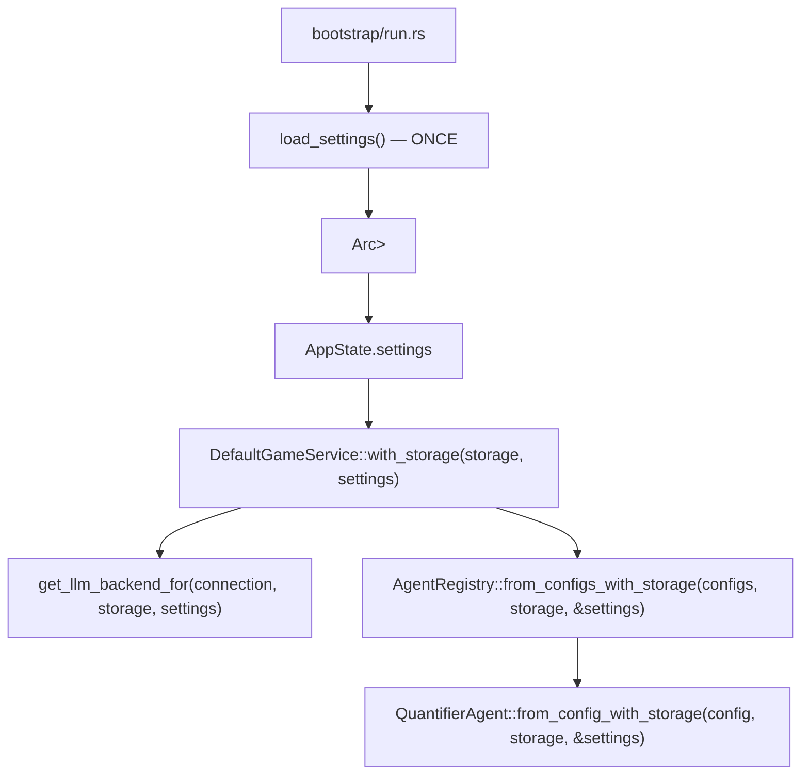

# Specification: Core Architecture (Modular)

## Objective

Establish a domain-driven modular architecture for the Chronicler Engine. This structure separates core data models, game mechanics, application orchestration, narrative processing, and user interface logic.

## Module Domains

### 1. The Model Tier (`crate::model::*`)

Contains pure data structures, serialization schemas, and the "Single Source of Truth" for game state. This tier has zero knowledge of the UI or LLM logic.

- **`world`**: Setting lore, global rules, and starting scenarios.
- **`map`**: Room/Region hierarchy and cardinal direction definitions.
- **`character`**: NPC attributes (name, description, personality, scenario, **profile_image**, **headshot_image**) and Player inventory. `inventory` lives on `PlayerCard`/`NpcCard`, not on the shared `CharacterSheet`.
- **`state`**: The `GameState` aggregation, narration history logs, and TUI state. `NarrativeState` holds a `MessageHistory` which encapsulates `Vec<Message>` where each `Message` is an independent narrative unit (input, narration, dialogue, or system). Each `Message` carries a `swipes: Vec<Swipe>` set — alternate generations preserved during retry, with `active_swipe_index` selecting the currently displayed version. `LogEntry` remains the atomic rendering unit for templates and prompts, now carrying `swipe_count` and `active_swipe_index` for swipe control rendering. `StoredTriggerContext` enables replaying trigger continuations on retry or retrigger. `LogEntry` carries optional `location_header` and `event_header` metadata for visual rendering; `NarrativeState` tracks `last_trigger_id` for retrigger capability.
- **`scenario`**: Starting scenario definitions for narrative introductions. `StartingScenario` carries `starting_room_id` (default `"start"`) so each scenario declares its own entry room.
- **`trigger`**: Trigger definitions, conditions, and NPC encounter tracking (`Trigger`, `TriggerCondition`, `TriggerEffect`, `NpcEncounterState`, `NpcEncounterLog`).
- **`settings`**: `AppSettings`, `Connection`, and agent configuration data models.
- **`agent`**: `AgentConfig`, `AgentResult`, `AgentContext`, `StatePatch`, `ExecutionPhase`, `BackendSelector`, `Confidence`. `AgentContext` carries the current room for agents that need spatial awareness.
- **`quantifier`**: `QuantifierResult`, `QuantifierParseResult`, `MovementParseResult`, `QuantifierConfidence`, `NpcEvent`, `NpcEventType`, `NpcEventList`. Mechanical result types produced by the narrative quantifier but consumed by the engine tier. Living in `model` prevents engine→narrative coupling.
- **`llm_backend`**: `LlmBackendType` enum for backend selection.
- **`llm_message`**: `LlmMessage` struct for LLM call forensics — agent name, backend, model, prompts, raw request/response JSON, parsed response, error, timestamp.
- **`state_snapshot`**: `GameStateSnapshot` for SQLite persistence. Snapshots are standalone state blobs with an auto-increment `id`. Each message stores `snapshot_id` referencing the snapshot saved after it was created.

### 2. The Engine Tier (`crate::engine::*`)

Contains the mechanics that drive the simulation. It translates user intent and state into outcomes.

- **`parser`**: Command wrapping — all input becomes `Action::FreeAction(String)`.
- **`action`**: The `Action` enum defining all supported system intents.
- **`logic`**: Rules for movement, fuzzy-matching, and room resolution.
- **`trigger_eval`**: Pure function evaluation of NPC triggers based on character state and room location (`evaluate_triggers(state) -> Vec<(NpcCard, Trigger, usize)>`). Triggers with `room_id` only fire in that room.
- **`action_processing`**: Pure functions for movement and narrative state updates. `attempt_movement` handles semantic walk with dynamic room creation on failure. `update_npc_encounters_on_room_change` updates NPC meeting state when room changes. `log_movement_completion` sets pending location. `handle_movement` composes these helpers linearly. `execute_freeaction_impl` evaluates triggers before applying NPC events and returns `TriggerMatch` data for the application tier to build continuation prompts. Enables unit testing of server-side logic.
- **`state_diagnostics`**: Runtime invariant checks (`INV-ROOM`, `INV-NPC`, `INV-CHAR`, `INV-LOG`), feature-flagged via `diagnostics` feature.

### 2.5. The Application Tier (`crate::application::*`)

Orchestration layer that coordinates game flow, persistence, and LLM generation. Sits between the HTTP server and the pure simulation engine.

- **`context`**: Shared infrastructure for game service operations.
  - `GameServiceContext`: Storage (unified SQLite/in-memory/test backend), preset storage, world/map/player/npc references, cancellation token, settings.
  - `context.rs`: Shared persistence helpers (`load_or_fresh`, `load_expecting_valid_state`, `save_state`, `save_message_and_snapshot`, `map_llm_error`). Cross-storage coordination helpers (`load_messages`, `update_message_text`, `load_state_for_test`, `migrate_swipes`).
  - `save_message_and_snapshot()`: Saves a snapshot and immediately persists the newest unpersisted message with the snapshot ID. Messages are persisted as they are created; there is no batching or `committed` flag.
- **`game_lifecycle.rs`**: Game lifecycle operations - `create_game`, `switch_game`, `delete_game`, `list_games`, `current_game_id`, `reset`.
- **`message_editing.rs`**: Message editing operations - `switch_swipe`, `edit_history`, `delete_last`, `retry`, `retrigger`.
- **`query_handlers.rs`**: Read-only query operations - `get_generating_status`, `get_current_game_name`, `list_latest_llm_messages`, `get_story_log_entries`, `get_input_status`, `get_current_room_view`, `get_npc_headshots`, `get_debug_state`.
- **`action_pipeline`**: Action-processing workflows and the `ActionPipeline` orchestration struct.
  - `pipeline.rs`: `ActionPipelineBackend` trait (narrow seam: `assembler()`, `complete`, `run_post_generation_agents`) and `ActionPipeline<'a, B>` generic over the trait. Orchestrates the full FreeAction pipeline via `run_from_input`. Checks `CancellationToken::is_cancelled()` at stage boundaries and aborts gracefully via `handle_cancellation()`. **Error model**: pipeline errors set `GenerationStatus::Error` on state and return `Ok(())`; only `Err(ActionOutcome::Cancelled)` uses the `Err` path.
  - `phases.rs`: Split `impl ActionPipeline` block — phase methods re-attached to `ActionPipeline` while keeping the separate file. `phase_narrate`, `phase_post_generation`, `phase_engine_commit`, `phase_trigger_continuation_raw`, `reconcile_post_trigger_npcs`, `build_trigger_request` are `pub(super)` methods. Includes `persist()`, `persist_snapshot_failed()`, and `error_return()` helpers. `pipeline.rs` calls these as `self.method()` rather than `phases::fn(service, ctx, ...)`.
  - `actions.rs`: Thin dispatch layer — `execute_action_impl` creates `ActionPipeline` and delegates to `run_from_input`.
  - `retry.rs`: Retry-specific setup (anchor finding, message deletion, snapshot loading) delegates continuation regeneration to `ActionPipeline::phase_trigger_continuation()` + `ActionPipeline::reconcile_post_trigger_npcs()` and main narration retry to `ActionPipeline::run_from_input()`.
- **`game_service`**: `DefaultGameService` struct implements `ActionPipelineBackend` trait and exposes public methods `execute_action(ctx, input, player_name)` and `retry_last_response(ctx)`. These wrap the internal `execute_action_impl()` and `retry_last_response_impl()` functions from the `action_pipeline` module. External callers use the `DefaultGameService` methods; only the `ActionPipeline` internals call the impl functions directly.
- **`application_service`**: Thin orchestrator struct (`DefaultApplicationService`) delegating to submodules. Contains `process_action` entry point with self-healing stale-`Generating` detection and `GenerationGuard` RAII helper for `is_generating` flag cleanup. `ApplicationError::is_user_displayable()` enables type-driven error branching — validation errors and `WorldHasGames` domain constraints are inline-displayable; engine errors use `app_err_to_response()`.

### 3. The Narrative Tier (`crate::narrative::*`)

The interface between the synchronous engine and stochastic LLM generation.

- **`llm`**: Directory module with traits (`LlmBackend`) and per-provider implementations (OpenRouter, DeepSeek, Ollama, Mock) for Game Master narration. The `LlmBackend` trait exposes transport primitives: `model()`, `name()`, `save_message()`, `wrap_and_save()`, `complete()`. Backend-specific preprocessing (`preprocess_user_text`) and postprocessing (`postprocess_response_text`) hooks allow model-specific hacks (e.g., Gemma 4 thinking suffix, response sanitization) to live in the provider modules instead of the generic HTTP client.
  - **`get_llm_backend_for(connection, storage, settings)`**: Create a backend for a specific `Connection` profile. Settings are passed in — no file I/O inside the backend.
  - **`DefaultGameService::with_storage(storage, settings)`**: Production constructor that receives pre-loaded settings.
  - **`DefaultGameService::with_backends(llm, registry)`**: Constructor for dependency-injecting mock backends and agent registry in tests. No globals, no file I/O, fully isolated.
- **`prompt`**: Directory module for layered prompt construction with token budget management. Uses XML-sectioned instructions + XML-wrapped data for reasoning-model compatibility. `LayeredPromptAssembler` owns prompt assembly. Includes `fit_messages_to_context()` for dynamic context-window fitting. `NpcContext<'a>` bundles `all_npcs` + `npcs_in_area` slices; `make_prompt_context()` takes 6 parameters (down from 7).
- **`agents`**: Directory module for the agent trait, registry, and agent implementations.
  - **`Agent` trait**: Core abstraction for pre-generation and post-generation agents
  - **`AgentRegistry`**: Loads agents from config and iterates by execution phase
  - **`QuantifierAgent`**: Post-generation agent for scene quantification and dynamic room presence detection
- **`quantifier`** (under `agents/`): Quantifier implementation module.
  - **`QuantifierAgent`**: Post-generation agent that uses `LlmBackend::complete()` for scene quantification. Receives the current room via `AgentContext.current_room`.
  - **`NpcEventList`**: NPC movement events from quantification (Entered, Left). Now lives in `model::quantifier`.
- **`text_check`**: Directory module for spell and grammar checking of player input.
  - **`HarperBackend`**: Wraps harper-core with curated + user dictionaries
  - **`check_player_input()`**: Facade that returns `Option<CheckResult>` based on `TextCheckMode`
  - **`CheckResult`/`CheckIssue`**: Structured lint results with byte spans and suggestions
- **`llm_client`**: Directory module (`mod.rs`, `request.rs`, `response.rs`, `client.rs`) with composable pure functions: `build_request_payload()`, `configure_request()`, `extract_content_from_response()`, `handle_response()`, and the main `call_chat_completions()` orchestration. Backend implementations live in `narrative/llm/` directory.

#### NPC Event Layer

Quantifier results include NPC movement events:

| Event | Trigger |
|-------|---------|
| `Entered` | NPC transitions from NOT in area → in area |
| `Left` | NPC transitions from in area → NOT in area |

When `Entered` fires: `currently_meeting = true`  
When `Left` fires: `currently_meeting = false`  

**times_met semantics**: Only increments on `Entered` (first encounter or NPC rejoins after leaving). Not on continuous presence across turns.

### 4. The Server Tier (`crate::server::*`)

The HTTP layer for the HTMX web dashboard with polling-based real-time updates.

**Layer Boundary:** The server tier must never access `GameState` directly. All reads go through the `ApplicationService` trait (`get_story_log_entries`, `get_input_status`, `get_current_room_view`, `get_npc_headshots`, `get_debug_state_view`, etc.). All writes go through `ApplicationService` command methods (`process_action`, `retry`, `reset`, etc.). This keeps the HTTP layer decoupled from domain state structure.

**Context Loading Pattern (ADR-025):** `AppState::as_game_service_context()` loads world context on-demand from DB based on active game's `world_key`. All handlers MUST propagate errors — never silently swallow with defaults. Use `ctx_or_error()` helper in `renderers.rs` to avoid repeating error handling boilerplate.

**`mod`**: Axum router, request handlers, `AppState`, `run_server_with_config`. Test constructors (`create_app_for_testing`, `create_app_for_testing_with_settings`) live in `test_support/test_app_builder.rs`.

- **`fragments`**: HTML fragment generators for HTMX partial updates. Split into submodules:
  - **`actions`**: Action form handlers and renderers
  - **`endpoints`**: HTMX fragment endpoints (`/fragment/story-log`, `/fragment/visual-sidebar`, etc.)
  - **`generation_guard`**: Generation lock/status fragment endpoints
  - **`history`**: History editing, deletion, and retry endpoints
  - **`misc`**: Utility endpoints (status, hints, text check)
  - **`renderers`**: HTML rendering helpers, markdown→HTML via `pulldown-cmark`. Exports `ctx_or_error()` helper for consistent context loading.
- **`games_fragment`**: Game management sub-module (moved from `fragments/games`). Handles the Games panel (formerly "Save / Load") with three vertical sections: Active Game (with inline reset button), New Game (always-visible form with world dropdown **and persona dropdown per ADR-026**), and Saved Games. Game switching, deletion, and reset. Endpoints: `/fragment/games` (list), `/games` (create with `world_key` + `persona_key` form params), `/games/:id/switch`, `/games/:id/delete`. Reset is the top-level `POST /reset` (renames/recreates the active game).
- **`settings_fragment`**: Settings panel fragment handlers and template rendering.
- **`prompt_presets_fragment`**: Prompt Presets panel with two independent collections (System, Quantifier). Supports CRUD operations, active selection, and protected default presets.
- **`worlds_fragment`**: Worlds management panel for multi-world orchestration. Supports CRUD operations on worlds including map/scenario definitions and game count validation. Persona selection moved to `games_fragment` per ADR-026. Handlers: `list_worlds_fragment`, `new_world_form_handler`, `edit_world_form_handler`, `create_world_handler`, `update_world_handler`, `delete_world_handler`. Uses HTMX inline swaps (no modal) — Create/Edit buttons replace the `.worlds-panel` content; Cancel button returns to list.
- **`view_models`**: View model structs that decouple templates from domain types.
  - `view_models.rs`: `MessageEntryView`, `LlmMessageView`, `PreviewIssueView`, `ActionAreaViewModel`, `VisualSidebarViewModel`, `NpcPortraitView`, and `SafeHtml` / `markdown_to_html`.
  - Domain-to-view mapping lives here; `templates.rs` focuses purely on HTML.
- **`templates`**: Askama template definitions with type-safe rendering.
  - Templates declare required data shapes at compile time.
  - Missing fields = compiler error (not runtime failure).
- **`debug`**: Dev diagnostic endpoint (`/debug/state`).

### 5. The Settings Tier (`crate::settings` + `crate::model::settings`)

DB-backed settings system for LLM configuration with reusable connection profiles (seeded from JSON at startup).

| Component | Purpose |
|-----------|---------|
| `data/settings.json` | Seed template for default settings (DB is runtime source of truth) |
| `AppSettings` struct | Configuration data model (connections, agents, prompt presets, text check settings) |
| `Connection` struct | Named provider+model profile |
| `AppState.settings` | Runtime access via `Arc<RwLock<AppSettings>>` |

#### Settings Flow

Settings are loaded **once** at startup and passed down through the construction chain:

- Backends store `Option<Arc<RwLock<AppSettings>>>` for settings access.
- Connection changes still require a server restart (Approach A).
- Only `max_context_tokens` is read dynamically at runtime.

#### Configuration Options

| Setting | Type | Default |
|---------|------|---------|
| `connections` | `Vec<Connection>` | Three default connections (OpenRouter GPT-4o Mini, OpenRouter Euryale, Ollama Gemma) |
| `narration_connection_id` | string | `"openrouter-gpt-4o-mini"` |
| `quantifier_connection_id` | string | `"openrouter-gpt-4o-mini"` |
| `text_check` | `TextCheckSettings` | Spell/grammar check config |
| `agents` | `Vec<AgentConfig>` | Agent registry config |
| `active_system_prompt_preset_id` | string | Active system prompt preset |
| `active_quantifier_prompt_preset_id` | string | Active quantifier preset |
| `active_system_prompt` | `Option<String>` | Runtime override (serde-skipped) |
| `active_quantifier_prompt` | `Option<String>` | Runtime override (serde-skipped) |

#### Connection Context Windows

Each connection can specify a `max_context_tokens` value. When unset, defaults are resolved by provider:

| Provider | Default `max_context_tokens` |
|----------|------------------------------|
| `ollama` | 8192 |
| `openrouter` / `deepseek` | 32768 |
| `mock` | 4096 |

Each `Connection` contains: `id`, `name`, `provider`, `model`, `api_key` (optional), `base_url` (optional), `single_user_message` (optional, default `false`), `max_tokens` (optional), `max_context_tokens` (optional).

#### Environment Fallback

- `OPENROUTER_API_KEY` env var used as fallback when connection `api_key` is None
- `LLM_BACKEND` env var is **not** consulted (settings file is sole source of truth)

### 5.5. The Storage Tier (`crate::storage`) — World Seeding & Loading

Seed-once, load-from-DB pattern for worlds, personas, and characters. See [`system/storage.md`](../system/storage.md) for the full specification.

### 6. The Error Tier (`crate::error`)

Unified error type shared across all tiers.

- **`EngineError`**: Top-level error enum (`Llm`, `Narrative`, `Internal`, `Io`, `Serde`, `Parse`, `Serialize`, `Navigation`, `RoomNotFound`, `NpcNotFound`, `WorldNotFound`, `WorldHasGames`, `Config`, `Template`, `DataLoad`, `ContextOverflow`)
- **`LlmFailure`**: LLM-specific errors (`EmptyResponse`, `Http`, `Network`, `ParseError`, `Timeout`)
- **`NarrativeFailure`**: Prompt build and generation failures
- **`InternalError`**: Invariant violations

### 7. The Storage Tier (`crate::storage`)

Unified `Storage` struct with `Backend` enum (`Sqlite`, `InMemory`, `Test`). All table operations are methods on `Storage` — no repository structs or trait objects. Schema lives in `src/storage/db.rs`; backend CRUD modules in `src/storage/backend/` (one file per table). See [`system/storage.md`](../system/storage.md) for design decisions, seeding pattern, module boundaries, and testing strategy.

### 8. The Bootstrap Tier (`crate::bootstrap`)

World seeding, validation, and server initialization.

- **`load`**: Game data seeding from JSON files (idempotent, file I/O only during seeding) — `ensure_presets()`, `seed_game_data()`
- **`validate`**: World data validation (rooms, NPCs, triggers)
- **`scenario`**: Starting scenario selection
- **`logging`**: Structured logging setup
- **`run`**: Server initialization and startup. Thin orchestrator that delegates to `init_game` for game state setup and arrival narration.
- **`init_game`**: Game state initialization — `resolve_game_id()` (auto-creates a game for the requested world using the `--persona` CLI flag when none exists), `load_game_state()`, `spawn_arrival_task_if_needed()`. Includes `ArrivalTaskContext` for background arrival narration with stored `Connection` for correct LLM backend selection.
- **`state.rs`**: Fresh game state initialization (`build_fresh_initial_state`)

### 9. The CLI Tier (`crate::cli`)

Command-line argument parsing via `clap`.

- **`Cli`**: CLI args struct (`--world`, `--persona`, `--port`, etc.)

### 10. The Test Support Tier (`crate::test_support`)

Shared test fixtures and utilities.

- **`fixtures`**: Test GameState, Npc, Map helpers
- **`context`**: Test context builders
- **`forensics`**: `ForensicsCollector` for capturing tracing spans/events on test failure with automatic JSON serialization and sensitive field redaction
- **`test_app_builder`**: Fluent test app builder API

### 11. Test Binaries (`tests/`)

Each `[[test]]` in `Cargo.toml` compiles an independent test binary.

| Binary | Path | Count | Purpose |
|--------|------|-------|---------|
| `integration` | `tests/integration/mod.rs` | ~208 | Cross-module integration (application service, game service, lifecycle, pipeline, storage, model, llm_client) |
| `http` | `tests/http/mod.rs` | ~60 | HTTP endpoint tests (action handlers, connections, fragments, status, text check) |
| `browser` | `tests/browser/mod.rs` | ~32 | Browser E2E tests (structure, editing, interactions, triggers) — requires Playwright |
| `llm` | `tests/llm/mod.rs` | 2 | Real LLM smoke tests — `#[ignore]` by default, requires `OPENROUTER_API_KEY` |
| `architecture` | `tests/architecture.rs` | 1 | Architecture guardrails |
| `guardrails` | `tests/guardrails.rs` | 15 | Convention guardrails |
| `invariant_contract` | `tests/invariant_contract.rs` | varies | Runtime invariant contracts |

> **Note:** `assets/` contains static web assets (`index.html`) served by the server. It is not a Rust module tier.

## File Navigation

For file-to-module mapping, use `cargo doc` or navigate `src/` directly. Files follow the pattern `src/<tier>/<module>.rs` with sibling `*_tests.rs` test files.

## Sub-system References

The following concerns are documented in dedicated `docs/system/` files. Those are the authoritative source — this file covers module structure only.

||  Topic | Document |
||-------|----------|
||| Dashboard layout, tabs, polling, edit/retry UI | [`system/dashboard.md`](../system/dashboard.md) |
||| Worlds management UI, CRUD operations, world-game relationships | [`system/worlds.md`](../system/worlds.md) |
||| UI design tokens, CSS components, animations | [`system/ui_design.md`](../system/ui_design.md) |
||| Game loop phases, retry flow, status phases | [`system/game_flow.md`](../system/game_flow.md) |
||| Game Master role, narrative modes, GM constraints | [`system/narration_engine.md`](../system/narration_engine.md) |
||| Auto-trigger system and mutation order invariant | [`system/triggers.md`](../system/triggers.md) |
||| Navigation and movement resolution | [`system/navigation.md`](../system/navigation.md) |
||| LLM infrastructure, backends, logging, tracing | [`system/llm_processing.md`](../system/llm_processing.md) |
||| Prompt layers, token budgets, prompt composition | [`system/prompt_system.md`](../system/prompt_system.md) |
||| Dynamic room creation, fallback behavior | [`system/dynamic_rooms.md`](../system/dynamic_rooms.md) |
||| Storage design, seeding, backend enum | [`system/storage.md`](../system/storage.md) |

## Error Strategy

A unified error type (`crate::error::EngineError`) is shared across all tiers for consistent error propagation — from data loading through LLM failures to HTTP responses. See `src/error.rs` for the full variant list.
