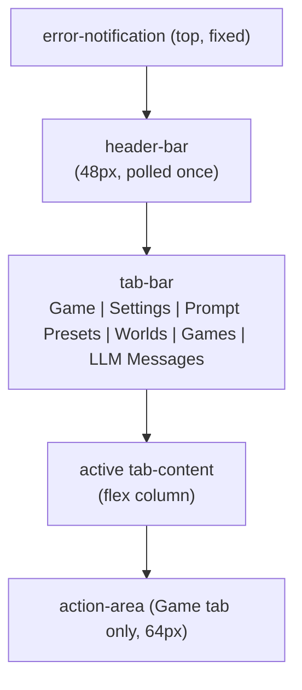

## Overview

The dashboard is a single-page HTMX application served at `/`. The page is statically served from `assets/index.html`; every per-tab panel and every per-message update is fetched as a server-rendered HTML fragment. The Game tab is the default landing view; the other five tabs host management surfaces whose domain content lives in their own reference docs.

The static HTML shell defines the tab bar, the active-tab body, the polling containers, and the in-page JavaScript that drives button-state transitions, edit-mode polling pauses, and swipe controls. The Rust side serves fragment endpoints and per-action POST endpoints that the shell calls via HTMX.

## Page Layout

The error-notification banner sits fixed at the top of the page and surfaces server-side error responses for 5 seconds before auto-hiding. It is populated by the global HTMX `htmx:beforeSwap` handler in the static shell (see `assets/index.html`).

The header bar is 48px tall, fetched once on load, and carries the game title, current game name, and connection status. Location is **not** in the header — it appears in the story log as a green location-header on the active room.

## Tabs

Six tabs, one active at a time. Tab switching is client-side JavaScript (`.tab` button toggles `.active` class on `.tab-content` siblings); only the panel-content fetch on first activation is server-rendered HTML.

| Tab | Polling |
|---|---|
| Game (default) | yes (multiple cadences) |
| Settings | on load |
| Prompt Presets | on load |
| Worlds | on load |
| Games | on load |
| LLM Messages | yes (4s) |

Inactive-tab content is `display: none`; the active tab uses `display: flex; flex-direction: column`. The static shell styles these states in `assets/styles.css`.

## Game Tab

The Game tab is the only view with three live regions stacked: the **main container** (story log + visual sidebar) and the **action area**.

### Story Log (80%)

A scrollable list of `MessageEntry` rendered rows. The list polls its fragment endpoint every 2 seconds (see Polling Cadences) and auto-scrolls to the bottom on new content. Each entry carries one of four `log_type` classes (`narration`, `dialogue`, `system`, `input`) that determines bubble styling and text color tokens.

Entry header structure:

- **Location header** — when the entry has a `location_header`, the header is "Room Name - HH:MM" in green (`--color-accent-green-bright`) bold inline.
- **Event header** — when the entry has an `event_header` (and no location), the header is "Event Name - HH:MM" in cyan (`.event-header`) bold inline.
- **Plain header** — sender name followed by timestamp; sender is omitted on system entries.

### Visual Sidebar (20%)

A flex column with the **location image** on top (full width, `object-fit: contain`, max-height 200px) and the **NPC portraits row** below (fixed 80×80 squares, horizontal scroll, gap 6px; shows NPCs currently in the room). When no location image is configured, a "No Location Image" placeholder is rendered in `--color-text-placeholder`. The sidebar polls its fragment endpoint every 5 seconds.

### Action Area (64px)

A persistent shell at the bottom of the Game tab that is **not** replaced by polling — only its inner form is swapped on action submission. The shell holds:

- A text input (`name="command"`, `autocomplete="off"`) and a submit button (`#submit-btn`).
- A status display (`#status-display`) polled every 5 seconds from the status endpoint.

The action area is in one of three states:

| State | Submit button | Status display | Input |
|---|---|---|---|
| Ready | "Send" (▶ icon), enabled | "Ready" in green | enabled |
| Thinking | "Stop" (■ icon), disabled | "Thinking..." / "Quantifying scene..." / "Generating event..." in yellow | disabled |
| Error | "Send" (▶ icon), enabled | last error message, banner shown | enabled |

State transitions happen on three events: form submission (immediately sets Thinking), `htmx:afterRequest` on the form (immediately resets the form input), and the next status poll (which reads `idle`/`narrating`/`quantifying`/`generating-event` and updates the status display).

**Empty-input behavior.** Submitting with an empty input dispatches a continuation request (same path as SillyTavern's "Continue"): the empty command routes to `continue_narration`. The submit button transitions to "Stop" immediately; the next status poll reads "Thinking...".

**Text-check preflight.** Before the action reaches its endpoint, the form posts to the action-check endpoint, which invokes the configured text checker. If issues are found, the action area is replaced with a preview showing the original text, an editable corrected text textarea, and issue tags (orange = spell, pink = grammar). Three buttons: Send (submit corrected), Send Original (submit original), Cancel (restore action area from `data-original-html`). The submit paths converge on the action-confirm endpoint; the corrected-vs-original distinction is carried by the form payload.

## Polling Cadences

Four endpoint cadences are declared as `hx-trigger="load, every Ns"` on their containers in `assets/index.html`: story log 2s, visual sidebar 5s, status display 5s, LLM messages 4s; the header fetches once on load. Per-tab panels (Settings / Prompt Presets / Worlds / Games) fetch on tab activation only — they do not poll while inactive.

## Edit, Delete, Swipe, Retrigger Flows

All four flows operate on the **last entry** in the story log. Conditional visibility is computed in `NarrativeLogTemplate::new` (templates.rs) — `show_retrigger` is set when the last entry is narration/dialogue, has no event continuation, and the previous turn had a trigger; swipe controls appear only when `swipe_count > 1` on the last entry; the delete button appears only when the last entry is not the only entry. The description below focuses on what each flow does.

### Edit Flow

1. The user clicks the edit (✎) button on an entry. JavaScript in the static shell (`showEditForm`) replaces the entry's text span with a textarea carrying the raw markdown from `data-raw-text`, swaps the action buttons for Save/Cancel, and **pauses story-log polling** by writing `hx-trigger="none"` on `#story-log` and calling `htmx.process()`.
2. The user edits the text and clicks Save. JavaScript submits the new raw text to the history-edit endpoint.
3. JavaScript **resumes polling** (restores the original `hx-trigger` value) and triggers `htmx:refresh` on `#story-log`. Cancel does the same without the submission.
4. The next poll re-renders the entry with the new text.

The pause prevents the polling refresh from racing the user's edit.

The textarea height is auto-resized on input. The save/cancel buttons replace the action-button cluster only for the entry being edited; other entries are unaffected.

### Delete Flow

1. The user clicks the delete (🗑) button on the last entry. JavaScript calls `confirm("Delete this message?")` before proceeding.
2. On confirm, JavaScript submits to the history-delete endpoint.
3. On a 2xx response, JavaScript fetches the story-log fragment and swaps it into `#story-log`. On a non-2xx response, the response body is shown via the global error notification.

### Swipe Flow

Swipes exist on the **last entry only** and only when `swipe_count > 1`. The control row holds: a left arrow (◀, disabled on the first swipe), a counter (`active_swipe_index + 1 / swipe_count`), and a right arrow (▶). Clicking ◀ or ▶ submits to the swipe-switch endpoint with the target swipe index. On success, JavaScript replaces `#story-log` innerHTML with the response and refreshes the visual sidebar and header — the sidebar and header reflect game state, and switching swipes restores the `snapshot_id` of the target swipe, so both must re-render to match. Clicking ▶ when on the latest swipe submits to the new-swipe endpoint; JavaScript transitions the submit button to "Stop" / status to "Thinking..." immediately, then refreshes `#story-log` on response.

### Retrigger Flow

The retrigger (♻) button appears on the last entry only when `show_retrigger` is true: the last entry is narration or dialogue, has no event continuation, and the previous turn had a trigger.

1. The user clicks the retrigger button. JavaScript submits to the retrigger endpoint and immediately transitions the button to "Stop" / status to "Thinking...".
2. On response, JavaScript triggers `htmx:refresh` on `#story-log`.

Retrigger re-runs the trigger narration for the previous turn.

## Game Management

The Games tab hosts three regions: **Active Game**, **New Game**, and **Saved Games**. Cross-world switching is allowed (a saved game from world A can be switched to while world B is active). The description below focuses on what each surface does and what the user sees.

### Active Game

Shows the current game name, a world badge (the world the game belongs to), a persona badge (the persona bound to the game), a "Current" badge, and a reset button (↻). Reset carries an HTMX confirm dialog ("Reset the current game? All progress will be lost."); on confirmation, the current game is deleted and a new game is created with a freshly auto-generated name (see "Name generation" below). When no game is active, the row shows the placeholder "No active game".

### New Game

A world selector (populated from worlds in storage) and a persona selector (populated from persona cards). The "Start New Game" button is disabled when the persona list is empty. On submit, the form posts the selected world key and persona key to the create-game endpoint. When no worlds are available, the section shows the empty-state message "No worlds available. Create a world first."

### Saved Games

A list of every game in storage (across all worlds), each with its game name, world badge, persona badge, and Switch/Delete affordances. Delete carries a confirm dialog ("Delete this game? This cannot be undone."); the dialog text is per-template, not engine-enforced.

### Name Generation

New-game names are auto-generated as `{WorldName}_{YYYY-MM-DD}_{N}` (underscores between segments, not spaces) where `{N}` is one greater than the highest existing suffix for that world-and-date base.

## Document References

- [`./http_routes.md`](./http_routes.md) — full HTTP route topology (52 routes; machine-generated).
- [`./ui_design.md`](./ui_design.md) — design tokens (colors, typography, spacing) + component specs.
- [`../narrative/narration_system.md#llm-call-logging--forensics`](../narrative/narration_system.md#llm-call-logging--forensics) — LLM Messages tab forensics + the 50-row `llm_messages` cap.
- [`../game_flow.md#text-check-branch`](../game_flow.md#text-check-branch) — text-check preflight, settings, and preview UI.
- [`../narrative/prompt_system.md`](../narrative/prompt_system.md) — Prompt Presets tab content.
- [`../storage.md#worlds`](../storage.md#worlds) — Worlds tab CRUD + world-game delete dependency.
- [`../storage.md#messages`](../storage.md#messages) — `Message`/`Swipe` model that drives swipe/retry controls.
- [`../game_flow.md#trigger-evaluation`](../game_flow.md#trigger-evaluation) — trigger evaluation that retrigger re-runs.
- [`../game_flow.md`](../game_flow.md) — phase pipeline that drives Thinking/Quantifying/Generating status text.
- [`../../explanation/dashboard_design.md`](../../explanation/dashboard_design.md) — design rationale: SillyTavern lineage, polling cadence choice, polling-pause pattern, snapshot-restoration cascade, empty-input continuation, server-rendered fragments over a SPA.
