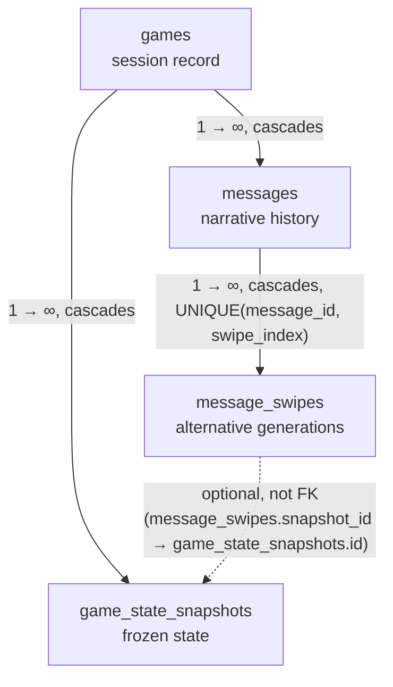
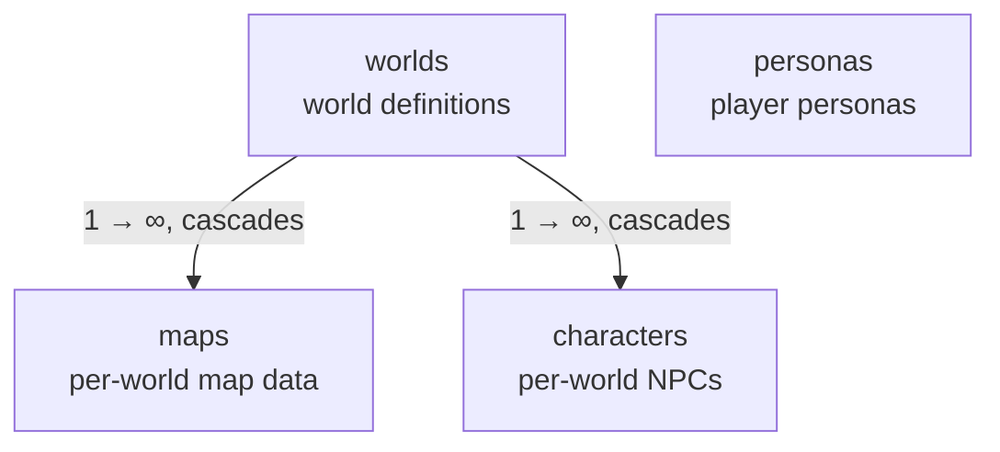
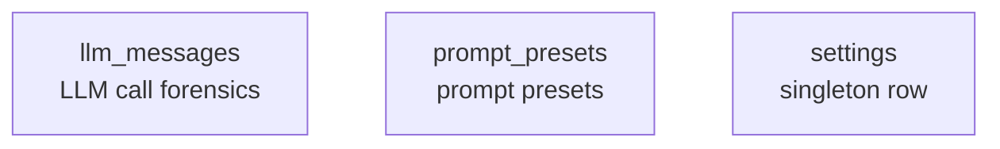

## Overview

`Storage` is the engine's persistence boundary for game sessions, narrative content, settings, and LLM call forensics.

## Backend and BackendKind

- **`Backend`** identifies the real storage implementations: `Sqlite` and `InMemory`.
- **`BackendKind`** selects `Direct` access or `Test` failure injection around one `Backend`.
- **Decorator invariant.** `Test` wraps a single `Backend`, never another `BackendKind`. The storage seam therefore permits at most one `Test` layer at a time.

## Game Scoping

A `Storage` instance is bound to its game id when it is constructed. Game-scoped operations use that binding for the `games`, `game_state_snapshots`, `messages`, and `message_swipes` tables; callers do not supply a game id per call.

## Seeding Contract

The bootstrap seeding flow reads JSON templates under `data/` and writes the corresponding rows before runtime database reads begin. Its guarantees are:

- **Idempotent.** Re-running the flow does not create duplicate rows.
- **Database authority.** The database is the sole source of truth at runtime; seed files are templates used during bootstrap.
- **Startup-blocking.** Seeding completes before the HTTP server starts.
- **Corrupt-file tolerance.** A malformed seed file is skipped and seeding continues with the remaining files.

The bootstrap boundary and dependency order live in this document's seeding section.

## Settings Persistence

Settings occupy a singleton row in the `settings` table. Bootstrap loads the engine's settings once; reload happens only on process restart.

## Read Contract: get_* and require_*

`Storage` exposes two absence policies for entity reads:

- **`get_*`** returns an optional result when absence is a valid runtime state.
- **`require_*`** returns a required result and turns absence into a typed error.

`GameNotFound` and `MessageNotFound` are the typed absence errors for their corresponding required reads. `Character` has no `require_*` helper; character access uses the listing contract. Backend read failures propagate as storage errors.

## GameStateSnapshot

`GameStateSnapshot` is a domain-owned DTO persisted by the storage layer. The storage layer serializes it, while application code uses the domain type. Snapshot JSON contains the serializable game-state subset; message history is persisted in `messages` and hydrated separately.

## Testing Strategy

Tests use an in-memory `Storage`. Failure-injection tests apply the `Test` decorator around a `Backend`, rather than around another decorator. This preserves the single-test-layer invariant while exercising storage failures through the same seam as production backends.

## Tables

The schema has 11 tables, organized into three logical clusters:

1. **Game state** — the runtime narrative and snapshot data, rooted at `games`.
2. **World catalogue** — the static world definitions and NPCs, rooted at `worlds`.
3. **Standalone** — settings, prompt presets, and LLM call forensics; independent of any game or world.

Every game and every world row can be referred to by multiple tables; the standalone tables have no FK relationships to the rest of the schema.

### Game state cluster

- **`games`** — top-level game session record. Every snapshot and message belongs to a game. The game pins one world and one persona at creation time (the world and persona keys are logical references, not SQL FKs — see Logical References below). Multiple games can exist in the same database. On first startup for a world, a new `games` row is auto-created with a generated name.
- **`game_state_snapshots`** — frozen point-in-time captures of the mutable game state. Used to load the latest state on server startup and to retry a message by loading the snapshot referenced by a message's `snapshot_id`. **Snapshot invariant:** messages are **not** stored in the snapshot JSON; they live in `messages` and are hydrated after a snapshot load.
- **`messages`** — chronological narrative history. Each row is one log entry (player input, narration, system message, dialogue), persisted incrementally. There is exactly one message history per game. Messages can be soft-deleted.
- **`message_swipes`** — per-message swipe versions. Each row is one alternative generation for a message. Deleting a message removes its swipes; the swipe index is unique per message. Each swipe carries an optional `snapshot_id` referencing `game_state_snapshots.id` that is **not** declared as a SQL FK — see Relationships.

### World catalogue cluster

- **`worlds`** — world definitions, identified by a unique `key` (e.g. `redmist_estate`). Carries global rules, scenarios, and the default scenario. Root of the world catalogue: `maps` and `characters` belong to a world.
- **`maps`** — map data per world. One-to-many with `worlds`; deleting a world removes its maps. `map_data` is a JSON-serialized `MapDef`.
- **`characters`** — NPC definitions per world. One-to-many with `worlds`; deleting a world removes its characters. Each character has a unique `key` within its world. Carries personality, triggers, relationships, and inventory.
- **`personas`** — player personas, identified by a unique `key` (e.g. `julian`). Stands alone — no SQL FK relationships — but referenced logically by `games.persona_key`. Carries personality, scenario, example dialogue, images, and inventory.

### Standalone tables

- **`llm_messages`** — forensics log of LLM API calls. **Not game-scoped** and not referenced by any other table. Used for debugging and prompt engineering. Pruned automatically with a default cap of 50 rows.
- **`prompt_presets`** — prompt preset CRUD (system, quantifier, and other preset types). `id` is a text key (e.g. `system_default`). Carries role, instructions, writing style, and output format. Each preset has an `is_default` flag.
- **`settings`** — engine settings singleton (exactly one row). Carries the connection list, default narration/quantifier connection IDs, response length, text-check config, agent configs, and active prompt preset IDs. Updated through the settings API; not related to any game or world.

## Relationships

### Game state cluster

- **`games → game_state_snapshots`** and **`games → messages`** — one-to-many. Deleting a game removes its snapshots and messages.
- **`messages → message_swipes`** — one-to-many. The swipe index is unique per message.
- **`message_swipes.snapshot_id → game_state_snapshots.id`** — **not a SQL FK**, deliberately. Each swipe carries the snapshot of the state captured *after* the swipe was created; switching swipes restores that exact state. Declaring it as a FK would cascade snapshot deletion to swipes, which the retry semantics don't want. The relationship is load-bearing but referential integrity is the application's responsibility.

### World catalogue cluster

- **`worlds → maps`** and **`worlds → characters`** — one-to-many. Deleting a world removes its maps and characters.
- **`personas`** — stands alone within this cluster, with no SQL FK to `worlds` or `characters`. It's referenced logically by `games.persona_key` (see the game state cluster's cross-cluster note below).

### Standalone tables

- **`llm_messages`**, **`prompt_presets`**, **`settings`** — no FK edges to anything. Truly standalone. `settings` is a singleton row; `llm_messages` is pruned automatically (default cap: 50 rows); `prompt_presets` uses text-key IDs.

### Cross-cluster logical references (no SQL FKs)

Several relationships between clusters are load-bearing but are **not** SQL foreign keys — either because the target table predates the column (added in a later migration) or because declaring the FK would impose a CASCADE that the application semantics don't want. Integrity for these is the application's responsibility:

- **`games.world_key → worlds.key`** (game state → world catalogue) — pins the world a game was created with. Added in migration v12.
- **`games.persona_key → personas.key`** (game state → world catalogue) — pins the persona a game was created with. Added in migration v13; persona binding moved from world to game in this migration.
- **`message_swipes.snapshot_id → game_state_snapshots.id`** (within the game state cluster, shown above) — non-FK so snapshot deletion doesn't cascade to swipes.

## Migrations

Migrations run on first access, gated by `PRAGMA user_version`. Column-level DDL — including `ALTER TABLE` adjustments in later migrations — lives in `src/adapters/driven/storage/utils/plumbing.rs`; this reference does not restate it.

## Worlds

A world is the persistent definition of a setting plus the map structure that games run on. Multiple games can reference one world. JSON shapes for world data (`WorldManifest`, `WorldCard`, `MapDef`, `Scenario`) live in the JSON seed-file contracts (see `data/schemas/world.schema.json` and `data/schemas/map.schema.json`).

The worlds management system is the dashboard UI plus CRUD route handlers that read/write worlds through the application service to storage.

## Personas

The player persona is a `PersonaCard`, a structured character sheet used by the Game Master. The card shape is defined by `data/schemas/character.schema.json`.

- **Per-game binding.** A game binds one persona at creation time through `games.persona_key` (non-FK logical ref — see Relationships). Game loading uses the bound key to hydrate the player's prompt context.
- **Empty-database creation.** When the database is empty, bootstrap auto-creates a game using the `--world` and `--persona` CLI flags. The requested persona key must already be present in the seeded persona rows; a missing persona key is a hard startup error.

## Messages

The message aggregate has three pieces: `Message`, `Swipe`, and `MessageHistory`.

- **`Message`** — a single narrative unit. Holds the message identity plus a `Vec<Swipe>` and an `active_swipe_index`.
- **`Swipe`** — one alternative generation for a `Message`. Holds the actual content fields (`text`, `location_header`, `event_header`, `snapshot_id`); `Message` itself carries none of these.
- **`MessageHistory`** — the ordered collection that owns `Vec<Message>`.

Component paths: `Message` + `Swipe` live at `src/domain/model/message.rs`; `MessageHistory` at `src/domain/model/message_history.rs`; `MessageType` + `MessageEntry` at `src/domain/model/state/message_types.rs`.

The read/write contract (accessors, mutators, intent-named methods) lives at `src/domain/model/message.rs` and `src/domain/model/message_history.rs`; the FIFO cap and bypass live at `src/domain/model/message_history.rs`.

### Persistence notes

The load-bearing split — identity fields (`id`, `sender`, `message_type`, `timestamp`, `active_swipe_index`, `is_deleted`) live on `messages`, content fields (`text`, `location_header`, `event_header`, `snapshot_id`) live on `message_swipes` — mirrors the per-swipe content-field invariant. The per-row DDL is not restated here.

Two message-specific observations the schema does not say directly:

- **`Swipe::snapshot_id` is nullable.** The initial message (before any snapshot was saved) has no snapshot. Nullable at the schema level.
- **Soft deletes preserve rows + swipes.** `is_deleted = true` keeps the row for retry restoration. Hard deletes happen via the storage purge path after a successful retry.

## Document References

- [Storage design](../explanation/storage_design.md) — current-understanding rationale for the storage layer, bootstrap flow, seed-as-template pattern, database authority, backend decorator, single-test-layer invariant, and the message-swipe design.
- [Startup and Bootstrap](./startup.md) — bootstrap boundary, seeding order, schema files, and seed-file invariants.
- [Dashboard](./frontend/dashboard.md) — worlds management UI and the worlds tab.
- [ADR-006: Quantifier-Driven Game Systems](../../docs/adr/adr-006-quantifier-systems.md) — quantifier detects NPCs + movement after narration.
- [ADR-008: SQLite Snapshot Persistence](../../docs/adr/adr-008-sqlite-snapshot-persistence.md) — `GameStateSnapshot` table + `persist_snapshot_or_err` pattern; rationale for the non-FK `snapshot_id`.
- [ADR-017: Message Swipes](../../docs/adr/adr-017-message-swipes.md) — swipe semantics for retry of the last AI message.
- [ADR-020: Unified Storage Struct](../../docs/adr/adr-020-storage-consolidation.md) — historical record of the unified storage decision.
- [ADR-024: Migrate Game Data to SQLite with Seed Pattern](../../docs/adr/adr-024-game-data-migration-to-sqlite.md) — historical record of the JSON-to-SQLite seed pattern.
- [ADR-025: Multi-World Data Foundation](../../docs/adr/adr-025-multi-world-data-foundation.md) — `world_key` logical reference; worlds/maps/characters cluster.
- [ADR-026: Relocate Persona Binding from World to Game](../../docs/adr/adr-026-persona-relocation-to-game.md) — `persona_key` logical reference; why persona binding moved from world to game.
- [ADR-027: Hexagonal Architecture Migration](../../docs/adr/adr-027-hexagonal-architecture-migration.md)
