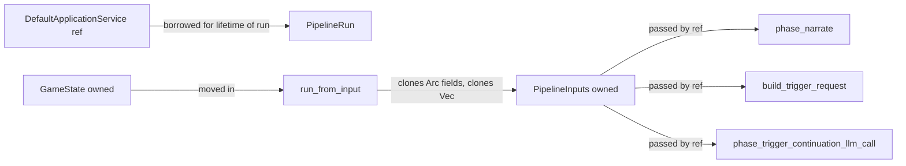
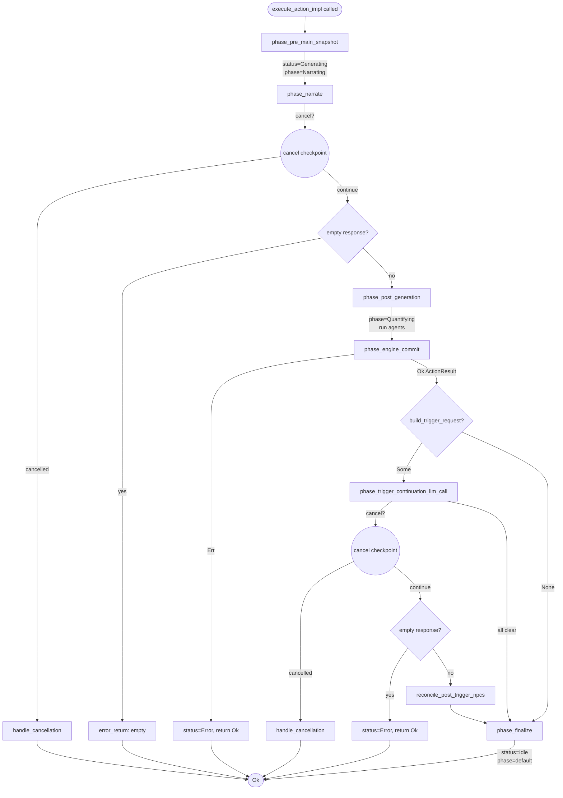

# Action Pipeline

## Status

> Status: Implemented. See [ADR-014](../adr/adr-014-action-pipeline.md) for rationale, [ADR-027](../adr/adr-027-hexagonal-architecture-migration.md) for the ports/traits collapse.

## Objective

The action pipeline orchestrates the FreeAction lifecycle: pre-snapshot, narrate, post-generation agents, engine commit, trigger continuation, finalize. Phases share borrow-checker-friendly structs, expose test seams, and unify the normal action and retry flows. Every `Arc` boundary is intentional: cheap to clone, but borrowing is preferred when lifetimes allow.

## Components

The pipeline is split across three modules. Each is load-bearing for one contract:

- **`ActionPipeline`** (`src/application/action_pipeline/pipeline.rs`) — orchestrator. Holds the three injected services by `Arc`. Constructed once at startup; one instance per game.
- **`PipelineInputs` + `PipelineRun<'a>`** (`src/application/action_pipeline/phases.rs`) — input snapshot and per-call borrow pair that decouples phase methods from `&DefaultApplicationService`. See the `PipelineRun` section below for the borrow contract.
- **`ActionOutcome`** (`src/application/action_pipeline/pipeline.rs`) — return type of every phase. Two variants: `Completed` and `Cancelled`. The pipeline uses `Err(ActionOutcome::Cancelled)` exclusively; every other failure path returns `Ok(())` and writes the failure into `state.narrative.input_buffer.status`.

Phase methods themselves are private. They are listed in the [Phase Flow](#phase-flow) mermaid and described at the section headers below; they do not belong in a registry.

## PipelineInputs

`PipelineInputs` owns its data outright instead of borrowing from `GameState`. Two reasons:

1. `GameState` is mutated across phase boundaries (new messages appended, NPC lists updated). Borrowing into a phase that mutates the borrowed-from struct is a borrow-checker fight.
2. Phases need stable snapshots of inputs (world, map, player, all NPCs) while the state evolves. Owned data means the snapshot is decoupled from state mutation.



All `Arc<...>` fields in `PipelineInputs` are cheap to clone (refcount bump). `Vec<NpcCard>` is owned because phase methods sometimes need to scan/filter without disturbing the state-owned NPC map.

## PipelineRun<'a> Borrow Mechanics

Each phase method is a method on `PipelineRun<'a>`, not a free function. This contract is enforced by every phase signature: dropping the `app: &DefaultApplicationService` parameter and routing phase calls through the `PipelineRun` borrowed pair. The borrow supports three properties:

1. `ActionPipeline` is held by `Arc`; `GameService` keeps one `Arc<ActionPipeline>` for the process lifetime, so the borrow covers every pipeline call.
2. `DefaultApplicationService` is held by `Arc` and is expensive to clone (storage backend, preset storage, settings `Arc<RwLock>`, shutdown token, is_generating atomic). Threading `app: &DefaultApplicationService` through every phase signature would either duplicate the borrow or require an explicit wrapper.
3. `PipelineRun::new(self, app)` is constructed once per call. After construction, no phase signature takes `app` again — the run carries it for every subsequent method.

```rust
// pipeline.rs::run_from_input
let run = PipelineRun::new(self, app);  // borrow both for the duration

// all phase calls go through `run`, which carries the borrow
let (mut state, narration_text, backend_name, model_name) =
    run.map_cancelled(run.phase_narrate(state, &inputs))?;
```

External callers that need phase methods directly (retry's `phase_trigger_continuation` wrapper) construct their own `PipelineRun`:

```rust
// retry.rs::retry_event_continuation
let run = PipelineRun::new(&pipeline, app);
run.reconcile_post_trigger_npcs(s, &input_text, &continuation_text);
```

The lifetime `'a` ties `PipelineRun` to the borrowed pipeline and app. Both outlive the run because the caller (spawn_blocking closure, retry continuation) holds them for the duration.

## Phase Flow



Cancel checkpoints (red diamonds): before persist in `phase_pre_main_snapshot`, after LLM call in `phase_narrate`, at start of `phase_trigger_continuation_llm_call`, after trigger LLM call. Each cancel returns `Err(ActionOutcome::Cancelled)`.

Error-return checkpoints (orange): `phase_narrate::error_return` for missing room / empty response / LLM error, `phase_trigger_continuation_llm_call` for trigger LLM error or empty response, `phase_engine_commit` for engine errors. All set `status = GenerationStatus::Error(...)` and return `Ok(())`.

## Error Model

Pipeline errors set `state.narrative.input_buffer.status = GenerationStatus::Error(...)` and return `Ok(())`. ONLY `ActionOutcome::Cancelled` uses the `Err` path.

Why: UI polls on `GenerationStatus` via `get_generating_status`. The state field IS the error channel. Returning `Err` from a pipeline phase would propagate the error up to the spawn_blocking closure where it has no consumer. The pipeline owns the error UI surface via `state`.

`phase_finalize` always sets status back to `Idle` UNLESS already `Error`:

```rust
// pipeline.rs::phase_finalize
if state.narrative.input_buffer.status.error_message().is_none() {
    state.narrative.input_buffer.status = GenerationStatus::Idle;
}
state.narrative.input_buffer.phase = GenerationPhase::default();
self.persist(state);
```

This guarantees the UI never sees a stuck `Generating` after the pipeline returns. The retry path (`save_retry_error` in `retry.rs`) uses the same pattern.

Cross-link: [system/game_flow.md](./game_flow.md) for the `GenerationPhase` + `GenerationStatus` phase table.

## spawn_pipeline_task

```rust
pub(crate) fn spawn_pipeline_task<F>(app: Arc<DefaultApplicationService>, f: F)
where
    F: FnOnce(&DefaultApplicationService) + Send + 'static,
{
    tokio::task::spawn_blocking(move || {
        f(&app);
    });
}
```

Three callers use this helper:

- `DefaultApplicationService::process_action` -- HTTP entry point for FreeAction
- `application::message_editing::retry` -- message-editing retry path
- `application::message_editing::retrigger` -- retrigger-event path

`ArrivalTaskContext::run` (background arrival narration) does NOT use this helper -- it owns its own `Arc<DefaultApplicationService>` so it spawns `spawn_blocking` directly from `bootstrap::init_game::spawn_arrival_task_if_needed` and does not need the helper's per-call shared-state plumbing.

The helper is a thin wrapper: it moves the `Arc<DefaultApplicationService>` into the spawn_blocking closure and hands a `&DefaultApplicationService` to the caller's `f`. Shutdown check (`is_shutting_down()`) + `GenerationGuard` RAII lifetime stay inside each caller's closure -- zero behaviour change from inlining the helper. The guard's `Drop` only releases the registry slot if the caller still owns it (no-op if superseded by a younger generation).

## External Callers

| Caller | Method | When | spawn_blocking? |
|--------|--------|------|-----------------|
| `DefaultApplicationService::process_action` | `spawn_pipeline_task` -> closure -> `execute_action_impl` | HTTP POST `/action` | true |
| `message_editing::retry` | `spawn_pipeline_task` -> closure -> `retry_last_response_impl` | HTTP POST `/messages/:id/retry` | true |
| `message_editing::retrigger` | `spawn_pipeline_task` -> closure -> `retrigger_event_impl` | HTTP POST `/messages/:id/retrigger` | true |
| `ArrivalTaskContext::run` | direct `spawn_blocking` (owns `Arc<DefaultApplicationService>`) | Game startup, arrival narration | true |
| `execute_action_impl` | direct call (no spawn) | Test paths + arrival-service composition | false |
| `retry_last_response_impl` | direct call (no spawn) | Test paths | false |

Test paths use direct calls because they hold the spawn_blocking machinery themselves in the test harness.

## Cancellation

`app.is_shutting_down()` (reading `AppState.shutdown_token`) is checked at 4 sites:

1. **Pre-main** (pipeline.rs `phase_pre_main_snapshot`): before persisting pre-main snapshot.
2. **Mid-narrate** (phases.rs `phase_narrate`): after the LLM narrator call returns, before `add_message`.
3. **Pre-trigger** (phases.rs `phase_trigger_continuation_llm_call`): at function start, before persisting pre-event snapshot.
4. **Mid-trigger** (phases.rs `phase_trigger_continuation_llm_call`): after the trigger LLM call returns, before commit.

On cancel: `handle_cancellation` loads fresh state via `app.load_or_fresh()`, sets `status = Idle`, clears `phase`, persists, returns `Err(ActionOutcome::Cancelled)`. The retry path (`retry.rs`) replicates this cleanup inline because it does not return through `map_cancelled`.

## Game-Identity Guard (α-check)

Reset / `switch_game` / `delete_game` may run while a generation is in flight. The pipeline rejects stale results at 3 phase boundaries via `PipelineRun::check_game_unchanged(started_for)`:

1. **Post-narrate** (phases.rs `phase_narrate`): after the main LLM call returns, before `add_message`.
2. **Pre-trigger** (phases.rs `phase_trigger_continuation_llm_call`): at function start, before persisting pre-event snapshot.
3. **Post-trigger** (phases.rs `phase_trigger_continuation_llm_call`): after the trigger LLM call returns.

If `app.current_game_id() != started_for`, the pipeline logs `"Pipeline aborting: game changed — discarding in-flight generation"` and returns `Err(ActionOutcome::Cancelled)`. The stale generation's `GenerationGuard::Drop` is a no-op (the registry slot has already been taken over by the younger generation).

## Retry and Trigger Continuation

`retry.rs` reuses pipeline phases without duplicating logic:

- `retry_main_narration`: calls `pipeline.run_from_input(app, state, input_text)`. Same pipeline as normal action.
- `retry_event_continuation`: calls `pipeline.phase_trigger_continuation(state, trigger, app)`. The `phase_trigger_continuation` wrapper on `ActionPipeline` is `pub(crate)` so retry can construct its own `PipelineRun` without going through `run_from_input`. After continuation, calls `PipelineRun::reconcile_post_trigger_npcs` to re-quantify NPC state.

Anchor: `app.find_retry_anchor(&messages)` locates the message whose snapshot the retry will restore. The old target message is saved as `state.narrative.retry_target` and appended back to history after the new generation completes.

Trigger context: `state.narrative.last_trigger` carries the `StoredTriggerContext` from the original trigger continuation. Retry reuses this to re-run the trigger LLM call without rebuilding the prompt.

## Cross-references

- [ADR-014: Action Pipeline Architecture](../adr/adr-014-action-pipeline.md) -- original decision
- [ADR-027: Hexagonal Architecture Migration](../adr/adr-027-hexagonal-architecture-migration.md) -- pipeline lives in `application/`, ports/traits collapsed
- [architecture/system.md](../architecture/system.md) -- 8-tier module organization (T2 application sub-modules included); this spec goes deeper on the pipeline itself.
- [system/game_flow.md](./game_flow.md) -- phase table + status enum definitions
- [system/llm_processing.md](./llm_processing.md) -- LLM recorder + agent registry contracts used by the pipeline
- [diagnostics/error_catalog.md](../diagnostics/error_catalog.md) -- error variants the pipeline may surface (room-not-found, empty response, LLM transport failures)