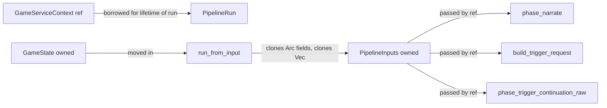

# Action Pipeline

## Status

> Status: Implemented (Phase 2+). See [ADR-014](../adr/adr-014-action-pipeline.md) for rationale. [ADR-027](../adr/adr-027-hexagonal-architecture-migration.md) superseded ADR-014's `ActionPipelineBackend` trait with direct fields on `ActionPipeline` (no behaviour change).

## Objective

The action pipeline orchestrates the FreeAction lifecycle: pre-snapshot, narrate, post-generation agents, engine commit, trigger continuation, finalize. It exists to replace the 1.3k-line `execute_action_impl` monolith (B3 finding) with named phases that share borrow-checker-friendly structs, expose test seams, and unify the normal action and retry flows. Every `Arc` boundary is intentional: cheap to clone, but borrowing is preferred when lifetimes allow.

## Components

| Component | File | Purpose |
|-----------|------|---------|
| `ActionPipeline` | `src/application/action_pipeline/pipeline.rs` | Pipeline orchestrator. Holds direct fields: `Arc<LayeredPromptAssembler>`, `Arc<LlmCallRecorder>`, `Arc<AgentRegistry>`. No trait (post-ADR-027). |
| `PipelineInputs` | `src/application/action_pipeline/phases.rs` | Owned struct bundling pipeline input parameters (`input: String`, `Arc<WorldCard>`, `Arc<MapDef>`, `Arc<PlayerCard>`, `Vec<NpcCard>`). |
| `PipelineRun<'a>` | `src/application/action_pipeline/phases.rs` | Borrowed `(pipeline, ctx)` pair constructed once per `run_from_input` call. Routes all phase methods without per-method `ctx` parameter. |
| `ActionOutcome` | `src/application/action_pipeline/pipeline.rs` | `Completed` or `Cancelled`. Returned by `PipelineResult<T>`; only `Cancelled` uses the `Err` path. |
| `spawn_pipeline_task` | `src/application/spawn.rs` | `pub(crate)` helper deduping `Arc::clone` + `tokio::task::spawn_blocking` for all blocking callers. |
| `phase_pre_main_snapshot` | `pipeline.rs` (impl `PipelineRun`) | Sets `status = Generating`, `phase = Narrating`, persists pre-main snapshot. |
| `phase_narrate` | `phases.rs` | Builds prompt context, calls LLM narrator, appends `MessageType::Narration`, returns `(state, text, backend, model)`. |
| `phase_post_generation` | `phases.rs` | Sets `phase = Quantifying`, runs post-generation agents (e.g. quantifier), handles low-confidence fallback. |
| `phase_engine_commit` | `pipeline.rs` (impl `ActionPipeline`) | Pure function: delegates to `execute_freeaction_impl` with `FreeActionContext`. Returns `TurnResult`. |
| `phase_trigger_continuation_raw` | `phases.rs` | Sets `phase = GeneratingEvent`, calls trigger LLM, commits via `commit_trigger_narration`. |
| `reconcile_post_trigger_npcs` | `phases.rs` | Re-runs quantifier after trigger narration, applies NPC events. |
| `build_trigger_request` | `phases.rs` | Builds `StoredTriggerContext` if trigger matched. Returns `Option`. |
| `run_post_generation_agents` | `pipeline.rs` | Filters `AgentRegistry` for `ExecutionPhase::PostGeneration`, merges `StatePatch`es into `QuantifierResult`. |
| `phase_finalize` | `pipeline.rs` | Resets status to `Idle` (or leaves `Error`), clears phase, persists. |
| `handle_cancellation` | `pipeline.rs` | Loads fresh state, sets `Idle`, persists, returns `ActionOutcome::Cancelled`. |
| `map_cancelled` | `pipeline.rs` | Wraps phase results to convert inner `Cancelled` into outer `Cancelled` via `handle_cancellation`. |

## PipelineInputs

`PipelineInputs` owns its data outright instead of borrowing from `GameState`. Two reasons:

1. `GameState` is mutated across phase boundaries (new messages appended, NPC lists updated). Borrowing into a phase that mutates the borrowed-from struct is a borrow-checker fight.
2. Phases need stable snapshots of inputs (world, map, player, all NPCs) while the state evolves. Owned data means the snapshot is decoupled from state mutation.



All `Arc<...>` fields in `PipelineInputs` are cheap to clone (refcount bump). `Vec<NpcCard>` is owned because phase methods sometimes need to scan/filter without disturbing the state-owned NPC map.

## PipelineRun<'a> Borrow Mechanics

The borrow pattern is the load-bearing design choice of this module. Each phase method signature drops the `ctx: &GameServiceContext` parameter and becomes a method on `PipelineRun<'a>`. Three reasons:

1. `ActionPipeline` fields are `Arc` (cheap to clone, but borrowing works because the pipeline outlives a single call -- `GameService` keeps one `Arc<ActionPipeline>`).
2. `GameServiceContext` is `Clone` but expensive (DB pool, storage backend, preset storage, settings `Arc<RwLock>`). Passing it through every phase signature would either duplicate the borrow or require threading through a wrapper.
3. `PipelineRun::new(self, ctx)` happens ONCE in `run_from_input`. The run then routes all phase calls through `self`, eliminating the `ctx: &GameServiceContext` parameter from each phase signature.

```rust
// pipeline.rs::run_from_input
let run = PipelineRun::new(self, ctx);  // borrow both for the duration

// all phase calls go through `run`, which carries the borrow
let (mut state, narration_text, backend_name, model_name) =
    run.map_cancelled(run.phase_narrate(state, &inputs))?;
```

External callers that need phase methods directly (retry's `phase_trigger_continuation` wrapper) construct their own `PipelineRun`:

```rust
// retry.rs::retry_event_continuation
let run = PipelineRun::new(&pipeline, ctx);
run.reconcile_post_trigger_npcs(s, &input_text, &continuation_text);
```

The lifetime `'a` ties `PipelineRun` to the borrowed pipeline and context. Both outlive the run because the caller (spawn_blocking closure, retry continuation) holds them for the duration.

## Phase Flow


Cancel checkpoints (red diamonds): before persist in `phase_pre_main_snapshot`, after LLM call in `phase_narrate`, at start of `phase_trigger_continuation_raw`, after trigger LLM call. Each cancel returns `Err(ActionOutcome::Cancelled)`.

Error-return checkpoints (orange): `phase_narrate::error_return` for missing room / empty response / LLM error, `phase_trigger_continuation_raw` for trigger LLM error or empty response, `phase_engine_commit` for engine errors. All set `status = GenerationStatus::Error(...)` and return `Ok(())`.

## Error Model

Pipeline errors set `state.narrative.input_buffer.status = GenerationStatus::Error(...)` and return `Ok(())`. ONLY `ActionOutcome::Cancelled` uses the `Err` path. This is a deliberate architectural choice (B9 finding, see CHANGELOG `8e4acf5`).

Why: UI polls on `GenerationStatus` via `get_generating_status`. The state field IS the error channel. Returning `Err` from a pipeline phase would propagate the error up to the spawn_blocking closure where it has no consumer. The pipeline owns the error UI surface via `state`.

`phase_finalize` always sets status back to `Idle` UNLESS already `Error`:

```rust
// pipeline.rs::phase_finalize
if state.narrative.input_buffer.status.error_message().is_none() {
    state.narrative.input_buffer.status = GenerationStatus::Idle;
}
state.narrative.input_buffer.phase = GenerationPhase::default();
self.persist(state);
```

This guarantees the UI never sees a stuck `Generating` after the pipeline returns. The retry path (`save_retry_error` in `retry.rs`) uses the same pattern.

Cross-link: [system/game_flow.md](./game_flow.md) for the `GenerationPhase` + `GenerationStatus` phase table.

## spawn_pipeline_task

```rust
pub(crate) fn spawn_pipeline_task<F>(game_service: &Arc<GameService>, ctx: GameServiceContext, f: F)
where
    F: FnOnce(&GameService, GameServiceContext) + Send + 'static,
{
    let game_service = Arc::clone(game_service);
    tokio::task::spawn_blocking(move || {
        f(&game_service, ctx);
    });
}
```

Three callers use this helper:

- `DefaultApplicationService::process_action` -- HTTP entry point for FreeAction
- `application::message_editing::retry` -- message-editing retry path
- `application::message_editing::retrigger` -- retrigger-event path

`ArrivalTaskContext::run` (background arrival narration) does NOT use this helper -- it spawns its own `spawn_blocking` directly from `bootstrap::init_game::spawn_arrival_task_if_needed` because it does not take a `GameService` (uses its own `LlmCallRecorder`).

The helper dedups: `Arc::clone` + `tokio::task::spawn_blocking`. Cancellation check + `GenerationGuard` RAII lifetime stay inside each caller's closure -- zero behaviour change from inlining the helper.

## External Callers

| Caller | Method | When | spawn_blocking? |
|--------|--------|------|-----------------|
| `DefaultApplicationService::process_action` | `spawn_pipeline_task` -> closure -> `execute_action_impl` | HTTP POST `/action` | true |
| `message_editing::retry` | `spawn_pipeline_task` -> closure -> `retry_last_response_impl` | HTTP POST `/messages/:id/retry` | true |
| `message_editing::retrigger` | `spawn_pipeline_task` -> closure -> `retrigger_event_impl` | HTTP POST `/messages/:id/retrigger` | true |
| `ArrivalTaskContext::run` | direct `spawn_blocking` | Game startup, arrival narration | true |
| `execute_action_impl` | direct call (no spawn) | Test paths + arrival-service composition | false |
| `retry_last_response_impl` | direct call (no spawn) | Test paths | false |

Test paths use direct calls because they hold the spawn_blocking machinery themselves in the test harness.

## Cancellation

`CancellationToken::is_cancelled()` is checked at 4 sites:

1. **Pre-main** (pipeline.rs `phase_pre_main_snapshot`): before persisting pre-main snapshot.
2. **Mid-narrate** (phases.rs `phase_narrate`): after the LLM narrator call returns, before `add_message`.
3. **Pre-trigger** (phases.rs `phase_trigger_continuation_raw`): at function start, before persisting pre-event snapshot.
4. **Mid-trigger** (phases.rs `phase_trigger_continuation_raw`): after the trigger LLM call returns, before commit.

On cancel: `handle_cancellation` loads fresh state via `load_or_fresh(ctx)`, sets `status = Idle`, clears `phase`, persists, returns `Err(ActionOutcome::Cancelled)`. The retry path (`retry.rs`) replicates this cleanup inline because it does not return through `map_cancelled`.

## Retry and Trigger Continuation

`retry.rs` reuses pipeline phases without duplicating logic (B7 finding marked stale; retry already delegates):

- `retry_main_narration`: calls `pipeline.run_from_input(ctx, state, input_text)`. Same pipeline as normal action.
- `retry_event_continuation`: calls `pipeline.phase_trigger_continuation(state, trigger, ctx)`. The `phase_trigger_continuation` wrapper on `ActionPipeline` is `pub(crate)` so retry can construct its own `PipelineRun` without going through `run_from_input`. After continuation, calls `PipelineRun::reconcile_post_trigger_npcs` to re-quantify NPC state.

Anchor finding: `ctx.find_retry_anchor(&messages)` locates the message whose snapshot the retry will restore. The old target message is saved as `state.narrative.retry_target` and appended back to history after the new generation completes.

Trigger context: `state.narrative.last_trigger` carries the `StoredTriggerContext` from the original trigger continuation. Retry reuses this to re-run the trigger LLM call without rebuilding the prompt.

## Cross-references

- [ADR-014: Action Pipeline Architecture](../adr/adr-014-action-pipeline.md) -- original decision, `ActionPipelineBackend` trait since deleted
- [ADR-027: Hexagonal Architecture Migration](../adr/adr-027-hexagonal-architecture-migration.md) -- pipeline lives in `application/`, ports/traits collapsed
- [architecture/system.md §2.5](../architecture/system.md) -- 200-word summary of the action_pipeline bullet (this spec goes deeper)
- [system/game_flow.md](./game_flow.md) -- phase table + status enum definitions
- [system/llm_processing.md](./llm_processing.md) -- LLM recorder + agent registry contracts used by the pipeline
- [diagnostics/error_catalog.md](../diagnostics/error_catalog.md) -- error variants the pipeline may surface (room-not-found, empty response, LLM transport failures)

## Open Findings

Items from the abstraction-fixes super-plan Finding State table that affect this code:

- **B3 `run_from_input` monolith** -- `deferred`, owner T1. State-machine rewrite scoped out per Phase 6.1 Issue 9. Current phased approach is the interim solution.
- **B9 `error_return` returns `Ok`** -- `deferred`, no owner (deliberate arch per `8e4acf5`). Documented in this spec as the canonical error-channel shape.
- **N3 new code self-invents `status` side-channel** -- `deferred`, owner T1. Consequence of B9; T1 fixes the root cause.
- **N5 prompt-context + LLM + persist drift between `ArrivalTaskContext` and `phase_narrate`** -- `deferred`, owner T2-ARCH. One deep Narration module split across two adapters (arrival service + action pipeline). Reframed from the original "two reimplementations" finding -- architecture-lens analysis says these are the same module split across compositions.
- **N11/N17/N20/M7/M8 + former T8** -- `closed`, extracted to `reliability-and-cancellation-plan.md`. Cancellation plumbing (R2) is the load-bearing work for the N17 checks this code relies on.