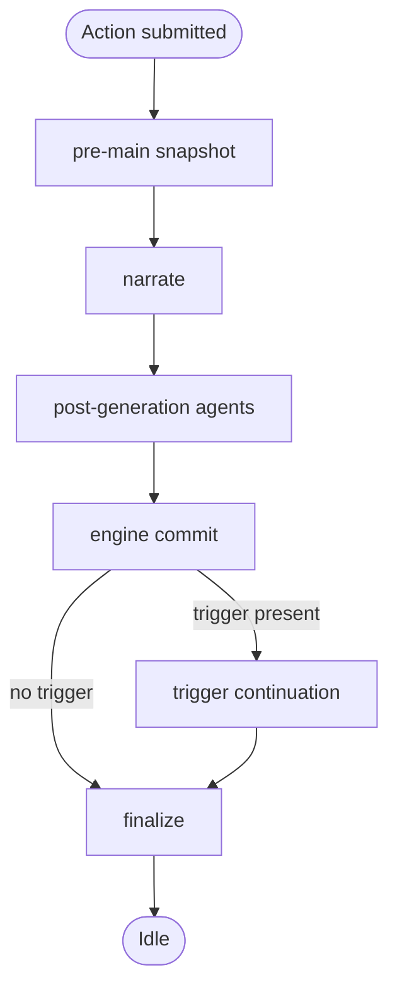

# Action Pipeline

**Scope:** This document specifies the FreeAction lifecycle and the error and cancellation shapes that bound it.

The FreeAction lifecycle is: pre-snapshot, narrate, post-generation agents, engine commit, trigger continuation, finalize. The pipeline unifies the normal action flow and the retry flows into a single execution path so phase logic is not duplicated. Phases run synchronously inside a `spawn_blocking` task.

## Phase Flow

## Error Model

Phase failures are observed through `state.narrative.input_buffer.status`. A phase that fails sets `GenerationStatus::Error(msg)` before returning, and the UI polls the status. Only `PhaseError::Cancelled` propagates out of the orchestrator. Every other variant stays inside; the orchestrator consumes it before the next phase begins.

| Variant | Contract | Recovery |
|---------|----------|----------|
| `Cancelled` | Mismatch between the started game and the active game. | Cancellation handler resets status to Idle, persists, returns the variant. |
| `NarratorFailed(String)` | The narrate call failed (missing room, empty response, LLM error). | Orchestrator sets `GenerationStatus::Error`, persists via the finalize path, returns `Ok(())`. |
| `PersistFailed { label, source }` | A snapshot persist failed at one of four checkpoints: pre-main, pre-event, post-trigger, post-engine. `label` names the site; `source` carries the underlying error. | Same as `NarratorFailed`. |
| `TriggerMissing` | Event-retry precondition: `state.narrative.last_trigger` is absent. | Same as `NarratorFailed`. |
| `FetchFailed(String)` | Event-retry precondition: `load_world_bundle` failed (game, world, persona lookup). Distinct from `NarratorFailed` because the failure precedes the LLM call. | Same as `NarratorFailed`. |

Errors must survive finalize. `phase_finalize` resets status to Idle unless status is already Error. Because every recovery path sets Error before calling finalize, the error persists. The UI never observes a stuck Generating after the pipeline returns.

## Cancellation

Two independent mechanisms guard against in-flight generation drift. Both produce the `Cancelled` variant; the cancellation handler consumes it by resetting status to Idle, persisting, and returning.

**In-phase alpha-check.** Compares the current game id to the game id captured when generation started. A mismatch returns the `Cancelled` variant — a reset, game switch, or game deletion running while a generation is in flight causes the stale result to be rejected. Three sites:

- After the narrate call returns; before the message is added to history.
- At the start of trigger continuation; before the pre-event snapshot is persisted.
- After the trigger LLM call returns; before commit.

**Pre-spawn shutdown gate.** Checks whether the application is shutting down at the HTTP entry boundary only — retry handlers, retrigger handlers, and the process-action handler. When the gate is set, generation does not start; phases do not see this check.

`GenerationGuard::Drop` releases the registry slot if the caller still owns it (no-op if superseded by a younger generation).

## Retry

Both retry paths re-enter the pipeline without duplicating phase logic.

- **Main retry** re-enters from action receipt. Soft-deletes messages after the anchor, preserves the old narration as a swipe, and re-runs narrate + quantifier + trigger.
- **Event retry** re-runs the trigger continuation against the restored snapshot, then re-quantifies NPCs from the new continuation text. Does not rerun main narration or main quantifier.
- **Anchor** is the message whose snapshot the retry restores. The target message is temporarily removed and re-inserted after engine commit and before trigger continuation, so the cycle can iterate cleanly.

Retry errors split into two paths. Postcondition failures returned from a retry phase run through the orchestrator's finalize seam, like the standard action path. Precondition failures (missing anchor, snapshot lookup failure, load errors, no input) persist Error directly and rely on the next action's heal-stale-state path to reset status — they skip finalize.

## Document References

- [ADR-014: Action Pipeline Architecture](../adr/adr-014-action-pipeline.md) — original decision + borrow structure rationale
- [ADR-027: Hexagonal Architecture Migration](../adr/adr-027-hexagonal-architecture-migration.md) — pipeline lives in `application/`; ports/traits collapsed
- [ADR-032: PhaseError](../adr/adr-032-phaseerror.md) — error variant handling and retry cleanup duplication
- [system/game_flow.md](./game_flow.md) — `GenerationPhase` + `GenerationStatus` phase table
- [system/llm_processing.md](./llm_processing.md) — LLM recorder + agent registry contracts used by the pipeline
- [diagnostics/error_catalog.md](../diagnostics/error_catalog.md) — error variants the pipeline may surface (room-not-found, empty response, LLM transport failures)
- [architecture/rust_technical.md](../architecture/rust_technical.md) — `spawn_blocking` offload rationale (sync services, no async traits)
