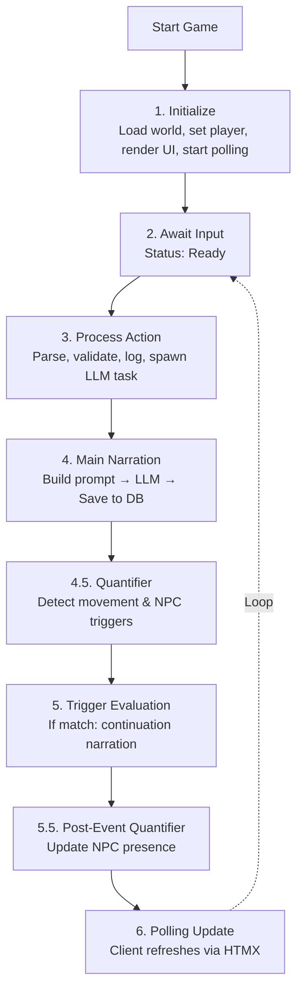
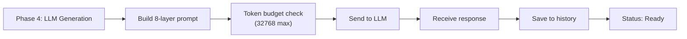
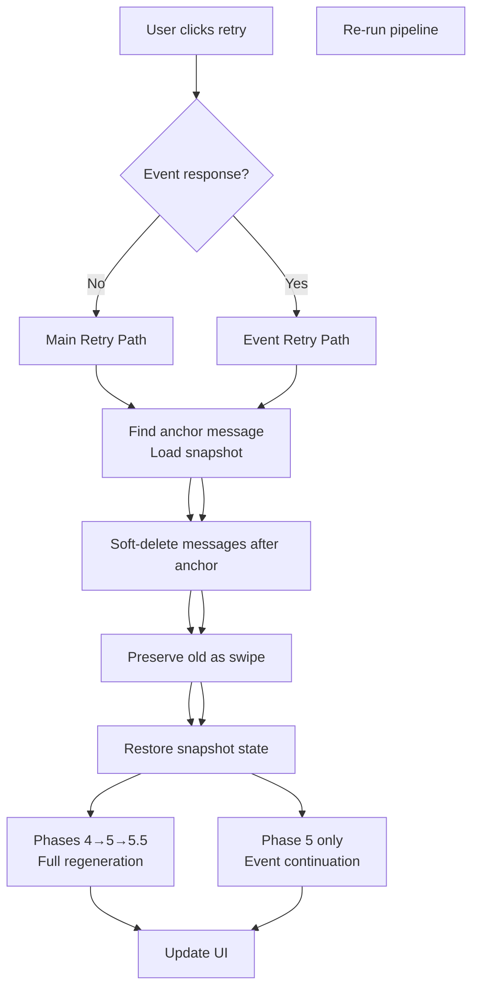

# Specification: Game Flow

> **Related Decisions**: [ADR-006](../adr/adr-006-quantifier-systems.md), [ADR-008](../adr/adr-008-sqlite-snapshot-persistence.md), [ADR-010](../adr/adr-010-concurrency-generation-gate.md), [ADR-013](../adr/adr-013-message-domain-model.md), [ADR-017](../adr/adr-017-message-swipes.md)

## Overview

This document defines the core game loop - the play-by-play experience from starting the game to receiving LLM responses. This is the fundamental user experience that must work reliably.

## The Game Flow



When the engine needs LLM narration (during Phase 4), it builds a comprehensive prompt using the **8-layer system** (layers 0-7, with layer 6 as Post-History; see [`prompt_system.md`](prompt_system.md)):



## Test Scenarios

These Gherkin scenarios are covered by **browser/integration tests** (`tests/browser/trigger.rs`, `tests/browser/structure.rs`). The `flow_mock/` test suite covers sequential service-level retry and state consistency flows rather than end-to-end browser scenarios.

### Scenario 1: Initial Load
```gherkin
Given the server is running with "test" world
When the user opens http://127.0.0.1:3000
Then the header shows "Chronicler Engine | <starting_room>"
And the story-log shows a minimal header with the room name
And after LLM generates: the story-log shows LLM-generated arrival narration
And the status shows "Ready"
```
- **Covered by**: `tests/browser/structure.rs` — `test_page_loads`, `test_header_displays_game_title`

### Scenario 2: Free Action (e.g., "look around")
```gherkin
Given the game is loaded
When the user enters "look around" and submits
Then the status shows "Generating narration..."
And after LLM generates response, the story-log shows the LLM description
And the status shows "Ready"
```
- **Covered by**: `tests/browser/trigger.rs` — `test_look_command_adds_narration_entries`, `test_freeaction_without_movement_works`

### Scenario 3: Quantifier-Driven Movement
```gherkin
Given the game is loaded at starting room
When the user enters "I walk to the village square" and submits
Then the status shows "Generating narration..."
And after LLM generates response, the quantifier detects movement intent
Then the status shows "Quantifying scene..."
And the story-log shows the LLM narration for arrival with an inline location header for the new room
And the visual-sidebar shows the new room's image and NPCs
And the status shows "Ready"
```
- **Covered by**: `tests/browser/trigger.rs` — `test_freeaction_with_movement_no_triggers`

### Scenario 4: Free Action (LLM Narration)
```gherkin
Given the game is loaded
When the user enters "examine the mysterious orb" and submits
Then the status shows "Generating narration..."
And after LLM generates response, the story-log shows the LLM's description of the orb
And the status shows "Ready"
```
- **Covered by**: `tests/browser/trigger.rs` — `test_freeaction_without_movement_works`

## Error Handling

### Invalid Command
- Show helpful error in story-log
- Status returns to "Ready"

### Granular Status Phases

During LLM processing, the UI displays granular status phases instead of a single "Thinking..." message:

| Phase | Display Text | Endpoint Value | When Active | UI Latency |
|-------|-------------|----------------|-------------|------------|
| `Narrating` | "Generating narration..." | `narrating` | During main LLM narration (Phase 4) | ~11s (narration saved immediately) |
| `Quantifying` | "Quantifying scene..." | `quantifying` | During post-narration quantifier analysis (Phase 4.5 or 5.5) | ~13s (narration visible, metadata pending) |
| `GeneratingEvent` | "Generating event..." | `generating-event` | During trigger continuation narration (Phase 5) | Variable (after trigger fires) |

**Streaming Narration Optimization:** Narration is saved to the database immediately after Phase 4 completes, before the quantifier runs. This reduces time-to-first-narration from ~40s to ~11s (73% improvement). The quantifier metadata (NPC list, confidence scores) lags by one poll cycle (~2s), which is an acceptable trade-off for faster initial visibility.

**Design Principles:**
- `GenerationStatus` (Idle/Generating/Error) remains unchanged for backward compatibility
- `is_generating()` is the single source of truth for disabling UI elements
- Phase is a secondary display concern only — all phases use the same `.thinking` CSS class
- The frontend maps endpoint values (`narrating`, `quantifying`, `generating-event`) to human-readable text
- An optimistic "Thinking..." is shown immediately on form submit before the first poll response

### Retry Flow

Retrying a response (via the right swipe arrow on the last message) branches based on whether the last AI-generated content was a **main narration** or a **trigger event continuation**:



**Key behaviors** (enforced by `tests/flow_mock/`):
- **Main retry** finds the last `Input` message, loads the snapshot stored in its `snapshot_id`, soft-deletes all messages after that input, preserves the old narration as a swipe, and re-runs the full pipeline: quantifier, movement, triggers, and post-event quantifier. On success, old swipes migrate to the new message and soft-deleted messages are purged. On failure, soft-deleted messages are restored (`test_retry_main_narration_applies_new_quantifier_result`, `test_main_retry_reevaluates_triggers`).
- **Event retry** finds the last non-event message (the anchor before any event messages), loads its `snapshot_id` snapshot, soft-deletes event messages, preserves the old event as a swipe, and regenerates only the continuation text using stored trigger prompts (`StoredTriggerContext`) (`test_retry_event_continuation_preserves_quantifier_result`).
- **Swipe navigation** (left/right arrows on the last message) switches between swipes. Restoring a swipe loads its `snapshot_id` and rewinds world state to that point. Only the last message is swipeable (`test_switch_swipe_changes_active_swipe`).
- **Retrigger Event** appears on a narration swipe when its restored snapshot contains `last_trigger` and there are no event messages after it. Clicking it runs `run_trigger_continuation()` from that snapshot state without rerunning the main narration.
- Snapshots are standalone — no `base_snapshot_id` chain. Each message carries the `snapshot_id` of the state captured after it was created. Each `Swipe` also stores its own `snapshot_id` so switching swipes restores the exact state that produced that text.
- If the anchor message has no `snapshot_id` or the snapshot is missing, retry fails gracefully (`test_retry_no_pre_main_snapshot`).

### Polling-based Updates
- HTMX polls story-log every 2 seconds for update visibility
- Status-display polls `/status/generating` every 5 seconds for responsive button state
- When `/status/generating` returns `idle`, JavaScript immediately triggers a story-log refresh via `htmx.trigger('#story-log', 'htmx:refresh')` — no waiting for the next story-log poll
- `/status/generating` returns phase endpoint values (`idle`, `narrating`, `quantifying`, `generating-event`)
- No manual reconnection needed

## Reference Implementation

- **Server**: `src/server/fragments/actions.rs` - `action_handler`, `process_action`, `continue_narration` (empty input → narrative continuation)
- **Application Service**: `src/application/application_service.rs` - `DefaultApplicationService::continue_narration()`
- **Action Pipeline**: `src/application/action_pipeline/pipeline.rs` - `ActionPipeline::run_from_input()` (passes `CONTINUE_SENTINEL` for continuation)
- **HTMX Polling**: `assets/index.html` - story-log `hx-trigger="load, every 2s"`; status-display `hx-trigger="load, every 5s"`; visual-sidebar & action-hints `hx-trigger="load, every 5s"`
- **LLM**: `src/narrative/llm/backend.rs` - `LlmBackend` trait (`narrate_continuation`, `complete`)
- **Prompt Assembler**: `src/narrative/prompt/assembler.rs` - 8-layer prompt construction
- **Mock Flow Tests**: `tests/flow_mock/` - Sequential service-level flow tests with mock backends (retry, state consistency, quantifier movement)
- **LLM Tests**: `tests/flow_llm_tests.rs` - Real LLM smoke tests (requires `OPENROUTER_API_KEY`)
