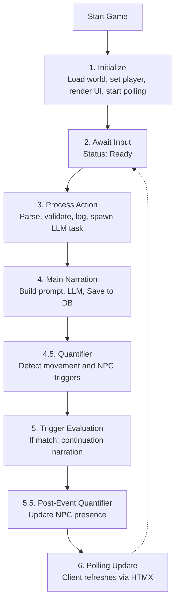
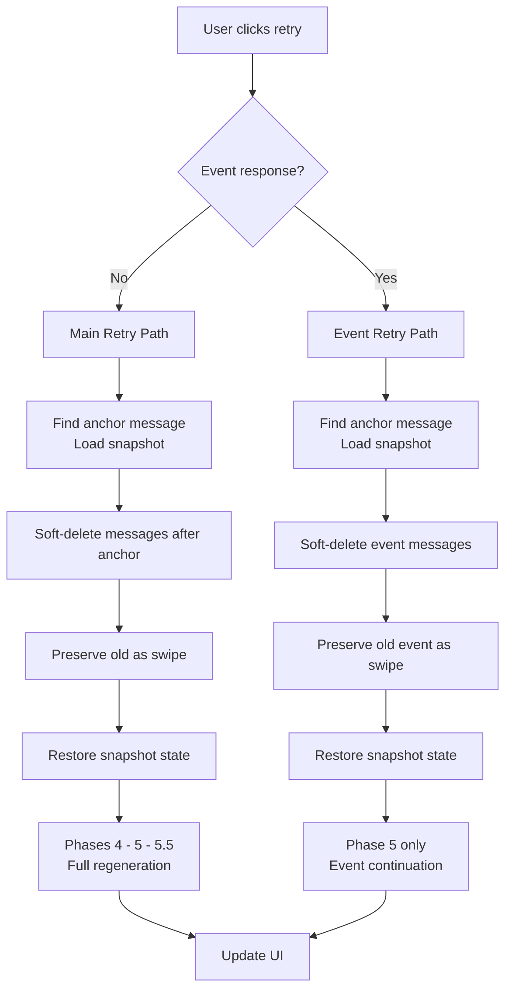

# Specification: Game Flow

> **Related Decisions**: [ADR-006](../adr/adr-006-quantifier-systems.md), [ADR-008](../adr/adr-008-sqlite-snapshot-persistence.md), [ADR-010](../adr/adr-010-concurrency-generation-gate.md), [ADR-013](../adr/adr-013-message-domain-model.md), [ADR-017](../adr/adr-017-message-swipes.md)

**Scope:** This document specifies the **runtime control flow** — the phase sequence from player input through LLM generation, quantification, and trigger evaluation back to UI update. For prompt composition, see [`prompt_system.md`](prompt_system.md). For trigger evaluation rules, see [`triggers.md`](triggers.md). For status display and polling, see [`dashboard.md`](dashboard.md). For Game Master role and behavioral constraints, see [`narration_engine.md`](narration_engine.md).

## Overview

This document defines the core game loop - the play-by-play experience from starting the game to receiving LLM responses. This is the fundamental user experience that must work reliably.

## The Game Flow

When the engine needs LLM narration (during Phase 4), it builds a comprehensive prompt using the **8-layer system** — see [`prompt_system.md`](prompt_system.md) for layer composition and [`llm_processing.md`](llm_processing.md) for token budget management.

### Granular Status Phases

During LLM processing, the UI displays granular status phases instead of a single "Thinking..." message:

| Phase | Display Text | Endpoint Value | When Active | UI Latency |
|-------|-------------|----------------|-------------|------------|
| `Narrating` | "Generating narration..." | `narrating` | During main LLM narration (Phase 4) | ~11s (narration saved immediately) |
| `Quantifying` | "Quantifying scene..." | `quantifying` | During post-narration quantifier analysis (Phase 4.5 or 5.5) | ~13s (narration visible, metadata pending) |
| `GeneratingEvent` | "Generating event..." | `generating-event` | During trigger continuation narration (Phase 5) | Variable (after trigger fires) |

**Streaming Narration Optimization:** Narration is saved to the database immediately after Phase 4 completes, before the quantifier runs. This reduces time-to-first-narration from ~40s to ~11s (73% improvement). The quantifier metadata (NPC list, confidence scores) lags by one poll cycle (~2s), which is an acceptable trade-off for faster initial visibility.

**Design Principles:**
- `GenerationStatus` (Idle/Generating/Error) remains unchanged for backward compatibility
- `is_generating()` is the single source of truth for disabling UI elements
- Phase is a secondary display concern only — all phases use the same `.thinking` CSS class
- The frontend maps endpoint values (`narrating`, `quantifying`, `generating-event`) to human-readable text
- An optimistic "Thinking..." is shown immediately on form submit before the first poll response

### Retry Flow

Retrying a response (via the right swipe arrow on the last message) branches based on whether the last AI-generated content was a **main narration** or a **trigger event continuation**:

**Key behaviors** (enforced by `tests/flow_mock/`):
- **Main retry** finds the last `Input` message, loads the snapshot stored in its `snapshot_id`, soft-deletes all messages after that input, preserves the old narration as a swipe, and re-runs the full pipeline: quantifier, movement, triggers, and post-event quantifier. On success, old swipes migrate to the new message and soft-deleted messages are purged. On failure, soft-deleted messages are restored (`test_retry_main_narration_applies_new_quantifier_result`, `test_main_retry_reevaluates_triggers`).
- **Event retry** finds the last non-event message (the anchor before any event messages), loads its `snapshot_id` snapshot, soft-deletes event messages, preserves the old event as a swipe, and regenerates only the continuation text using stored trigger prompts (`StoredTriggerContext`) (`test_retry_event_continuation_preserves_quantifier_result`).
- **Swipe navigation** (left/right arrows on the last message) switches between swipes. Restoring a swipe loads its `snapshot_id` and rewinds world state to that point. Only the last message is swipeable (`test_switch_swipe_changes_active_swipe`).
- **Retrigger Event** appears on a narration swipe when its restored snapshot contains `last_trigger` and there are no event messages after it. Clicking it runs `run_trigger_continuation()` from that snapshot state without rerunning the main narration.
- Snapshots are standalone — no `base_snapshot_id` chain. Each message carries the `snapshot_id` of the state captured after it was created. Each `Swipe` also stores its own `snapshot_id` so switching swipes restores the exact state that produced that text.
- If the anchor message has no `snapshot_id` or the snapshot is missing, retry fails gracefully (`test_retry_no_pre_main_snapshot`).

