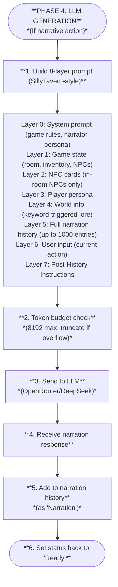

# Specification: Game Flow

## Overview

This document defines the core game loop - the play-by-play experience from starting the game to receiving LLM responses. This is the fundamental user experience that must work reliably.

## The Game Flow

```mermaid
flowchart TD
    Start(["**START GAME**<br>*(Server starts, loads world)*"])
    
    Phase1["**PHASE 1: INITIALIZE**<br>1. Load world data<br>2. Set player in starting room<br>3. Render initial UI (Header, Story Log, Sidebar)<br>4. Establish HTMX polling (every 5s)"]
    
    Phase2["**PHASE 2: AWAIT INPUT**<br>*(Status: 'Ready')*<br>User types command → submits form"]
    
    Phase3["**PHASE 3: PROCESS ACTION**<br>1. Parse command & execute game logic<br>2. Log command as 'Input'<br>3. Set status to 'Generating' + phase 'Narrating'<br>4. Offload to `tokio::task::spawn_blocking` for LLM work"]
    
    Phase4["**PHASE 4: MAIN LLM NARRATION**<br>*(Phase: Narrating)*<br>1. Build prompt via PromptBuilder<br>2. Send to LLM (see Context Pipeline below)<br>3. Add to history as 'Narration'"]
    
    Phase45["**PHASE 4.5: QUANTIFIER & MOVEMENT**<br>*(Phase: Quantifying)*<br>1. Post-narration Quantifier analyzes<br>2. Process movement intent<br>3. If moved: trigger `narrate_arrival` LLM call<br>4. Determine NPC Enter/Leave events"]
    
    Phase5["**PHASE 5: TRIGGER EVALUATION**<br>*(Phase: GeneratingEvent — only if trigger fires)*<br>1. `evaluate_triggers(state)` — first match only<br>2. Build prompt with continuation context<br>3. Call LLM & mark trigger as fired<br>4. Set status back to 'Ready'"]
    
    Phase6["**PHASE 6: POLLING UPDATE**<br>1. Client polls /fragment/story-log (5s)<br>2. Server returns updated HTML<br>3. HTMX swaps content"]

    Start --> Phase1
    Phase1 --> Phase2
    Phase2 --> Phase3
    Phase3 --> Phase4
    Phase4 --> Phase45
    Phase45 --> Phase5
    Phase5 --> Phase6
    Phase6 -.->|BACK TO 2| Phase2
```



## The LLM Context Pipeline

When the engine needs LLM narration (during Phase 4), it builds a comprehensive prompt using the **8-layer system** (see [`prompt_system.md`](prompt_system.md)):



## Test Scenarios

### Scenario 1: Initial Load
```gherkin
Given the server is running with "test" world
When the user opens http://127.0.0.1:3000
Then the header shows "Chronicler Engine | <starting_room>"
And the story-log shows a minimal header with the room name
And after LLM generates: the story-log shows LLM-generated arrival narration
And the status shows "Ready"
```

### Scenario 2: Look Command
```gherkin
Given the game is loaded
When the user enters "look" and submits
Then the status shows "Generating narration..."
And after LLM generates response, the story-log shows the LLM description
And the status shows "Ready"
```

### Scenario 3: Quantifier-Driven Movement
```gherkin
Given the game is loaded at starting room
When the user enters "I walk to the village square" and submits
Then the status shows "Generating narration..."
And after LLM generates response, the quantifier detects movement intent
Then the status shows "Quantifying scene..."
And the story-log shows a minimal header with the new room name
And the story-log shows the LLM narration for arrival
And the visual-sidebar shows the new room's image and NPCs
And the status shows "Ready"
```

### Scenario 4: Free Action (LLM Narration)
```gherkin
Given the game is loaded
When the user enters "examine the mysterious orb" and submits
Then the status shows "Generating narration..."
And after LLM generates response, the story-log shows the LLM's description of the orb
And the status shows "Ready"
```

## Error Handling

### LLM Timeout
- If LLM takes >30 seconds, show error in story-log
- Status returns to "Ready"

### Invalid Command
- Show helpful error in story-log
- Status returns to "Ready"

### Granular Status Phases

During LLM processing, the UI displays granular status phases instead of a single "Thinking..." message:

| Phase | Display Text | Endpoint Value | When Active |
|-------|-------------|----------------|-------------|
| `Narrating` | "Generating narration..." | `narrating` | During main LLM narration (Phase 4) |
| `Quantifying` | "Quantifying scene..." | `quantifying` | During post-narration quantifier analysis (Phase 4.5) |
| `GeneratingEvent` | "Generating event..." | `generating-event` | During trigger continuation narration (Phase 5) |

**Design Principles:**
- `GenerationStatus` (Idle/Generating/Error) remains unchanged for backward compatibility
- `is_generating()` is the single source of truth for disabling UI elements
- Phase is a secondary display concern only — all phases use the same `.thinking` CSS class
- The frontend maps endpoint values (`narrating`, `quantifying`, `generating-event`) to human-readable text
- An optimistic "Thinking..." is shown immediately on form submit before the first poll response

### Polling-based Updates
- HTMX automatically polls every 5 seconds for story-log updates
- Status-display polls `/status/generating` for button state
- `/status/generating` returns phase endpoint values (`idle`, `narrating`, `quantifying`, `generating-event`)
- No manual reconnection needed

## Reference Implementation

- **Server**: `src/server/fragments.rs` - `action_handler`, `process_action`
- **HTMX Polling**: `assets/index.html` - `hx-trigger="load, every 5s"`
- **LLM**: `src/narrative/llm/mod.rs` - `narrate_action`, `narrate_arrival`
- **Prompt Builder**: `src/narrative/prompt/builder.rs` - 8-layer prompt construction
- **LLM Tests**: `tests/flow_llm_tests.rs` - Real LLM integration tests
