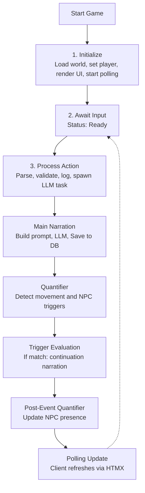
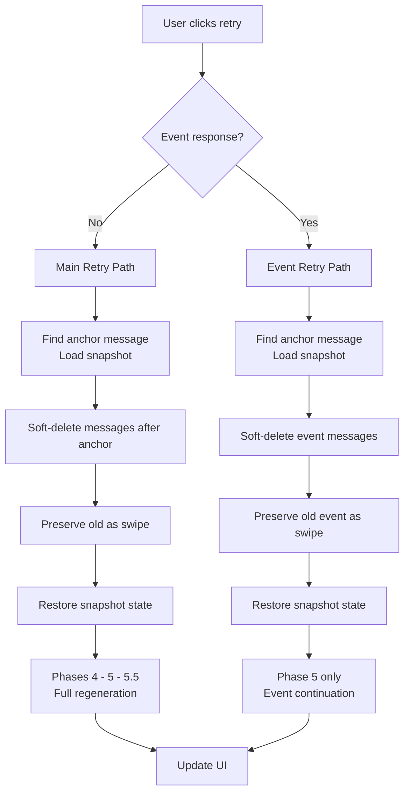

# Specification: Game Flow

> **Related Decisions**: [ADR-006](../adr/adr-006-quantifier-systems.md), [ADR-008](../adr/adr-008-sqlite-snapshot-persistence.md), [ADR-010](../adr/adr-010-concurrency-generation-gate.md), [ADR-017](../adr/adr-017-message-swipes.md)

**Scope:** This document specifies the **runtime control flow** — the phase sequence from player input through LLM generation, quantification, and trigger evaluation back to UI update. For prompt composition, see [`prompt_system.md`](prompt_system.md). For trigger evaluation rules, see [`triggers.md`](triggers.md). For status display and polling, see [`dashboard.md`](dashboard.md). For Game Master role and behavioral constraints, see [`narration_engine.md`](narration_engine.md).

## The Game Flow

Main narration builds a comprehensive prompt using the **8-layer system** — see [`prompt_system.md`](prompt_system.md) for layer composition and [`llm_processing.md`](llm_processing.md) for token budget management.

### Granular Status Phases

During LLM processing, the UI displays granular status phases instead of a single "Thinking..." message:

| Phase | Display Text | Endpoint Value | When Active |
|-------|-------------|----------------|-------------|
| `Narrating` | "Generating narration..." | `narrating` | During main LLM narration — narration saved to DB before quantifier runs |
| `Quantifying` | "Quantifying scene..." | `quantifying` | During post-narration quantifier analysis — narration visible, metadata pending |
| `GeneratingEvent` | "Generating event..." | `generating-event` | During trigger continuation narration — fires after trigger evaluation |

- `GenerationStatus` (Idle/Generating/Error) is the single source of truth for disabling UI elements
- The frontend maps endpoint values (`narrating`, `quantifying`, `generating-event`) to human-readable text
- An optimistic "Thinking..." is shown immediately on form submit before the first poll response

### Retry Flow

Retrying a response (via the right swipe arrow on the last message) branches based on whether the last AI-generated content was a **main narration** or a **trigger event continuation**:

**Retry semantics** (enforced by `tests/integration/flow/`):
- **Main retry** soft-deletes messages after the anchor input and re-runs phases 4 → 4.5 → 5 → 5.5 (full regeneration). Old narration preserved as a swipe. On success, prior swipes migrate to the new message and soft-deletes are purged; on failure, soft-deletes are restored.
- **Event retry** regenerates only the continuation text from the anchor snapshot using stored `StoredTriggerContext` prompts — does not rerun main narration or quantification.
- **Retrigger Event** (on a narration swipe with `last_trigger` and no following event messages) runs `ActionPipeline::phase_trigger_continuation()` → `reconcile_post_trigger_npcs()` → `phase_finalize()` from the restored snapshot state without rerunning the main narration.
- Snapshots are standalone — no `base_snapshot_id` chain. Each message and each `Swipe` carries its own `snapshot_id` of the state captured after it was created; switching swipes restores that exact state.
- If the anchor message has no `snapshot_id` or the snapshot is missing, retry fails gracefully.

### Error Model

Pipeline errors (LLM failures, empty responses, room-not-found, etc.) follow a unified pattern:
1. Set `state.narrative.input_buffer.status = GenerationStatus::Error(message)` on the current `GameState`
2. Persist via `save_state()` (or `save_message_and_snapshot()` if a system message was added)
3. Return `Ok(state)` / `Ok(())` — **not** `Err(ActionOutcome::Error)`

The caller checks `state.narrative.input_buffer.status.error_message()` to decide whether to continue to later phases or skip straight to `phase_finalize`. This ensures:
- State is always persisted (never lost to an `Err` that skips `save_state`)
- The UI shows the error via the existing `GenerationStatus::Error` polling path
- `phase_finalize` always runs, resetting `is_generating`

**Cancellation** is the only path that uses `Err(ActionOutcome::Cancelled)`. The `ActionOutcome::Error` variant is retained for exhaustiveness but never constructed in production code.

**Stale-Generating recovery**: If `is_generating` is `false` but persisted status is still `Generating` (e.g., after a panic), `process_action` resets status to `Idle` before proceeding. Panics in `spawn_blocking` propagate naturally; `GenerationGuard::Drop` clears `is_generating`.

