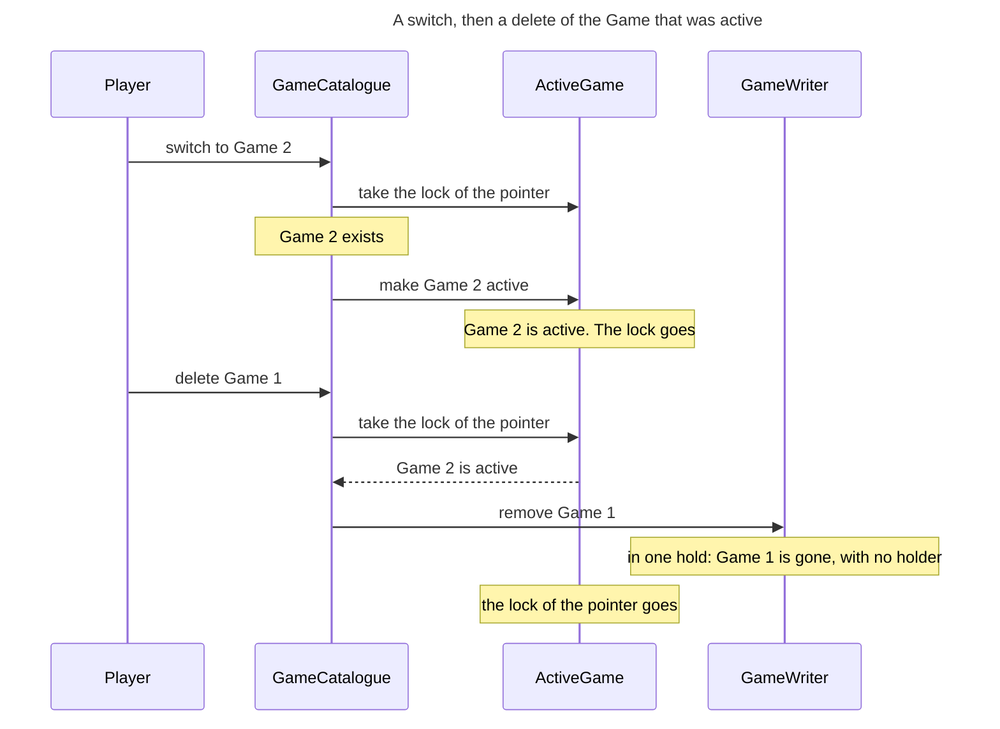

<!-- Generated by verify-gate from its TLA+ model, inputs b8f2bda4a42b6cdf. Do not edit. -->

Rule: A delete never removes the active Game.

```mermaid
---
title: "A switch, then a delete of the Game that was active"
---
sequenceDiagram
  participant You as Player
  participant C as GameCatalogue
  participant P as ActiveGame
  participant G as GameWriter
  You->>C: switch to Game 2
  C->>P: take the lock of the pointer
  Note over C: Game 2 exists
  C->>P: make Game 2 active
  Note over P: Game 2 is active. The lock goes
  You->>C: delete Game 1
  C->>P: take the lock of the pointer
  P-->>C: Game 2 is active
  C->>G: remove Game 1
  Note over G: in one hold: Game 1 is gone, with no holder
  Note over P: the lock of the pointer goes
```

## Document References

- [Game Flow](../game_flow.md)
