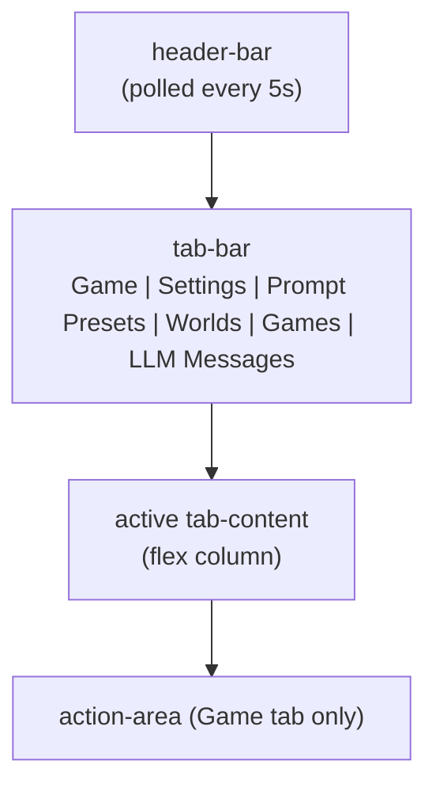

## Overview

The dashboard is a single-page HTMX application served at `/`. The page is the static shell `assets/index.html`. Every per-tab panel and every per-message update is a server-rendered HTML fragment that the shell fetches. The Game tab is the default landing view. The other five tabs hold management panels whose domain content lives in their own reference docs.

The static shell defines the tab bar, the active-tab body, the polling containers, and the dashboard scripts. The scripts drive the button states, the edit-mode polling pause, and the swipe controls. The Rust side serves the fragment endpoints and the per-action POST endpoints that the shell calls through HTMX.

The browser and HTTP specs listed in Document References define the dashboard's behaviour. This doc names its regions, controls, endpoints, polling cadences and states.

## Page Layout

The header bar carries the game title and the current display name.

### Failure display

A failure appears in one of three places: the failure banner under the header, the status display, or the failing region's own inline error slot (`[data-error-slot]`).

### Failure and health states

Four state names cover the failure and health displays. Role health comes from the server. The client owns the Unreachable state. Degraded and Unreachable raise the failure banner.

- **Healthy** — the role's newest LLM attempt carries no error.
- **Degraded** — the role's newest LLM attempt carries an error. Role health is engine-wide: the newest attempt per role covers all games. The banner names each degraded role and what its failure cost the turn.
- **No calls yet** — the role has no recorded LLM attempt. The banner detail and the Settings role row name it.
- **Unreachable** — the client got no usable answer: a transport failure, or a polled container that answered non-2xx. The client raises the banner and clears it on the next successful response.

The header poll refreshes the Settings role-health cells and the Connections sub-tab marker out of band.

## Tabs

Six tabs, one active at a time. Tab switching is client-side. Each management panel fetches once when the dashboard loads, and switching tabs does not refetch it.

| Tab | Polling |
|---|---|
| Game (default) | yes (multiple cadences) |
| Settings | on load; role-health cells refresh with the header poll |
| Prompt Presets | on load |
| Worlds | on load |
| Games | on load |
| LLM Messages | yes (4s) |

## Game Tab

The Game tab stacks three live regions: the **main container** (story log and visual sidebar), the **options dock** (`#options-dock`), and the **action area**.

### Story Log

A scrollable list of `MessageEntry` rows, polled every 2 seconds. Each entry carries one of three `log_type` classes (`narration`, `system`, `input`) that select its bubble style.

Each entry header is one of:

- **Location header** — "Room Name - HH:MM", when the entry has a `location_header`.
- **Event header** — "Event Name - HH:MM" (`.event-header`), when the entry has an `event_header` and no location.
- **Plain header** — the timestamp alone.

### Visual Sidebar

Shows the location image and the portraits of the NPCs in the current room. A "No Location Image" placeholder replaces a missing image. The sidebar polls every 5 seconds.

### Action Area

A static shell at the bottom of the Game tab. It holds:

- A command input (`#command-input`) and a submit button (`#submit-btn`).
- An empty preview region (`#action-preview`) that receives the text-check preview.
- A status display (`#status-display`), polled every 5 seconds.

The client derives one of four states from the DOM and applies it to the submit button and the input:

| State | Submit button | Input | State holds while |
|---|---|---|---|
| Checking | "Send" (`#i-send` icon), disabled | disabled | a pre-flight text check is in flight |
| Generating | "Generating…" (`#i-loader-circle` icon, spinning), disabled | enabled | the status display carries a thinking status |
| Preview | "Send" (`#i-send` icon), enabled | enabled | `#action-preview` holds the preview |
| Idle | "Send" (`#i-send` icon), enabled | enabled | none of the above |

**Status display.** It shows one of:

- "Ready";
- a phase label (`Thinking...`, `Generating narration...`, `Quantifying scene...`, `Generating event...`, `Generating options...`);
- "Still thinking...", for a refused concurrent action;
- a clamped generation error, with the raw text behind a Details disclosure.

The clamped line is one sentence per `GenerationFailureKind`. The container's class (`status ready`, `status thinking`, `status wait`, `status error`) names the current state.

**Text-check preflight.** The command form posts to the action-check endpoint, which runs the configured text checker. Engine commands skip the check. So do requests while the check is disabled or auto-check is off. When the checker finds issues, the response renders a preview into `#action-preview`: the original text, an editable corrected text, and issue tags. The preview has three controls: **Send with edits**, **Send Original**, and **Cancel**. Both send controls post to the action-confirm endpoint.

**Slash-command palette.** Typing `/` in the command input opens a palette of the three slash commands (`/impersonate`, `/guide`, `/options`).

## Polling Cadences

Six containers in `assets/index.html` declare `hx-trigger="load, every Ns"`: header 5s, story log 2s, options dock 2s, visual sidebar 5s, status display 5s, LLM messages 4s. The header poll also refreshes the failure banner and the Settings role-health cells. The per-tab panels (Settings, Prompt Presets, Worlds, Games) fetch once, when the dashboard loads.

The story log's poll merges the fragment into the existing DOM (`morph:innerHTML`, the vendored idiomorph extension). Each `.log-entry` carries a stable `id` for the morph to match on. The other polled containers use an `innerHTML` swap.

## Assistive-technology announcements

The shell carries four visually hidden live regions:

| Region | Announced content | Politeness |
|---|---|---|
| `#status-announcer` | the status label on a phase change | `role="status"` (polite) |
| `#status-error-announcer` | a generation error's short line | `role="alert"` (assertive) |
| `#narration-announcer` | the text of a new story-log entry | `role="status"` (polite) |
| `#options-announcer` | a changed option set | `role="status"` (polite) |

`#restore-notice` (the swipe-restore confirmation) and the failure banner own their own announcements.

## Story-log entry controls

Each control posts to its own endpoint.

| Control | Icon | Endpoint |
|---|---|---|
| Edit | `#i-pencil` | history edit |
| Delete | `#i-trash` | history delete |
| Previous / next swipe | `#i-chevron-left` / `#i-chevron-right` | swipe switch |
| Retry (new swipe) | `#i-refresh-cw` | new swipe |
| Retrigger | `#i-zap` | retrigger |

A swipe switch restores the game state snapshot of the target swipe. Retrigger re-runs the trigger narration for the previous turn.

## Game Management

The Games tab holds three regions: **Active Game**, **New Game**, and **Saved Games**. A saved game from any world can be switched to.

### Active Game

Shows the current display name, a world badge, a persona badge, a rename control, and a reset button (`#i-rotate-ccw`). The rename control opens an inline disclosure with a text input. Save posts the new name and reloads the page. Reset asks "Reset the current game? All progress will be lost.". On confirmation, the engine deletes the current game and creates a new one with a generated name. With no active game, the row shows "No active game".

### New Game

A World selector and a Persona selector, filled from the worlds and persona cards in storage. "Start New Game" is disabled when the persona list is empty. Submit posts the world key and persona key to the create-game endpoint. With no worlds, the section shows "No worlds available. Create a world first."

### Saved Games

A list of the games other than the active one, across all worlds. Each row shows the display name, a world badge, a persona badge, and rename, Switch and Delete controls. Delete asks "Delete this game? This cannot be undone.". A confirmed delete removes the row. With no other games, the section shows "No other saved games.".

### Name Generation

A new game carries two names. The stable generated name is `{WorldName}_{YYYY-MM-DD}_{N}`, where `{N}` is one greater than the highest existing suffix for that world and date. A rename never changes it. The display name defaults to a readable form of the stable name (`Redmist Estate — 29 Sep 2026 (1)`), and the player can rename it at any time.

## Settings Tab

The Settings tab has two client-side sub-tabs: **Connections** and **Text Check**.

- The Connections sub-tab holds a Narrator and a Quantifier role row. Each role row has a connection select and a health cell (`#role-health-<agent>`).
- One row per connection follows, with its name, provider and model, role tags, and Edit, Test and Delete.
- Add and Edit open one shared form page with a back link to Connections.
- The sub-tab's degraded marker is `#subtab-connections-marker`.

A connection's **Test** control sends one short fixed prompt to the connection and shows the result in the surface's result slot. A pass names the backend, the model, and the reply time. On a connection row, Test uses the saved values. On the Add/Edit form, it uses the values typed into the form. Test runs only on a click and writes no LLM Messages row, so it does not change role health or the failure banner.

## Document References

- [`../../../specs/browser_dashboard.md`](../../../specs/browser_dashboard.md) — dashboard chrome, failure display and action area.
- [`../../../specs/browser_story_log.md`](../../../specs/browser_story_log.md) — story log poll and edit flow.
- [`../../../specs/browser_games.md`](../../../specs/browser_games.md) — Games panel.
- [`../../../specs/browser_settings.md`](../../../specs/browser_settings.md) — Settings panel.
- [`../../../specs/browser_slash_menu.md`](../../../specs/browser_slash_menu.md) — slash-command palette.
- [`../../../specs/browser_llm_messages.md`](../../../specs/browser_llm_messages.md) — LLM Messages panel.
- [`../../../specs/failure_display.md`](../../../specs/failure_display.md) — failure display HTTP contract.
- [`../../../specs/games.md`](../../../specs/games.md) — game create, switch, delete and rename.
- [`../../../specs/settings.md`](../../../specs/settings.md) — Settings endpoints.
- [`./http_routes.md`](./http_routes.md) — full HTTP route topology (machine-generated).
- [`./ui_design.md`](./ui_design.md) — design tokens and component specs.
- [`../../../specs/llm_messages.md`](../../../specs/llm_messages.md) — LLM Messages tab forensics.
- [`../game_flow.md#text-check-branch`](../game_flow.md#text-check-branch) — text-check preflight, settings, and preview UI.
- [`../narrative/prompt_system.md`](../narrative/prompt_system.md) — Prompt Presets tab content.
- [`../storage.md#worlds`](../storage.md#worlds) — Worlds tab CRUD and the world-game delete dependency.
- [`../storage.md#messages`](../storage.md#messages) — the `Message`/`Swipe` model that drives the swipe and retry controls.
- [`../game_flow.md#trigger-evaluation`](../game_flow.md#trigger-evaluation) — trigger evaluation that retrigger re-runs.
- [`../game_flow.md`](../game_flow.md) — the phase pipeline that drives the status text.
- [`../../explanation/dashboard_design.md`](../../explanation/dashboard_design.md) — design rationale: SillyTavern lineage, polling cadences, polling-pause pattern, snapshot-restoration cascade, empty-input continuation, server-rendered fragments, the text-check preview emphasis.
