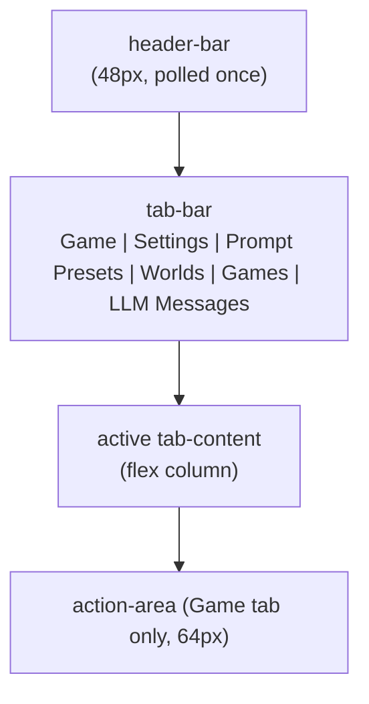

## Overview

The dashboard is a single-page HTMX application served at `/`. The page is statically served from `assets/index.html`; every per-tab panel and every per-message update is fetched as a server-rendered HTML fragment. The Game tab is the default landing view; the other five tabs host management panels whose domain content lives in their own reference docs.

The static HTML shell defines the tab bar, the active-tab body, the polling containers, and the in-page JavaScript that drives button-state transitions, edit-mode polling pauses, and swipe controls. The Rust side serves fragment endpoints and per-action POST endpoints that the shell calls via HTMX.

## Page Layout

A failure appears in one of three places: the failure banner under the header, the status display, or the failing region's own error slot. A non-2xx response swaps nothing into the region it describes. A failed poll answers non-2xx with `HX-Reswap: none`, so the region keeps its last good content. A failed form or card action renders a short message into that region's inline error slot (`[data-error-slot]`), with the raw server text behind the Details disclosure. The connection test answers 200 and targets its own `.connection-test-slot`, so the client swaps the result or the same disclosure into that slot, which cannot replace the row or form it reports on.

The header bar is 48px tall, polls every 5s, and carries the game title and current game name. Location is **not** in the header — it appears in the story log as a green location-header on the active room.

## Tabs

Six tabs, one active at a time. Tab switching is client-side JavaScript (`.tab` button toggles `.active` class on `.tab-content` siblings); only the panel-content fetch on first activation is server-rendered HTML.

| Tab | Polling |
|---|---|
| Game (default) | yes (multiple cadences) |
| Settings | on load |
| Prompt Presets | on load |
| Worlds | on load |
| Games | on load |
| LLM Messages | yes (4s) |

Inactive-tab content is `display: none`; the active tab uses `display: flex; flex-direction: column`. The static shell styles these states in `assets/styles.css`.

## Game Tab

The Game tab is the only view with three live regions stacked: the **main container** (story log + visual sidebar), the **options dock** (`#options-dock`), and the **action area**.

### Story Log (80%)

A scrollable list of `MessageEntry` rendered rows. The list polls its fragment endpoint every 2 seconds (see Polling Cadences) and auto-scrolls to the bottom on new content. Each entry carries one of three `log_type` classes (`narration`, `system`, `input`) that determines bubble styling and text color tokens.

Entry header structure:

- **Location header** — when the entry has a `location_header`, the header is "Room Name - HH:MM" in green (`--color-accent-green-bright`) bold inline.
- **Event header** — when the entry has an `event_header` (and no location), the header is "Event Name - HH:MM" in `--color-accent-blue-cyan` (`.event-header`) bold inline.
- **Plain header** — the timestamp alone.

### Visual Sidebar (20%)

A flex column with the **location image** on top (full width, `object-fit: contain`, max-height 200px) and the **NPC portraits row** below (fixed 80×80 squares, horizontal scroll, gap 6px; shows NPCs currently in the room). When no location image is configured, a "No Location Image" placeholder is rendered in `--color-text-placeholder`. The sidebar polls its fragment endpoint every 5 seconds.

### Action Area (64px)

A persistent shell at the bottom of the Game tab that is **not** replaced by polling — only its inner form is swapped on action submission. The shell holds:

- A text input (`name="command"`, `autocomplete="off"`) and a submit button (`#submit-btn`).
- A status display (`#status-display`) polled every 5 seconds from the status endpoint.

The action area is in one of three states:

| State | Submit button | Status display | Input |
|---|---|---|---|
| Ready | "Send" (`#i-send` icon), enabled | "Ready" in `--color-accent-ok` | enabled |
| Thinking | "Generating…" (`#i-loader-circle` icon), disabled | "Thinking..." / "Quantifying scene..." / "Generating event..." / "Generating options..." in `--color-accent-yellow` | disabled |
| Error | "Send" (`#i-send` icon), enabled | last error message, banner shown | enabled |

State transitions happen on three events: form submission (immediately sets Thinking), `htmx:afterRequest` on the form (immediately resets the form input), and the next status poll (which reads `idle`/`narrating`/`quantifying`/`generating-event`/`options` and updates the status display).

**Empty-input behavior.** Submitting with an empty input dispatches a continuation request (same path as SillyTavern's "Continue"): the action dispatcher folds an empty command into a continuation. The submit button transitions to "Generating…" immediately; the next status poll reads "Thinking...".

**Text-check preflight.** Before the action reaches its endpoint, the form posts to the action-check endpoint, which invokes the configured text checker. If issues are found, the action area is replaced with a preview showing the original text, an editable corrected text textarea, and issue tags (orange = spell, pink = grammar). Three buttons: Send (submit corrected), Send Original (submit original), Cancel (restore action area from `data-original-html`). The submit paths converge on the action-confirm endpoint; the corrected-vs-original distinction is carried by the form payload.

**Slash-command palette.** Typing `/` in the command input opens a fixed-position palette above the input listing the three slash commands (`/impersonate`, `/guide`, `/options`); further typing filters the list, arrow keys move the highlight (wrapping at the ends), Enter or a click populates the input with the highlighted command plus a trailing space without submitting, and Escape, focus loss, scroll, or submit closes it. The palette element is a `<body>` child whose listeners are delegated to `document`, so it survives the action-area innerHTML swap that action submission performs — the input is recreated and the wiring re-binds to it. The interaction contract is enforced by [`../../../specs/browser_slash_menu.md`](../../../specs/browser_slash_menu.md) (scenarios 31.1–31.7).

## Polling Cadences

Six endpoint cadences are declared as `hx-trigger="load, every Ns"` on their containers in `assets/index.html`: header 5s (which also refreshes the failure banner), story log 2s, options dock 2s, visual sidebar 5s, status display 5s, LLM messages 4s. Per-tab panels (Settings / Prompt Presets / Worlds / Games) fetch once, when the dashboard loads. They do not poll.

The story log's poll merges the fragment into the existing DOM (`morph:innerHTML`, the vendored idiomorph extension) instead of replacing it, so an idle poll touches no nodes and a text selection, focus, or scroll position inside the log survives. Each `.log-entry` carries a stable `id` for the morph to match on. The other polled containers keep their `innerHTML` swap.

## Assistive-technology announcements

Because the polled containers are re-rendered wholesale each cycle, a live region on the container itself would re-announce unchanged content. The shell instead carries dedicated live regions, each written only when its value changes (the four announcers are visually hidden):

| Region | Announced content | Politeness |
|---|---|---|
| `#status-announcer` | the status label on a phase change (Ready / Thinking... / Generating narration... / Quantifying scene...) | `role="status"` (polite) |
| `#status-error-announcer` | a generation error's short line, never the raw text behind its disclosure | `role="alert"` (assertive) |
| `#narration-announcer` | the text of a story-log entry the poll has not shown before | `role="status"` (polite) |
| `#options-announcer` | a changed option set | `role="status"` (polite) |

The client tracks the entry ids the story log has already shown, so only a newly appended narration is announced; an unchanged poll announces nothing. `#restore-notice` (the swipe-restore confirmation) and the failure banner own their own announcements.

## Edit, Delete, Swipe, Retrigger Flows

All four flows operate on the **last entry** in the story log. Conditional visibility is computed in `NarrativeLogTemplate::new` (templates.rs); the per-button and swipe-control visibility rules are specified in the UI design doc (see Document References). The description below focuses on what each flow does.

### Edit Flow

1. The user clicks the edit (`#i-pencil`) button on an entry. JavaScript in the static shell (`showEditForm`) replaces the entry's text span with a textarea carrying the raw markdown from `data-raw-text`, swaps the action buttons for Save/Cancel, disables every other entry's Edit button, and **pauses story-log polling** by writing `hx-trigger="none"` on `#story-log` and calling `htmx.process()`.
2. The user edits the text and clicks Save. JavaScript submits the new raw text to the history-edit endpoint.
3. JavaScript **resumes polling** (restores the original `hx-trigger` value). Cancel does the same without the submission.
4. The next poll re-renders the entry with the new text.

The pause prevents the polling refresh from racing the user's edit.

The textarea height is auto-resized on input. The save/cancel buttons replace the action-button cluster only for the entry being edited. The other entries' Edit buttons are disabled while the edit is open; cancel, Escape, and a failed save re-enable them at once, and a successful save leaves them disabled until the resumed poll re-renders the log.

### Delete Flow

1. The user clicks the delete (`#i-trash`) button on the last entry. JavaScript calls `confirm("Delete this message?")` before proceeding.
2. On confirm, JavaScript submits to the history-delete endpoint.
3. On a 2xx response, JavaScript fetches the story-log fragment and swaps it into `#story-log`. On a non-2xx response, the message renders in the story log's own inline error slot.

### Swipe Flow

Swipes exist on the **last entry only**. The control row holds: a previous-swipe button (`#i-chevron-left`, disabled on the first swipe), a counter (`active_swipe_index + 1 / swipe_count`), and a forward button (`#i-chevron-right` when a later swipe exists, `#i-refresh-cw` on the latest swipe). Clicking the previous button or the forward navigation button submits to the swipe-switch endpoint with the target swipe index. On success, JavaScript replaces `#story-log` innerHTML with the response. Switching swipes restores the `snapshot_id` of the target swipe, so the visual sidebar's own 5s poll picks up the restored game state; the header shows only the game name, which a swipe does not change. Clicking the forward button on the latest swipe submits to the new-swipe endpoint; JavaScript transitions the submit button to "Generating…" / status to "Thinking..." immediately, and the story log's 2s poll renders the response.

### Retrigger Flow

The retrigger (`#i-zap`) button appears on the last entry only when `show_retrigger` is true.

1. The user clicks the retrigger button. JavaScript submits to the retrigger endpoint and immediately transitions the button to "Generating…" / status to "Thinking...".
2. On response, the story log's 2s poll renders the retriggered entry.

Retrigger re-runs the trigger narration for the previous turn.

## Game Management

The Games tab hosts three regions: **Active Game**, **New Game**, and **Saved Games**. Cross-world switching is allowed (a saved game from world A can be switched to while world B is active). The description below focuses on what each region does and what the user sees.

### Active Game

Shows the current game name, a world badge (the world the game belongs to), a persona badge (the persona bound to the game), and a reset button (`#i-rotate-ccw`). Reset carries an HTMX confirm dialog ("Reset the current game? All progress will be lost."); on confirmation, the current game is deleted and a new game is created with a freshly auto-generated name (see "Name generation" below). When no game is active, the row shows the placeholder "No active game".

### New Game

A labelled World selector and Persona selector, populated from worlds and persona cards in storage. The "Start New Game" button is disabled when the persona list is empty. On submit, the form posts the selected world key and persona key to the create-game endpoint. When no worlds are available, the section shows the empty-state message "No worlds available. Create a world first."

### Saved Games

A list of the games other than the active one (across all worlds), each with its game name, world badge, persona badge, and Switch/Delete affordances. Delete carries a confirm dialog ("Delete this game? This cannot be undone."); the dialog text is per-template, not engine-enforced.

### Name Generation

New-game names are auto-generated as `{WorldName}_{YYYY-MM-DD}_{N}` (underscores between segments, not spaces) where `{N}` is one greater than the highest existing suffix for that world-and-date base.

## Settings Tab

The Settings tab has two client-side sub-tabs: **Connections** and **Text Check**. The Connections sub-tab holds a Narrator and a Quantifier role row, each with a connection select and that role's health, followed by one row per connection with its name, provider and model, role tags, and Edit, Test and Delete. Add and Edit open one shared form page with a back link to Connections.

A connection's **Test** control sends one short fixed prompt to that connection and shows the result inline in the surface's result slot: a passing reply names the backend and model with the reply time, and a failure renders the shared short-message + Details disclosure. On a connection row it tests the saved values; on the Add/Edit form it tests the values typed into the form before Save. It runs only on a click, and it writes no LLM Messages row, so it never moves role health or the failure banner.

## Document References

- [`./http_routes.md`](./http_routes.md) — full HTTP route topology (machine-generated).
- [`./ui_design.md`](./ui_design.md) — design tokens (colors, typography, spacing), component specs, and the per-button/swipe-control visibility rules.
- [`../narrative/narration_system.md#llm-call-logging--forensics`](../narrative/narration_system.md#llm-call-logging--forensics) — LLM Messages tab forensics + the 50-row `llm_messages` cap.
- [`../game_flow.md#text-check-branch`](../game_flow.md#text-check-branch) — text-check preflight, settings, and preview UI.
- [`../narrative/prompt_system.md`](../narrative/prompt_system.md) — Prompt Presets tab content.
- [`../storage.md#worlds`](../storage.md#worlds) — Worlds tab CRUD + world-game delete dependency.
- [`../storage.md#messages`](../storage.md#messages) — `Message`/`Swipe` model that drives swipe/retry controls.
- [`../game_flow.md#trigger-evaluation`](../game_flow.md#trigger-evaluation) — trigger evaluation that retrigger re-runs.
- [`../game_flow.md`](../game_flow.md) — phase pipeline that drives Thinking/Quantifying/Generating status text.
- [`../../explanation/dashboard_design.md`](../../explanation/dashboard_design.md) — design rationale: SillyTavern lineage, polling cadence choice, polling-pause pattern, snapshot-restoration cascade, empty-input continuation, server-rendered fragments over a SPA.
